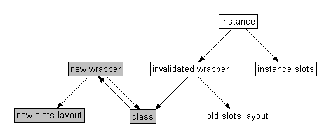

[Ravenbrook](http://www.ravenbrook.com/) / [ILC 2003](http://www.international-lisp-conference.org/)

[Nick Levine](mailto:ndl@ravenbrook.com), [Ravenbrook Limited](http://www.ravenbrook.com/), 2003-07-15

## 1. Introduction

This document was written for presentation during a tutorial session at the
[International Lisp Conference](http://www.international-lisp-conference.org/)
held in New York City in October 2003.

The intended audience for the tutorial is anybody with a basic
knowledge of lisp or scheme, who wants to know something about how to
use the "Common Lisp Object System" (CLOS). However, in an attempt to
provide something for everyone, the tutorial will cover:

* an introduction to the 10% of CLOS which you need to get you
through 90% of use cases;
* a number of opinionated statements, for instance about the
differences between CLOS and other object systems;
* a brief look "under the hood" at how some of the more dynamic
features of CLOS might be implemented;
* some exercises.

The [author](http://www.nicklevine.org/) worked on the LispWorks project at
Harlequin for ten years. Since then he has [taught
lisp](http://www.nicklevine.org/declarative/lectures/) to undergraduates and
written an [open-source search engine](http://www.nicklevine.org/FastIndex/).

The examples in this tutorial are available in a separate file
[examples.lisp](assets/clos/examples.lisp). I hope to use the code in
[present.lisp](assets/clos/present.lisp) to squirt them into a lisp
listener during the tutorial.

This document is not confidential. Original version is available at
[http://www.nicklevine.org/ilc2003/](http://www.nicklevine.org/ilc2003/).

## 2. Background

<cite>CLOS</cite> (either one syllable rhyming with "dross", or two syllables as in
"see-loss") is the "Common Lisp Object System". The functionality belonging to
this name was added to the Common Lisp language between the publication of
Steele's first edition of "Common Lisp, the Language" in 1984 and the
formalization of the language as an ANSI standard ten years later.

The source material for CLOS was a report written in three chapters. The first
two, consisting of "Programmer Interface Concepts" and "Functions in the
Programmer Interface", will now be found as the two halves of chapter 28 in
[Steele 1990] and were the basis for relevant parts of the ANSI
specification when it later appeared. The third chapter, on the Metaobject
protocol, was regarded (by its authors, I believe) as incomplete and never
published.

This tutorial is also incomplete, but in a different sense: I have deliberately
omitted as much as I could. CLOS offers many alternate styles of working, as
well as - in some considerable detail - a number of opportunities for
applications to extend and reconfigure CLOS itself. (Some of this detail will
be covered in the following tutorial, on the "Metaobject Protocol".) The
intention of this tutorial is to provide a sufficient grounding in the (say)
10% of CLOS which covers 90% of use cases - enough to get a novice off the
ground. We will access this 10% by examining in some (but not full!) detail two
defining macros: [`defclass`] [section-3] and [`defmethod`] [section-4].

As to what an <cite>object system</cite> is: I can only say that by the end of
this tutorial you should have some idea of what CLOS has to offer. (Is it just
a collection of 33 functions, 8 macros and some interesting new types? Or is it
something more profound?) Historically, and implementationally, all the
concepts here are strongly related. However, when you come to use them yourself
you'll find that in an application the relation is not so strong, and you can
pick and choose what's useful to you and leave alone what isn't.

### 2.1. References

These are listed in [appendix A][section-A] at the end of this document. [Keene
1989] is a very easy introduction and more thorough than the single chapter in
[Graham 1995], but it will obviously take you longer to read. [Steele 1990,
otherwise known as "CLtl2"] is a handy reference guide, but do take a little
care because it predates the ANSI specification - for which see the "hyperspec"
[Pitman 1996] - and differs in some important respects (for a list of which see
the end of appendix C in [Graham 1995). A (note: not "the") metaobject protocol,
described in [Kiczales et al 1991, otherwise known as "AMOP"], gives many hints
about configuration and implementation.

### 2.2. Getting started

Theoretically this should not be an issue in any fully enabled Common Lisp,
    because CLOS is part of the language. However, some implementations might
    expect you to `(require "clos")` or similar. Check your manual.

Most of the examples in this tutorial should work fine in any package which
    "uses" `COMMON-LISP`, and they should port to any conforming implementation.
    The exceptions are marked as such. I have tested the examples in LispWorks
    (version 4.2.7, used to generate all the examples below) and Allegro CL
    (version 6.2).

## 3. Classes and instances

### 3.1. Review - the non-OO approach

Before we introduce the first of our two defining macros, let's review its non
    object-oriented equivalent: `defstruct`. The language provides you with a
    number of specialized data types (`cons`, `string`, `hash-table`, etc.)
    along with this mechanism for defining your own structures. An example:

~~~lisp
(defstruct point
  x
  y
  z)
~~~

The form is roughly equivalent to a struct declaration in C. It
    defines a new type, called `point`, with three
    <cite>slots</cite> (or <cite>fields</cite> if that's a word you're
    happier with) called `x`, `y` and
    `z`.

Compactly, the above invocation of `defstruct` gives us
    all of the following:

*   A <cite>constructor</cite> function `make-point`,
    which takes keyword arguments `:x` `:y` and
    `:z` (all defaulting to `nil` if not
    supplied). Every time you call this function a new `point`
    is allocated and returned.

*   Any object returned by `make-point` will be of type
    `point`, and will respond enthusiastically to the
    <cite>predicate</cite> `point-p`.

*   Setfable <cite>accessors</cite> `point-x`,
    `point-y` and `point-z` can be used to read and
    modify the slots of any `point` object.

*    A shallow <cite>copier</cite>,
    `copy-point`.

Structures can have any number of slots, from zero up (to some
    implementation-defined limit, e.g. 254 in LispWorks for Windows) and -
    as with lists and general vectors - the slots can hold any values.

In this example, **note** the form in which structures
    are printed by default, and which can be parsed by the lisp
    reader.

~~~lisp
CL-USER 1 > (defstruct point
              x
              y
              z)
POINT

CL-USER 2 > (defun distance-from-origin (point)
              (let* ((x (point-x point))
                     (y (point-y point))
                     (z (point-z point)))
                (sqrt (+ (* x x) (* y y) (* z z)))))
DISTANCE-FROM-ORIGIN

CL-USER 3 > (defun reflect-in-y-axis (point)
              (setf (point-y point)
                    (- (point-y point))))
REFLECT-IN-Y-AXIS

CL-USER 4 > (setf my-point (make-point :x 3 :y 4 :z 12))
#S(POINT X 3 Y 4 Z 12)

CL-USER 5 > (type-of my-point)
POINT

CL-USER 6 > (distance-from-origin my-point)
13.0

CL-USER 7 > (reflect-in-y-axis my-point)
-4

CL-USER 8 > my-point
#S(POINT X 3 Y -4 Z 12)

CL-USER 9 > (setf a-similar-point #s(point :x 3 :y -4 :z 12))
#S(POINT X 3 Y -4 Z 12)

CL-USER 10 > (equal my-point a-similar-point)
NIL

CL-USER 11 > (equalp my-point a-similar-point)
T

CL-USER 12 >
~~~

**Note** that `defstruct` has a number of
    options (which we won't cover here), for describing inheritance,
    printing behaviour, slot types and defaults, and so on.

### 3.2. Introducing the macro `defclass`

The macro used for defining new data types in CLOS is
    `defclass`. An example:

~~~lisp
(defclass point ()
  (x
   y
   z))
~~~

**Note** but ignore the empty parentheses for
    now. **Note** also the parentheses around the set of slot
    names (unlike `defstruct`). The above invocation gives us
    the following (and no more):

*    A CLOS type (or <cite>class</cite>) named `point`.
*   Three slots in this class, again named `x`,
    `y` and `z`.

**Note** that - unlike `defstruct` above -
    `defclass` gives us <u>none</u> of the following:
    constructor, predicate, accessors (unless we ask for them explicitly -
    see [section 3.5][section-35] below), copier,
    `#s` `print` / `read` syntax. You can
    generate similar functionality in CLOS, but it doesn't come
    automatically the way it did with structures. Quite often, you'll find
    that you don't need the power of CLOS and that `defstruct`
    is more than enough to meet your needs, not to mention being more
    convenient. When I'm writing an application, I typically start by
    defining my types with `defstruct`, and only change them to
    `defclass` when it becomes necessary to do so.

**Note** next that if a type has previously been
    defined as a structure, then you can't redefine it as a class. (On the
    other hand, "the consequences of redefining a defstruct structure are
    undefined" so we shouldn't feel we're losing out.) We'll sneak around
    that in this session by `unintern`ing the name of the old
    type:

~~~lisp
CL-USER 12 > (unintern 'point)
T

CL-USER 13 > (defclass point ()
               (x
                y
                z))
#<STANDARD-CLASS POINT 2060C12C>

CL-USER 14 > (setf my-point (make-instance 'point))
#<POINT 205FA53C>

CL-USER 15 > (type-of my-point)
POINT

CL-USER 16 > (defun set-point-values (point x y z)
               (setf (slot-value point 'x) x
                     (slot-value point 'y) y
                     (slot-value point 'z) z))
SET-POINT-VALUES

CL-USER 17 > (set-point-values my-point 3 4 12)
12

CL-USER 18 > (defun distance-from-origin (point)
               (with-slots (x y z)
                   point
                 (sqrt (+ (* x x) (* y y) (* z z)))))
DISTANCE-FROM-ORIGIN

CL-USER 19 > (distance-from-origin my-point)
13.0

CL-USER 20 >
~~~

**Note** the following:

*   The use of `make-instance` to allocate an
    <cite>instance</cite> of our new class.

*   The "unreadable" printed representation of
    `my-point` in line 14.

*   The setfable function `slot-value` used to access
    values in an instance's slots.

*   The macro `with-slots`, for abbreviating calls to
    `slot-value`. The first argument is a list of slot
    names. The second argument evaluates to a CLOS instance; this is
    followed by optional declarations and an implicit
    `progn`. Lexically during the evaluation of the body, an
    access to any of these names as a variable is equivalent to accessing
    the corresponding slot of the CLOS instance.

**Exercise:** Rewrite `set-point-values`
    using `with-slots`.

**Exercise:** Use `symbol-macrolet` to
    implement `with-slots`. Note that each name listed in the
    first argument to `symbol-macrolet` can be replaced by the
    pair <cite>(variable-name slot-name)</cite>.

**Exercise:** Write a macro `defclass-plus`
    which expands into a `defclass` plus some or all of the
    following, in the spirit of `defstruct`: constructor,
    predicate, accessors and copier. This may get tedious, in which case
    convince yourself that you know what you're doing and then stop.

### 3.3. Classes are instances too

Compare the values returned from the example calls to
    `defstruct` (line 1 above) and `defclass` (line
    13). The former doesn't return anything useful, but the latter has
    returned a lisp object of some sort: `#<STANDARD-CLASS POINT
275B78DC>`. This object <u>is</u> the class named
    `point`. It's a first class object within lisp: an
    embodiment of a CLOS type. In fact it can be passed as the type
    argument to `typep` and `subtypep`. It's also a
    CLOS object, which means it must be an instance of a CLOS class, and
    we can find out what that class is, as in the example below.

~~~lisp
CL-USER 20 > (find-class 'point)
#<STANDARD-CLASS POINT 275B78DC>

CL-USER 21 > (class-name (find-class 'point))
POINT

CL-USER 22 > (class-of my-point)
#<STANDARD-CLASS POINT 275B78DC>

CL-USER 23 > (typep my-point (class-of my-point))
T

CL-USER 24 > (class-of (class-of my-point))
#<STANDARD-CLASS STANDARD-CLASS 20306534>

CL-USER 25 >
~~~

The last of these looks a little scary at first. The object
    `my-point` is an instance of the class named
    `point`; the class named `point` is itself an
    instance of the class named `standard-class`. We say that
    the class named `standard-class` is the
    <cite>metaclass</cite> (i.e. the class of the class) of
    `my-point`.

**Notation:** describing something as "the class named
    `standard-class`" may be correct but it doesn't make for
    elegant reading. When we refer to "the class
    `standard-class`" or even to `standard-class`,
    we generally mean the class named by that symbol.

### 3.4. You don't need CLOS objects to use CLOS

Generously, the functions introduced in the last section also work
    on lisp objects which are <u>not</u> CLOS instances:

~~~lisp
CL-USER 25 > (let ((the-symbol-class (find-class 'symbol)))
               (values the-symbol-class
                       (class-name the-symbol-class)
                       (eq the-symbol-class (class-of 'symbol))
                       (class-of the-symbol-class)))
#<BUILT-IN-CLASS SYMBOL 20306474>
SYMBOL
T
#<STANDARD-CLASS BUILT-IN-CLASS 20306414>

CL-USER 26 >
~~~

Postponing to [section 4.5][section-45] the question
    of why this might be useful to us, we see here that lisp
    `symbol`s are instances of the system class
    `symbol`. This is one of 75 cases in which the language
    requires a class to exist with the same name as the corresponding lisp
    type. Many of these cases are concerned with CLOS itself (for example,
    the correspondence between the type `standard-class` and
    the CLOS class of that name) or with the condition system (which might
    or might not be built using CLOS classes in any given
    implementation). However, 33 correspondences remain relating to
    "traditional" lisp types:

|`array`|`hash-table`|`readtable`|
|`bit-vector`|`integer`|`real`|
|`broadcast-stream`|`list`|`sequence`|
|`character`|`logical-pathname&nbsp;&nbsp;`|`stream`|
|`complex`|`null`|`string`|
|`concatenated-stream&nbsp;&nbsp;`|`number`|`string-stream`|
|`cons`|`package`|`symbol`|
|`echo-stream`|`pathname`|`synonym-stream`|
|`file-stream`|`random-state`|`t`|
|`float`|`ratio`|`two-way-stream`|
|`function`|`rational`|`vector`|

**Note** that not all "traditional" lisp types are
    included in this list. (Consider: `atom`,
    `fixnum`, `short-float`, and any type not
    denoted by a symbol.)

The presence of `t` is interesting. Just as every lisp
    object is of type `t`, every lisp object is also a member
    of the class named `t`. This is a simple example of
    membership of more then one class at a time, and it brings into
    question the issue of <cite>inheritance</cite>, which we will consider
    in some detail later ([section 3.6][section-36]).

~~~lisp
CL-USER 26 > (find-class t)
#<BUILT-IN-CLASS T 20305AEC>

CL-USER 27 >
~~~

In addition to classes corresponding to lisp types, there is also a
    CLOS class for every structure type you define:

~~~lisp
CL-USER 27 > (defstruct foo)
FOO

CL-USER 28 > (class-of (make-foo))
#<STRUCTURE-CLASS FOO 21DE8714>

CL-USER 29 >
~~~

The metaclass of a `structure-object` is the class
    `structure-class`. It is implementation-dependent whether
    the metaclass of a "traditional" lisp object is
    `standard-class` (as in [section 3.3][section-33]), `structure-class`, or
    `built-in-class`. Restrictions:

|`built-in-class`| May not use `make-instance`, may not use `slot-value`, may not use `defclass` to modify, may not create subclasses.|
|`structure-class`| May not use `make-instance`, might work with `slot-value` (implementation-dependent). Use `defstruct` to subclass application structure types. Consequences of modifying an existing `structure-class` are undefined: full recompilation may be necessary.|
|`standard-class`|None of these restrictions.|

### 3.5. Slots

The full syntax for `defclass` is:

> `**defclass**` <cite>class-name ({superclass-name}*) ({slot-specifier}*) [[class-option]]</cite>

We'll discuss the second argument in [section 3.6][section-36] below. <cite>Class-options</cite> are outside the scope of
    this tutorial. In this section, we'll take a look at the
    <cite>slot-specifiers</cite>.

In the class definition of `point` above, each slot was
    specified simply by its name. We can instead specify a slot thus:

> <cite>(slot-name [[slot-option]])</cite>

Each <cite>slot-option</cite> consists of a keyword followed by a
    value. Among the keywords available are the following; you can specify
    as many or few as you need. Three of these keywords
    (`:accessor`, `:reader` and
    `:initarg`) may appear more than once for each slot, if you
    like.

`:accessor`
: Defines <cite>methods</cite> (see [section 4][section-4] below, think of them as functions for the time being), named by
    the given value, for reading and modifying the slot. For example,
    `:accessor point-x` defines the functions
    `point-x` and `(setf point-x)`. Using accessors
    is a Good Idea, because:

    *       you can use them as part of a documented interface without
            committing yourself to implementing the interface by means of a
            `slot-value` access in future;

    *   you are rewarded for using them by having code that's simpler and
            more compact.
    
    

`:reader`
: Defines a single method for reading the slot; a read-only
    counterpart to `:accessors`.

`:initarg`
: Specifies a keyword which can be used to pass an initial value
    for this slot to `make-instance` (an <cite>initialization
        argument</cite>).
    
`:initform`
:   Specifies a default value for this slot, to be used if no
    initial value was specified explicitly. This form is evaluated each
    time it's needed, in the lexical environment of the
    `defclass`.

`:allocation`
:   Specifies whether the value of this slot:

    *   can be different for each instance of the class (`:allocation
        :instance` - the default - resulting in a <cite>local
        slot</cite>); or

    *   is shared between all instances of the class (`:allocation
        :class` - resulting in a <cite>class slot</cite>).

In the following example, **note** the following:

*   the specification and use of the `:x` initialization
    argument for the slot `x`;

*   the default value for the slot `y`;

*   how changing the value of the class slot `z` - but
    not the local slots - affects all instances of the class (whether or
    not those instances exist yet);

*   the stylistic difference in line 33 between using an accessor
    (`daft-y`) and `slot-value`.

~~~lisp
CL-USER 29 > (defclass daft-point ()
               ((x :accessor daft-x :initarg :x)
                (y :accessor daft-y :initform 3.14159)
                (z :reader daft-z :allocation :class)))
#<STANDARD-CLASS DAFT-POINT 21DF867C>

CL-USER 30 > (setf (slot-value (make-instance 'daft-point) 'z) 42)
42

CL-USER 31 > (setf my-daft-point (make-instance 'daft-point :x 19))
#<DAFT-POINT 205F264C>

CL-USER 32 > (list (daft-x my-daft-point)
                   (daft-y my-daft-point)
                   (daft-z my-daft-point))
(19 3.14159 42)

CL-USER 33 > (let ((temp (make-instance 'daft-point)))
               (setf (daft-y temp) 999
                     (slot-value temp 'z) 0))
0

CL-USER 34 > (list (daft-x my-daft-point)
                   (daft-y my-daft-point)
                   (daft-z my-daft-point))
(19 3.14159 0)

CL-USER 35 >
~~~

**Exercise:** Find a `defstruct` form and
    "port to CLOS" one of its slot options (or more if they're
    interesting).

### 3.6. Subclasses and inheritance

Suppose we want two classes to share behaviour, in the sense that
    one of them (the <cite>subclass</cite>) is defined in terms of the
    other (the <cite>superclass</cite>). This leads us to the notion of
    <cite>inheritance</cite>, common in some form to all object
    systems.

For example:

~~~lisp
CL-USER 35 > (defclass animal ()
               ((legs :reader leg-count :initarg :legs)
                (comes-from :reader comes-from :initarg :comes-from)))
#<STANDARD-CLASS ANIMAL 2150BA0C>

CL-USER 36 > (defclass mammal (animal)
               ((diet :initform 'antelopes :initarg :diet)))
#<STANDARD-CLASS MAMMAL 2150A894>

CL-USER 37 > (defclass aardvark (mammal)
               ((cute-p :accessor cute-p :initform nil)))
#<STANDARD-CLASS AARDVARK 2150A5D4>

CL-USER 38 >
~~~

In this example, `mammal` is defined (by line 36) to be
    a subclass of `animal`. This means that every instance of
    `mammal` is also an instance of `animal`. If we
    `(make-instance 'mammal)`, we get an object with three
    slots: `diet` which comes directly from the definition of
    `mammal`, plus `legs` and
    `comes-from` which are both <cite>inherited</cite> from the
    definition of `animal`.

Similarly, every `aardvark` is both a
    `mammal` and an `animal`, and has four slots,
    three of which are inherited from superclasses. **Note**
    that the subclass relationship is <cite>transitive</cite> -
    `aardvark` is an (<cite>indirect</cite>) subclass of
    `animal`, via `mammal`. Therefore you do not
    need to explicitly list `animal` as a superclass of
    `aardvark`.

| <a id="figure-1" name="figure-1"> |
| Figure 1. `Aardvark` is a subclass of `mammal` which is a subclass of `animal`. The arrows denote the <cite>superclass</cite> relationship. |

In CLOS, these relationships can be queried by the readers
    `class-direct-superclasses` and
    `class-precedence-list`. (**Implementation
note:** these two functions are not part of Common Lisp. In
    LispWorks they're available via your default
    `package-use-list`, in Allegro they're exported from
    `ACLMOP`. Also in Allegro, you have to have made an
    instance of `aardvark` before you can interrogate its
    precedence list.) 

~~~lisp
CL-USER 38 > (class-direct-superclasses (find-class 'aardvark))
(#<STANDARD-CLASS MAMMAL 2150A894>)

CL-USER 39 > (class-precedence-list (find-class 'aardvark))
(#<STANDARD-CLASS AARDVARK 2150A5D4> #<STANDARD-CLASS MAMMAL 2150A894>
                  #<STANDARD-CLASS ANIMAL 2150BA0C> #<STANDARD-CLASS STANDARD-OBJECT 20305B4C>
                  #<BUILT-IN-CLASS T 20305AEC>)

CL-USER 40 >
~~~

The `class-precedence-list` of a class is a list which
    starts from that class and recursively shows superclasses, in
    order. The first three elements in the above list come as no surprise
    but the other two merit brief discussion.

*   All CLOS objects (anything allocated by calling
    `make-instance`) are instances of the system class
    `standard-object`. In other words, all instances of
    `standard-class`es inherit from
    `standard-object`. You do not ever have to list
    `standard-object` as a superclass because it's there
    implicitly. `(defclass foo () ())` and `(defclass foo
    (standard-object) ())` are the same.

*   All classes are subclasses of the class named `t`,
    which we introduced in [section 3.4][section-34]
    above.

| <a id="figure-2" name="figure-2"> |
| Figure 2. Class precedence for `aardvark` |

Now consider this:

~~~lisp
CL-USER 40 > (defclass figurine ()
               ((potter :accessor made-by :initarg :made-by)
                (comes-from :initarg :made-in)))
#<STANDARD-CLASS FIGURINE 205FBD1C>

CL-USER 41 > (defclass figurine-aardvark (aardvark figurine)
               ((name :reader aardvark-name :initarg :aardvark-name)
                (diet :initform nil)))
#<STANDARD-CLASS FIGURINE-AARDVARK 205FF354>

CL-USER 42 >
~~~

The class `figurine-aardvark` here inherits its
    behaviour from <u>two</u> direct superclasses. Any instance of this
    class will therefore also be an instance of each of these two classes,
    and of all their superclasses.

| <a id="figure-3" name="figure-3"> |
| Figure 3. `Figurine-aardvark` inherits from two direct superclasses |

This is called <cite>multiple inheritance</cite>. It's a terribly
    useful feature of CLOS. Not all OO systems support it. For example,
    consider `implements` in Java, where you can have full
    inheritance from no more than one superclass and a highly restricted
    form of inheritance from any others. Multiple inheritance in CLOS is
    symmetric between as many superclasses as you want to specify. Ensure
    that the OO system you're using supports full multiple
    inheritance.

**Note that**, because every CLOS class inherits from
    `standard-object`, a feature of multiple inheritance is the
    presence of "loops" in the class inheritance diagram. Calculating the
    precedence list is no longer straightforward (look up
    <cite>topological sorting</cite>), but it's worth knowing that the
    result has to be compatible with (a) the order of explicitly named
    superclasses and (b) the class precedence lists of all
    superclasses.

~~~lisp
CL-USER 42 > (class-precedence-list (find-class 'figurine-aardvark))
(#<STANDARD-CLASS FIGURINE-AARDVARK 2150938C> #<STANDARD-CLASS AARDVARK 2150A5D4>
                  #<STANDARD-CLASS MAMMAL 2150A894> #<STANDARD-CLASS ANIMAL 2150BA0C>
                  #<STANDARD-CLASS FIGURINE 2150A06C> #<STANDARD-CLASS STANDARD-OBJECT 20305B4C>
                  #<BUILT-IN-CLASS T 20305AEC>)

CL-USER 43 >
~~~

Let's now turn to look at the slots of
    `figurine-aardvark`:

*   `legs` - inherited from `animal`;

*   `comes-from` - inherited from `animal` and
`figurine`;

*   `diet` - inherited from `mammal`, also a
direct slot in `figurine-aardvark`;

*   `cute-p` - inherited from `aardvark`;

*   `potter` - inherited from `figurine`;

*   `name` - direct slot in
`figurine-aardvark`.

What happens if a slot with some given name appears more than once
    in the precedence list? The answer is that the subclass ends up with
    only one slot of that name, and that slot's properties are a
    combination of the properties of the slots which it inherited. The
    rules for combining each option are as follows:

*   `:accessor` and `:reader` - the union of
    accessors / readers from all the inherited slots; see [section 4][section-4] below for the sense in which this
    works if names are repeated.

*   `:initarg` - the union of initialization arguments
    from all the inherited slots. For example, the valid
    `:initarg`s for the `comes-from` slot in
    `figurine-aardvark` are `:comes-from` and
    `:made-in`.

*   `:initform` - the most <cite>specific</cite> default
    initial value form (i.e. the first `:initform` for that
    slot in the precedence list). For example, the `:initform`
    for a `figurine-aardvark`'s `diet` is
    `nil`.

*   `:allocation` - not inherited; controlled solely by
    the class being defined; defaults to `:instance`.

Example:

~~~lisp
CL-USER 43 > (setf Eric (make-instance 'figurine-aardvark
                                       :legs 4
                                       :made-by "Jen"
                                       :made-in "Brittany"
                                       :aardvark-name "Eric"))
#<FIGURINE-AARDVARK 206108BC>

CL-USER 44 > (shiftf (cute-p Eric) t)
NIL

CL-USER 45 > (slot-value Eric 'diet)
NIL

CL-USER 46 >
~~~

Be warned that inheritance is fairly easy to misuse, and multiple
    inheritance is multiply so, so please take a little care. Ask yourself
    whether `foo` really wants to inherit from
    `bar`, or whether instances of `foo` want a slot
    containing a `bar`. A good general guide is that if
    `foo` and `bar` are "same sort of thing" then
    it's correct to mix them together by inheritance, but if they're
    really separate concepts then you should use slots to keep them
    apart.

For instance, suppose your application wants to draw a picture of a
    traffic light. The class `drawable-traffic-light` probably
    wants to inherit from `drawable` and to have a slot
    pointing to each instance's `traffic-light`. Mixing the
    classes together with this flashy multiple inheritance stuff will just
    lead to <a
        href="http://www.cogsci.princeton.edu/cgi-bin/webwn1.7.1?stage=1&word=spaghetti">spaghetti</a>.
    If following your code depends on an intimate understanding of how
    topological sorting works, or detailed examination of many classes to
    figure out why you didn't get the `:initform` you wanted,
    then you've overdone it by a long way. Back off.

**Exercise:** For which features of
    `defstruct` have we not yet covered the CLOS
    counterparts?

**Exercise:** Take an application which uses
    structures, rewrite it using `defclass`, and get it working
    again.

**Exercise:** Use your lisp implementation, to take a
    look at the `class-precedence-list` of (the class of)
    `nil`.

### 3.7. Changing a class

This section briefly covers two topics: redefinition of an existing
    class, and changing an instance of one class into an instance of
    another. In both cases we'll gloss over the details: suffice it to say
    that they're hairy but everything's configurable.

To redefine a class, simply evaluate a new `defclass`
    form. This then takes the place of the old definition, the existing
    class object is updated, and all instances of the class (and -
    recursively - its subclasses) are updated to reflect the new
    definition. For example:

~~~lisp
CL-USER 46 > (list Eric (class-of Eric) (slot-exists-p Eric 'has-tail-p))
(#<FIGURINE-AARDVARK 2112B44C>
                     #<STANDARD-CLASS FIGURINE-AARDVARK 2150938C>
                     NIL)

CL-USER 47 > (defclass animal ()
               ((legs :reader leg-count :initarg :legs)
                (has-tail-p :reader has-tail-p :initform t)
                (comes-from :reader comes-from :initarg :comes-from)))
#<STANDARD-CLASS ANIMAL 2150BA0C>

CL-USER 48 > (list Eric (class-of Eric) (slot-value Eric 'has-tail-p))
(#<FIGURINE-AARDVARK 2112B44C>
                     #<STANDARD-CLASS FIGURINE-AARDVARK 2150938C>
                     T)

CL-USER 49 >
~~~

You can redefine classes while an application is running, in just
    the same way and for the same reasons as you can redefine
    functions. The great strength of class redefinition though is during
    application development. For example, you can revisit a class and add
    a slot or a superclass that you hadn't thought about earlier, without
    having to recompile anything other than the new `defclass`,
    and without invalidating any of your objects.

To change the class of an instance, use
    `change-class`:

~~~lisp
CL-USER 49 > (defclass antelope (mammal)
               ((diet :reader munched-by)))
#<STANDARD-CLASS ANTELOPE 2061A14C>

CL-USER 50 > (change-class Eric 'antelope
                           :diet 'greens)
#<ANTELOPE 2112B44C>

CL-USER 51 > (list (slot-exists-p Eric 'potter) (munched-by Eric))
(NIL GREENS)

CL-USER 52 >
~~~

In the above example, a ceramic aardvark has become a graceful Old
    World ruminant, automatically losing the slot `potter` and
    explicitly being put on a healthy diet of greens (among other
    changes). Leaving aside questions of <a
                        href="http://ww.telent.net/diary/2002/10/#28.4949">animal cruelty</a>,
    this is a powerful feature of CLOS although probably one which you
    won't use very often.

### 3.8. Pretty printing

Remember the `daft-point` above. Creating an instance prints it like so:

    #<STANDARD-CLASS DAFT-POINT 21DF867C>

What if we want to show more information ? Something like

    #<DAFT-POINT x: 10 y: -2>

Pretty print it is done by writing a `print-object` method for this class:

~~~lisp
(defmethod print-object ((daft-point daft-point) stream)
      (print-unreadable-object (daft-point stream :type t)
        (with-accessors ((daft-x daft-x)
                         (daft-y daft-y))
            daft-point
          (format stream "x: ~a, y: ~a" daft-x daft-y))))
~~~

`print-unreadable-object` prints the `#<...>`, that says to the reader
that this object can not be read back in.

For reference, the following reproduces the default behaviour:

~~~lisp
(defmethod print-object ((object foo) stream)
  (print-unreadable-object (object stream :type t :identity t)))
~~~

### 3.9. Implementation notes: object wrappers

We'll conclude this part of the tutorial by looking at a possible
    implementation for instances, covering:

*   access to local and class slots,
*   how an instance knows its class but why a class doesn't know its
instances,
*   preservation of identity when a class is redefined,
*   lazy updating of slots.
This section is extremely implementation-specific, although I have
    a sneaky feeling that many implementations will have followed a
    similar route. The examples are for illustrative purposes only.

A <cite>wrapper</cite> is an internal structure. Every class -
    including structure-classes and built-in-classes - has a wrapper. The
    class points to the wrapper and the wrapper points back to the
    class. Every call to `make-instance` allocates two new
    structures: a vector of instance slots and the instance itself. The
    internal structure of the instance is small: it has two slots,
    pointing to the wrapper and to the slots vector.

| <a id="figure-4" name="figure-4"> |
| Figure 4. Instance, class and wrapper. The arrows denote the relationship <cite>points to</cite>. |

We can define `class-of` like this.

~~~lisp
(defun class-of (object)
  (if (built-in-object-p object)
      (built-in-class-of object)
      ;; structures wrappers are similar enough to CLOS instances
      (wrapper-class (instance-wrapper object))))
~~~

The wrapper has the following slots (**note** the
    absence of pointers from the wrapper to the instance):

*   `class` - points to the instance's class.

*   `cache-number` - a fixnum unique to the class
    definition; every time a class is defined (including structure and
    built-in classes, for reasons which will be made clear at the end of
    [section 4][section-4]) some global variable is
    incremented and its value is used for the new wrapper.

*   `instance-slot-names` - a sequence of the instance's
    local slot names. This serves to describe the instance's <cite>slot
    layout</cite>.

*   `shared-slots` - an association list of shared slot
    names and the corresponding values.

(**Implementation note:** the function
    `wrapper-of` below is not part of Common Lisp. In Allegro
    it's in the `EXCL` package.)

~~~lisp
CL-USER 52 > (clos::wrapper-of Eric)
#<record 1513 (LEGS HAS-TAIL-P COMES-FROM DIET) NIL
#<STANDARD-CLASS ANTELOPE 2115243C>>

CL-USER 53 >
~~~

An implementation of `slot-value` might take the
    following lines, if it weren't for issues of inefficiency and - in
    particular - several failures to follow the CLOS API which we won't go
    into here.

~~~lisp
(defun slot-value (instance slot-name)
  (validate-instance instance)                   ; See below
  (let* ((wrapper (instance-wrapper instance))
         (local-slot-names (wrapper-local-slot-names wrapper))
         (local-position (position slot-name local-slot-names))
         (value (if local-position
                    ;; It's a local slot.
                    (let ((local-slots (instance-slots instance)))
                      (svref local-slots local-position))
                    (let* ((shared-slots (wrapper-shared-slots wrapper))
                           (shared-slot (assoc slot-name shared-slots)))
                      (if shared-slot
                          ;; It's a class slot.
                          (cdr shared-slot)
                          ;; It's not a slot of this instance.
                          (slot-missing-error instance slot-name))))))
    (if (eq value (the-unbound-slot-value))
        ;; The slot-value has not yet been set. Always an error in CLOS.
        (slot-unbound-error instance slot-name)
        value)))
~~~

If a class is redefined it gets a new wrapper with a new
    `cache-number`, and reflecting the new slot layout.  The
    `cache-number` of the old wrapper is zeroed (this marks the
    wrapper as <cite>invalidated</cite>). Nothing else is done at this
    stage. CLOS doesn't require instances to be updated until they're
    "touched" by the application. A class could therefore be updated
    several times without any work having to be done on its instances.

| <a id="figure-5" name="figure-5"> |
| Figure 5. "Invalid" instance, class, new and old wrappers. The greyed-out strutures have been updated. |

Every time the application accesses an instance - for example in
    the definition of `slot-value` above - the CLOS system
    needs to know whether that instance has been invalidated, and this
    check must be cheap because it's going to happen often. In practice,
    `validate-instance` and everything it calls, except the
    revalidation function, would be implemented as macros or inlined
    functions to keep the overheads down.

~~~lisp
(defun validate-instance (instance)
  (let ((wrapper (instance-wrapper instance)))
    (when (zerop (wrapper-cache-number wrapper))
      ;; Instance needs revalidation
      (revalidate-instance instance))))
~~~

Revalidation is a laborious process, but the general plan is clear
    enough: you follow the chain of pointers through to the new
    slot-layout, compare it with the old layout, and build a new
    slots vector using the new description and as many of the old
    values as are still valid. The instance is left pointing to its fresh
    slot vector and the new class wrapper.

**Final notes:**

*   `change-class` follows a route similar to the
    revalidation described above, setting the new class wrapper and a
    fresh slot vector into an existing instance;

*   `class-of` doesn't require validation: the old class
    was modified rather than replaced and so the old wrapper points to the
    (updated) class;

*   indirection through wrappers (see <a href="#figure-4">figure
    4</a> above) permits dynamic lookup of slot names, `EQ`ness
    through dynamic redefinition, and lazy modification, all at a low
    overhead.

## 4. Methods

### 4.1. Review - the non-OO approach

The step up from functions to methods parallels the move from
    structures to instances.

Suppose we want to implement our own - simplified - version of
    `describe`:

~~~lisp
CL-USER 53 > (defun my-describe (thing)
               (typecase thing
                 (cons   (describe-cons thing))
                 (symbol (describe-symbol thing))
                 (array  (describe-array thing))
                 (number (describe-number thing))
                 ;; [ etc etc etc ]
                 (t      (describe-whatever thing))))
MY-DESCRIBE

CL-USER 54 > (defun describe-symbol (symbol)
               (let ((package (symbol-package symbol))
                     (boundp (boundp symbol)))
                 (format t
                         "~s is a symbol. ~
It ~:[~*does not have a home~;is in the ~s~] package. ~
Its value is ~:[unbound~;~s~]."
                         symbol
                         package (when package (package-name package))
                         boundp (when boundp (symbol-value symbol)))))
DESCRIBE-SYMBOL

CL-USER 55 > (my-describe :foo)
:FOO is a symbol. It is in the "KEYWORD" package. Its value is :FOO.
NIL

CL-USER 56 > (my-describe '#:foo)
#:FOO is a symbol. It does not have a home package. Its value is unbound.
NIL

CL-USER 57 >
~~~

There are a number of problems with this:

*   There's no obligation on `typecase` to be
    efficient. Of course in the case of `my-describe` this
    doesn't matter, because the code only runs once per user interaction
    and so nobody will ever notice if it isn't as fast as it might have
    been. But discrimination according to the type of some program value
    is a common operation in lisp and there are many occasions
    (e.g. implementing a GUI) where the number of possibilities may be
    non-trivial and the overheads in working down a case list are
    unacceptable.

*   We have to take care ordering the statements (the case for
    `null` would have to preceed `symbol`.)

*   Suppose we wanted to discriminate according to the types of
    more than one value?

~~~lisp
(typecase (cons thing stream)
  ((cons array non-scrollable-io)
   (describe-array-non-scrollable array stream))
  ((cons array scrollable-io)
   (describe-array-scrollable array stream))
  ((cons array output-stream)
   (describe-array-general-stream array stream))
  ...)
~~~

*   As we keep on thinking up cases, the definition of
    `my-describe` gets longer and longer, as we keep revisiting
    it to add more clauses.

*   The names of subsidiary functions also risk getting longer and
    longer. (Suppose we discriminate on three values, or four...) The code
    rapidly gets less readable.

### 4.2. Introducing the macro `defmethod`

The defining macro for controlling type-based discrimination in
    CLOS is `defmethod`. An example:

~~~lisp
CL-USER 57 > (fmakunbound 'my-describe)
MY-DESCRIBE

CL-USER 58 > (defmethod my-describe (thing)
               (format t
                       "~s could be anything, for all I care."
                       thing))
#<STANDARD-METHOD MY-DESCRIBE NIL (T) 205EA9E4>

CL-USER 59 > (defmethod my-describe ((animal animal))
               (format t
                       "~s is an animal. It has ~d leg~:p ~
    and comes from ~a."
                       animal
                       (leg-count animal)
                       (comes-from animal)))
#<STANDARD-METHOD MY-DESCRIBE NIL (ANIMAL) 205F476C>

CL-USER 60 > (my-describe Eric)
#<ANTELOPE 2112B44C> is an animal. It has 4 legs and comes from Brittany.
NIL

CL-USER 61 > (my-describe (make-instance 'figurine))
#<FIGURINE 205FFD14> could be anything, for all I care.
NIL

CL-USER 62 >
~~~

The `defmethod` form looks like - and is similar to - a
    `defun`. It associates a body of code with the function
    name `my-describe` but - unlike an <cite>ordinary
function</cite> - that body may only be executed if the types of the
    arguments match the pattern declared by the lambda list.

**Note** that the syntax for invoking a method is
    precisely the same as the syntax for invoking an ordinary
    function. You cannot tell from the calling code (e.g. lines 60 and 61
    above) whether the call is to an ordinary function or a CLOS
    method. You can call methods from ordinary functions, and ordinary
    functions from methods, and generally mix them together.

Moving onto the `defmethod` form itself, the way that
    pattern matching works is that the required parameters in the method's
    lambda list may take one of the following two forms:
    <cite>variable</cite> or <cite>(variable specializer)</cite>. In the
    first case, <cite>variable</cite> is bound to the corresponding
    argument value as usual. However in the latter case,
    <cite>variable</cite> is bound to the corresponding argument only if
    that argument is of class <cite>specializer</cite> (or a subclass). If
    any argument fails to match its specializer then the method is not
    <cite>applicable</cite> and it cannot be executed with those
    arguments.

You can define any number of methods with the same function name
    but with different specializers. The system chooses the most
    <cite>specific</cite> applicable method - that is, the applicable
    method whose specializers are nearest to the head of the
    `class-precedence-list` corresponding to each argument -
    and executes its body.

In the above example, we defined two methods on
    `my-describe`. The first one does not specialize on its
    argument and so that method is always applicable. The second method
    specializes its argument on the class `animal`, and so is
    applicable only if this argument is an `animal`.

In line 60 we describe an `animal`. Both methods are
    applicable. How does the system choose which one to invoke?

~~~lisp
CL-USER 62 > (mapcar 'class-name
                     (class-precedence-list (class-of Eric)))
(ANTELOPE MAMMAL ANIMAL STANDARD-OBJECT T)

CL-USER 63 >
~~~

The specialized method is more <cite>specific</cite> because its
    specializer appears earlier in the precedence list than that of the
    <cite>unqualified</cite> (or <cite>default</cite>) method:
    `animal` precedes `t`. Another way of expressing
    this is that the specialized method <cite>overrides</cite> the
    unqualified one.

In line 61 we describe a `figurine`. This time only one
    of the two methods is applicable, because the class
    `figurine` is not a subclass of `animal`.

This matching process has two consequences:

*   dispatch by discrimination according to the type of a program
    value, which is just what we were looking for; and

*   as an interesting side effect, an implied guarantee about the
    class of a specialized value inside the method body, which has
    implications for optimization (for example, of calls to
    `slot-value`).

**Notes:**

*   It's an error to define a method with the same function name as
    an ordinary function, hence the call to `fmakunbound`
    above.

*   Methods can be redefined (exactly as for ordinary
    functions).

*   The order in which methods are defined is irrelevant, although
    any classes on which they specialize must already exist.

*   An unspecialized argument is more or less equivalent to being
    specialized on the class `t`. The only difference is that
    all specialized arguments are implicitly taken to be "referred to" (in
    the sense of `declare ignore`.)

*   Each `defmethod` form generates (and returns) a CLOS
    instance, of class `standard-method`.

**Exercise:** All CLOS objects are printed by a method
    on `print-object`, whose arguments are `(object
stream)`. Define methods for printing `aardvark`s and
    `antelope`s more interestingly than by the default
    method. How might the default method (for printing a
    `standard-object`) be defined?

**Exercise** (in which I am indebted to Steve Haflich
    for his clarifications): Consider the following code and form
    unassailable opinions as to the circumstances in which a compiler
    might be entitled to eliminate either of the tests in the method
    body.

~~~lisp
(defclass frob (standard-object) ())

(defmethod foo ((baz frob))
  (loop initially (mangle)
        while baz do
          (etypecase baz
            (frob (setf baz (bar baz)))))))
~~~

### 4.3. Generic functions and next methods

A <cite>generic function</cite> is a lisp function which is
    associated with a set of methods and dispatches them when it's
    invoked. All the methods with the same function name belong to the
    same generic function.

The first time we defined a method on `my-describe`, we
    implicitly created a generic function with that name. The generic
    function initially had a single method, until we added a second method
    with the same name.

(**Implementation note:** the functions
    `generic-function-methods` and
    `method-generic-function` below are not part of Common
    Lisp. In LispWorks they're available via your default
    `package-use-list`, in Allegro they're exported from
    `ACLMOP`.)

~~~lisp
CL-USER 63 > #'my-describe
#<STANDARD-GENERIC-FUNCTION MY-DESCRIBE 21111C2A>

CL-USER 64 > (generic-function-methods #'my-describe)
(#<STANDARD-METHOD MY-DESCRIBE NIL (T) 2110B544>
                   #<STANDARD-METHOD MY-DESCRIBE NIL (ANIMAL) 21111BF4>)

CL-USER 65 > (method-generic-function (car *))
#<STANDARD-GENERIC-FUNCTION MY-DESCRIBE 21111C2A>

CL-USER 66 >
~~~

**Some notes:**

*   In [section 4.2][section-42] above we mentioned
    "invoking a method". To be accurate, the application cannot directly
    invoke a method. If the application calls a function which happens to
    be a generic function, then this will dispatch to (i.e. invoke) the
    most applicable method.

*   Methods can have optional, keyword and `&rest`
    arguments. These must be compatible (<cite>congruent
    lambda lists</cite>) between every method of each generic
    function. For example, if there existed an optional
    `stream` argument in one of the two methods on
    `my-describe` then this argument would have to be present
    and optional in the other.

*   All slot accessors / readers defined by `defclass`
    are methods. They can override or be overridden by other methods on
    the same generic function.

When a generic function is invoked, the dispatch mechanism proceeds
    as follows:

1.  compute the list of applicable methods;
2.  if no method is applicable then signal an error;
3.  sort the applicable methods in order of specificity;
4.  invoke the most specific method.

During the execution of a method, the remaining applicable methods
    are still accessible, via the <cite>local function</cite>
    `call-next-method`. This function has lexical scope within
    the body of a method but indefinite extent. It invokes the next most
    specific method, and returns whatever value that method returned. It
    can be called with either:

*   no arguments, in which case the <cite>next method</cite> will
    receive exactly the same arguments as this method did; or

*   explicit arguments, in which case it is required that the
    sorted set of methods applicable to the new arguments must be the same
    as that computed when the generic function was first called.

Calling `call-next-method` when there is no next method
    signals an error. You can find out whether a next method exists by
    calling the local function `next-method-p` (which also has
    has lexical scope and indefinite extent).

~~~lisp
CL-USER 66 > (defmethod my-describe ((antelope antelope))
               (if (string= (slot-value antelope 'comes-from)
                            "Brittany")
                   (format t "Eric? Is that you?")
                   (call-next-method)))
#<STANDARD-METHOD MY-DESCRIBE NIL (ANTELOPE) 20603594>

CL-USER 67 > (my-describe
              (make-instance 'antelope :comes-from 'nowhere :legs 4))
#<ANTELOPE 205ECB64> is an animal. It has 4 legs and comes from NOWHERE.
NIL

CL-USER 68 > (my-describe Eric)
Eric? Is that you?
NIL

CL-USER 69 >
~~~

**Note** finally that the body of every method
    establishes a block with the same name as the method's generic
    function. If you `return-from` that name you are exiting
    the current method, not the call to the enclosing generic
    function.

**Exercise:** Use your lisp implementation, to take a
    look at the `class-precedence-list` of generic
    functions.

**Exercise:** When you evaluate `(comes-from
Eric)`, from which class is the reader inherited? Override this
    method, so that Antelopes always come from Africa. (This isn't true,
    but it's an improvement.)

**Exercise:** Experiment with the indefinite extent of
    `call-next-method`.

### 4.4. In OO languages the functionality lives in the object

This preposterous claim is the product of a diseased
    imagination. However many OO systems feel obliged to try and enforce
    it. Try to avoid having to program in one of these.

As far as CLOS is concerned, the truth is that - with the exception
    of slot accessors - all of your application's functionality lives in
    function and method definitions, not in classes.

It's sometimes appropriate to place methods applicable to some
    class into the same file as that class. It's sometimes appropriate to
    place all the methods of a generic function into a single file. There
    are no language constraints on this.

Hand in hand with the title of this section comes the notion of
    <cite>message passing</cite>. This derives from OO systems which only
    allow you to specialize on the first argument. This argument is then
    given linguistic prominence, and the function call is given a new
    syntax to reflect that:

~~~lisp
Eric<-(my-describe)
~~~

You'd read that as <cite>send the message</cite>
    `my-describe` to `Eric` (in this case with no
    <cite>additional</cite> arguments). C++ is an obvious culprit:
    `Eric::my_describe();`

CLOS supports <cite>multi-methods</cite> - methods that can
    specialize on more than one argument. Although you might not use that
    much, it's liberating. Not only does it free you from the truly horrid
    code you can end up with as programmers struggle to get around the
    restrictions of the message-passing paradigm, but it implies that
    methods don't have to live inside classes. (If a method specializes on
    two classes, which one would it live in?) A consequence is that you
    can redefine one of your methods without having to recompile the class
    and with it 500 other methods. That's nice.

**A stylistic note:** there's an occasional tendency,
    maybe borrowed from languages which don't support multi-methods, to
    call "the" specialized argument `self`:

~~~lisp
(defmethod wibble ((self aardvark) ...) ...)
~~~

If the methods of a generic function only specialize on the same
    argument, this is no better or worse than calling arguments after the
    class they specialize:

~~~lisp
(defmethod wibble ((aardvark aardvark) ...) ...)
~~~

Do whatever makes your code clearer.

**Exercise:** Lisp's `describe` is
    implemented by the generic function
    `describe-object`. Implementations are expected to define
    sufficient methods (and users are encouraged to add more if they
    like), specializing on the two arguments `object` and
    `stream`. Discuss whether the implementors should group all
    the methods on `describe-object` into one file, or spread
    them around (so that - for instance a method specializing on
    `aardvark`s should be in the file "aardvark.lisp" along
    with the class definition and other methods). What are the issues?

**Exercise:** Find some excuse to specialize a method
    on its second argument, or on more than one argument.

### 4.5. Other specializers (you still don't need CLOS objects to use CLOS)

The examples of methods shown so far all specialize on
    `standard-class`es. That isn't necessary. You can specialize on any CLOS
    class: for example the system classes listed near the top of
    [section 3.4][section-34], or any structure class.

~~~lisp
CL-USER 69 > (defmethod my-describe ((self structure-object))
               (format t "~s is a structure object."
                       self))
#<STANDARD-METHOD MY-DESCRIBE NIL (STRUCTURE-OBJECT) 205F5744>

CL-USER 70 > (my-describe (make-foo))
#S(FOO) is a structure object.
NIL

CL-USER 71 > (defmethod my-describe ((self foo))
               (format t "bar"))
#<STANDARD-METHOD MY-DESCRIBE NIL (FOO) 205F3ADC>

CL-USER 72 > (my-describe (make-foo))
bar
NIL

CL-USER 73 >
~~~

You can use methods in your code without ever defining a CLOS
    class, just as you can use CLOS classes without a single
    `defmethod`. These two parts of CLOS are independent -
    think of them as two object systems for the price of one.

Another form of specializer, which will occasionally be useful, is
    known as an <cite>eql specializer</cite>. In this case, the
    specializing class name is replaced by a list whose first element is
    the symbol `eql` and whose second value is any lisp
    form. That form is evaluated at the same time as the
    `defmethod`. In order for the method to be applicable, the
    corresponding argument must be `eql` to the result of that
    evaluation. An <cite>eql method</cite> is more specific than one
    specializing on classes.

~~~lisp
CL-USER 73 > (defmethod my-describe ((self (eql pi)))
               (format t "approximately 22/7"))
#<STANDARD-METHOD MY-DESCRIBE NIL ((EQL 3.141592653589793)) 2060E57C>

CL-USER 74 > (defmethod my-describe ((self float))
               (format t "some float"))
#<STANDARD-METHOD MY-DESCRIBE NIL (FLOAT) 2061EEF4>

CL-USER 75 > (my-describe pi)
approximately 22/7
NIL

CL-USER 76 >
~~~

**Exercise:** Write a method on
    `my-describe` for lists. 

**Exercise:** Write a method on
    `print-object` for `Eric` the antelope. Change
    the `class-of Eric`. Do you expect your method to still be
    applicable?

### 4.6. Qualifiers and method combination

Let's start with a word of warning. Reckless use of method
    combination can - like an unfettered hand with multiple inheritance -
    <a
    href="http://www.cogsci.princeton.edu/cgi-bin/webwn1.7.1?stage=1&word=spaghetti">tangle</a>
    your code beyond recognition.

The full syntax for `defmethod` is:

~~~lisp
**defmethod** <cite>function-name {method-qualifier}* specialized-lambda-list
        [[declaration* | documentation]] form*</cite>
~~~

We're only going to look here at the default, or <cite>standard
method combination</cite>. (Other method combinations are available,
    and you can even define your own but I'm not sure I've ever met anyone
    who did.) With standard method combination, no more than one
    <cite>method qualifier</cite> is permitted per method, and if present
    is must be one of the following keywords: `:before`,
    `:after` and `:around`. The methods without a
    qualifier are known as <cite>primary</cite> methods. The full dispatch
    mechanism for generic functions is as follows; **note**
    that `:before` and `:after` methods are only run
    for their side effects.

1.  compute the applicable methods, and partition them into
    separate lists according to their qualifier;
2.  if there is no applicable primary method then signal an
    error;
3.  sort each of the lists into order of specificity;
4.  execute the most specific `:around` method and
    return whatever that returns;
5.  if an `:around` method invokes
    `call-next-method`, execute the next most specific
    `:around` method;
6.  if there were no `:around` methods in the first
    place, or if an `:around` method invokes
    `call-next-method` but there are no further
    `:around` methods to call, then proceed as follows:

    a.  run all the `:before` methods, in order,
            ignoring any return values and not permitting calls to
            `call-next-method` or
            `next-method-p`;

    b.  execute the most specific primary method and return
            whatever that returns;

    c.  if a primary method invokes `call-next-method`,
            execute the next most specific primary method;

    d.  if a primary method invokes `call-next-method`
            but there are no further primary methods to call then signal an
            error;

    e.  after the primary method(s) have completed, run all the
            `:after` methods, in **<u>reverse</u>**
            order, ignoring any return values and not permitting calls to
            `call-next-method` or
            `next-method-p`.

If you think all this looks insanely complicated, you're probably
    right. Think of it as an onion, with all the `:around`
    methods in the outermost layer, `:before` and
    `:after` methods in the middle layer, and primary methods
    on the inside. Be grateful there are only three layers. To make the
    model work, it helps conceptually to pair `:before` and
    `:after` methods like this:

~~~lisp
(defmethod spong :before-and-after
    (&rest args)
     (let ((before (find-method #'spong '(:before) args))
           (after  (find-method #'spong '(:after) args)))
       (when before (invoke-method before args))
       (multiple-value-prog1
           (call-next-before-and-after-method)
         (when after (invoke-method after args)))))
~~~

**Note** how this gives us a reversed order for
    `:after` methods. This happens quite naturally, which might
    explain why the reversal was specified in the first place.

In real life (you hope) the situation won't get that complicated. A
    simple example: `my-describe` suppressing return values.

~~~lisp
CL-USER 76 > (defmethod my-describe :around (self)
               (call-next-method)
               (values))
#<STANDARD-METHOD MY-DESCRIBE (:AROUND) (T) 20605A34>

CL-USER 77 > (my-describe Eric)
Eric? Is that you?

CL-USER 78 >
~~~

Another example: The CLOS implementation of
    `make-instance` is in two stages: allocate the new object,
    and then pass it along with all the `make-instance` keyword
    arguments, to the generic function
    `initialize-instance`. Implementors and application writers
    define `:after` methods on
    `initialize-instance`, to initialize the slots of the
    instance. The system-supplied primary method does this with regard to
    (a) `:initform` and `:initarg` values supplied
    with the class was defined and (b) the keywords passed through from
    `make-instance`. Other methods can extend this behaviour as
    they see fit. For example, they might accept an additional keyword
    which invokes a database access to fill certain slots. The lambda list
    for `initialize-instance` is:

~~~
**initialize-instance** <cite>instance</cite> &rest <cite>initargs</cite> &key &allow-other-keys
~~~

**Exercise:** Add an `:after` method to
    `initialize-instance` to make all aardvarks come from
    Cambridge, England. Add another method (qualified how?) to prohibit
    the following interaction:

~~~lisp
(make-instance 'cannibal :diet (make-instance 'cannibal))
~~~

**Exercise:** You might choose to regard
    `initialize-instance` as a souped-up analogue of the
    <cite>constructors</cite> offered by other OO systems. But CLOS
    doesn't offer a <cite>destructor.</cite> Should this matter?

### 4.7. Implementation notes: generic function dispatch

Computing, sorting and executing a list of applicable methods are
    time-consuming operations. An implementation will typically want to
    cache its results and reuse them as often - but as cheaply - as
    possible. An implementor once told me that his aim was to make "best
    case" generic function dispatch no more than three times slower than
    calling an ordinary function. 

The method cache cannot be calculated in advance, because (a) we
    typically don't know what arguments might be passed to the generic
    function in future and (b) there are so many classes in the system
    that the cache might be enormous, particularly if the generic function
    specializes on more than one argument. Therefore the cache has to be
    augmented <cite>on the fly</cite> as the application runs.

The following strategies might be useful:

*   A generic function is both a function and a CLOS
    instance. Implement the former by closing system template code over
    the latter.

*   Implement method execution (steps 4 though 6 in the "full
    dispatch mechanism" described in [section 4.6][section-46] above) 
    by closing pre-compiled templates over sorted lists of
    applicable methods, thus generating <cite>combined methods</cite>. A
    combined method is a funcallable object which takes the same arguments
    as the generic function, and which handles the all aspects of method
    combination when the arguments are of given classes.

*   Only <cite>invoke the compiler</cite> - i.e. only generate
    fresh dispatch code - if no pre-compiled template exists. For example,
    the implementation might be prepared for generic functions which
    specialize on up to ten arguments, and then some benevolent user
    writes a generic function which specializes on all eleven.

*   Maintain a "slow-lookup" cache within each generic function,
    associating classes of arguments against combined methods. This cache
    is augmented every time the generic function is called with arguments
    whose classes have not previously been seen by the generic
    function.

*   Also maintain optimized "fast-lookup" caches, associating
    classes of the arguments used in the last few calls to this generic
    function against combined methods.

*   If a new method is added, throw away the caches rather than
    attempt to modify them. Method definition is much rarer than method
    invocation.

*   Consider special cases. For example, a gratifyingly high
    proportion of generic functions in a typical application will only
    have one method, and these can be optimized accordingly.

The assumption behind the fast-lookup cache is that any given call
    to a generic function is likely to have arguments of the same class as
    one of the last few calls. This cache is responsible for the "no more
    than three times slower" property mentioned above, and so has to be
    very fast indeed. A possible implementation is as a flat vector, using
    the following lookup scheme. **Note** that this scheme
    does not allocate.

1.  Obtain the wrapper of the first specialized argument (recall:
    wrappers are associated with all lisp objects, not just CLOS
    instances). For CLOS or structure objects this is very fast, for
    built-in objects it's worth optimizing.

2.  Validate the wrapper (so the cache-number will be up to
    date).

3.  Fetch the wrapper's `cache-number`, divide it by the
    length of the cache vector, and take the remainder.

4.  Use this value as an index into the cache. If the value in the
    cache at that location is the wrapper in question, we look at the next
    location and compare that with the wrapper of the next specialized
    argument, and so on until we've matched all the arguments against
    wrappers in the cache. If we get that far, we look one location
    further on still and there we hope to find the combined
    method.

5.  If any of the above failed, we have a cache miss. Go to the
    list of classes and combined methods in the main cache and use
    `assoc` to locate the combined method. (If this too fails,
    calculate the combined method - at this point we have to bite the
    bullet and allocate - and add it to the slow cache.) Write the
    argument wrappers and combined method into the fast cache.

**To discuss over dinner:** How large do you think the
    fast-lookup cache should be?

**To discuss over dinner:** How might an
    implementation optimize the process of obtaining the wrappers of
    built-in objects (such as numbers and strings)? Answers involving
    `assoc` on the type, or `typecase`, are
    incorrect.

**To discuss over dinner:** How might the above be
    modified to take account of `eql` methods?

## A. References

[Graham 1995]
: "ANSI Common Lisp"; [Paul Graham](mailto:pg@paulgraham.com); Prentice Hall; 1995; ISBN 0133708756. See [http://www.paulgraham.com/acl.html](http://www.paulgraham.com/acl.html)

[Keene 1989]
: "Object-Oriented Programming in Common Lisp"; Sonya E. Keene; Addison-Wesley; 1989; ISBN 0201175894.

[Kiczales et al 1991]
: "The Art of the Metaobject Protocol"; Gregor Kiczales, Jim des Rivi&egrave;res, Daniel G. Bobrow; MIT Press; 1991; ISBN 0262610744.

[Pitman 1996]
: "The Common Lisp Hyperspec"; [Kent M. Pitman](mailto:pitman@nhplace.com) (editor); 1996. Available online at [http://www.lispworks.com/reference/HyperSpec/Front/index.htm](http://www.lispworks.com/reference/HyperSpec/Front/index.htm)

[Steele 1990]
: "Common Lisp the Language, 2nd edition"; Guy L. Steele Jr.; Digital Press; 1990; ISBN 1555580416. Available online at [http://www-2.cs.cmu.edu/Groups/AI/html/cltl/cltl2.html](http://www-2.cs.cmu.edu/Groups/AI/html/cltl/cltl2.html)

## B. Partial class hierarchy

| <a id="figure-6" name="figure-6"> |
| Figure 6. Partial class hierarchy. The arrows denote the <cite>superclass</cite> relationship. All classes are instances of `standard-class`, apart from `t` and `function` which are instances of `built-in-class` and `generic-function` which is an instance of `funcallable-standard-class.` |

[section-1]: #1-introduction
[section-2]: #2-background
[section-21]: #21-references
[section-22]: #22-getting-started
[section-3]: #3-classes-and-instances
[section-31]: #31-review---the-non-oo-approach
[section-32]: #32-introducing-the-macro-defclass
[section-33]: #33-classes-are-instances-too
[section-34]: #34-you-dont-need-clos-objects-to-use-clos
[section-35]: #35-slots
[section-36]: #36-subclasses-and-inheritance
[section-37]: #37-changing-a-class
[section-38]: #38-implementation-notes-object-wrappers
[section-4]: #4-methods
[section-41]: #41-review---the-non-oo-approach
[section-42]: #42-introducing-the-macro-defmethod
[section-43]: #43-generic-functions-and-next-methods
[section-44]: #44-in-oo-languages-the-functionality-lives-in-the-object
[section-45]: #45-other-specializers-you-still-dont-need-clos-objects-to-use-clos
[section-46]: #46-qualifiers-and-method-combination
[section-47]: #47-implementation-notes-generic-function-dispatch
[section-A]: #a-references
[section-B]: #b-document-history
[section-C]: #c-partial-class-hierarchy
