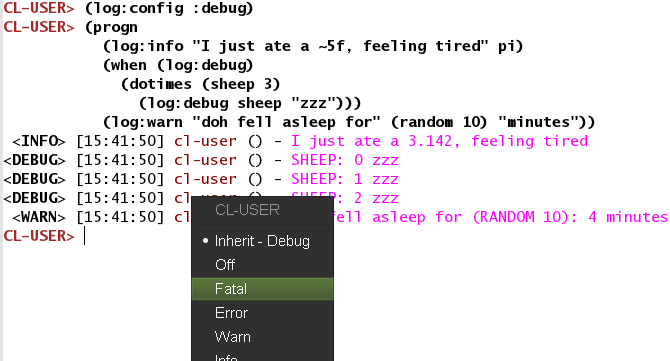
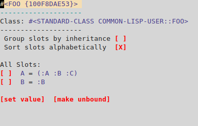
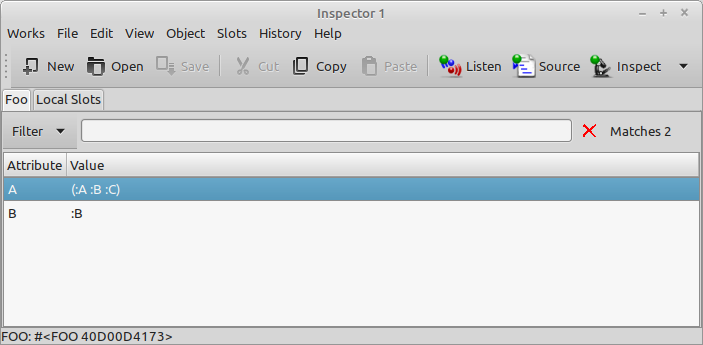

You entered this new world of Lisp and now wonder: how can we debug
what's going on? How is it more interactive than other platforms?
What does the interactive debugger bring, apart from stack traces?

## Print debugging

Well of course we can use the famous technique of "print
debugging". Let's just recap a few print functions.

`print` works, it prints a `read`able representation of its argument,
which means what is `print`ed can be `read` back in by the Lisp
reader. It accepts only one argument.

`princ` focuses on an *aesthetic* representation.

`(format t "~a" …)`, with the *aesthetic* directive, prints a string (in `t`, the standard output
stream) and returns nil, whereas `format nil …` doesn't print anything
and returns a string. With many format controls we can print several
variables at once.

`print` has this useful debugging feature that it prints *and* returns
the result form it was given as argument. You can intersperse `print`
statements in the middle of your algorithm, it won't break it.

~~~lisp
(+ 2 (print 40))
~~~


## Logging

Logging is already a good evolution from print debugging ;)

[log4cl](https://github.com/sharplispers/log4cl/) is the popular,
de-facto logging library although it isn't the only one. Download it:

~~~lisp
(ql:quickload "log4cl")
~~~

and let's have a dummy variable:

~~~lisp
(defvar *foo* '(:a :b :c))
~~~

We can use log4cl with its `log` nickname, then it is as simple to use as:

~~~lisp
(log:info *foo*)
;; <INFO> [13:36:49] cl-user () - *FOO*: (:A :B :C)
~~~

We can interleave strings and expressions, with or without `format`
control strings:

~~~lisp
(log:info "foo is " *foo*)
;; <INFO> [13:37:22] cl-user () - foo is *FOO*: (:A :B :C)
(log:info "foo is ~{~a~}" *foo*)
;; <INFO> [13:39:05] cl-user () - foo is ABC
~~~

With its companion library `log4slime`, we can interactively change
the log level:

- globally
- per package
- per function
- and by CLOS methods and CLOS hierarchy (before and after methods)

It is very handy, when we have a lot of output, to turn off the
logging of functions or packages we know to work, and thus narrowing
our search to the right area. We can even save this configuration and
re-use it in another image, be it on another machine.

We can do all this through commands, keyboard shortcuts and also through a
menu or mouse clicks.



We invite you to read log4cl's README.

## Using the powerful REPL

Part of the joy of Lisp is the excellent REPL. Its existence usually
delays the need to use other debugging tools, if it doesn't annihilate
them for the usual routine.

As soon as we define a function, we can try it in the REPL. In Slime,
compile a function with `C-c C-c` (the whole buffer with `C-c C-k`),
switch to the REPL with `C-c C-z` and try it. Eventually enter the
package you are working on with `(in-package :your-package)`
or `C-c ~` (`slime-sync-package-and-default-directory`,
which will also change the default working directory to the package definition's directory).

The feedback is immediate. There is no need to recompile everything,
nor to restart any process, nor to create a main function and define
command line arguments for use in the shell (which we can of course do later on
when needed).

We usually need to create some data to test our function(s). This is a
subsequent art of the REPL existence and it may be a new discipline
for newcomers. A trick is to write the test data alongside your
functions but below a `#+nil` feature test (or safer, `+(or)`: it is still possible that someone pushed `NIL` to the `*features*` list) so that only you can
manually compile them:

~~~lisp
#+nil
(progn
   (defvar *test-data* nil)
   (setf *test-data* (make-instance 'foo …)))
~~~

When you load this file, `*test-data*` won't exist, but you can
manually create it with `C-c C-c`.

We can define tests functions like this.

Some do similarly inside `#| … |#` comments.

All that being said, keep in mind to write unit tests when time comes ;)


## Inspect and describe

These two commands share the same goal, printing a description of an
object, `inspect` being the interactive one.

~~~
(inspect *foo*)

The object is a proper list of length 3.
0. 0: :A
1. 1: :B

2. 2: :C
> q
~~~

We can also, in editors that support it, right-click on any object in
the REPL and `inspect` them (or `C-c I` on the object to inspect in Slime).
We are presented a screen where we can
dive deep inside the data structure and even change it.

Let's have a quick look with a more interesting structure, an object:

~~~lisp
(defclass foo ()
    ((a :accessor foo-a :initform '(:a :b :c))
     (b :accessor foo-b :initform :b)))
;; #<STANDARD-CLASS FOO>
(make-instance 'foo)
;; #<FOO {100F2B6183}>
~~~

We right-click on the `#<FOO` object and choose "inspect". We are
presented an interactive pane (in Slime):



When we click or press enter on the line of slot A, we inspect it further:

```
#<CONS {100F5E2A07}>
--------------------
A proper list:
0: :A
1: :B
2: :C
```

In LispWorks, we can use a graphical inspector:




## Trace

[trace](http://www.lispworks.com/documentation/HyperSpec/Body/m_tracec.htm) allows us to see when a
function was called, what arguments it received, and the value it
returned.

~~~lisp
(defun factorial (n)
  (if (plusp n)
    (* n (factorial (1- n)))
    1))
~~~

To start tracing a function, just call `trace` with the function name
(or several function names):

~~~lisp
(trace factorial)

(factorial 2)
  0: (FACTORIAL 3)
    1: (FACTORIAL 2)
      2: (FACTORIAL 1)
        3: (FACTORIAL 0)
        3: FACTORIAL returned 1
      2: FACTORIAL returned 1
    1: FACTORIAL returned 2
  0: FACTORIAL returned 6
6

(untrace factorial)
~~~

To untrace all functions, just evaluate `(untrace)`.

To get a list of currently traced functions, evaluate `(trace)` with no arguments.

In Slime we have the shortcut `C-c M-t` to trace or untrace a
function.

If you don't see recursive calls, that may be because of the
compiler's optimizations. Try this before defining the function to be
traced:

~~~lisp
(declaim (optimize (debug 3)))  ;; or C-u C-c C-c to compile with maximal debug settings.
~~~

The output is printed to `*trace-output*` (see the CLHS).

In Slime, we also have an interactive trace dialog with ``M-x
slime-trace-dialog`` bound to `C-c T`.


### Trace options

`trace` accepts options. For example, you can use `:break t` to invoke
the debugger at the start of the function, before it is called (more on break below):

~~~lisp
(trace factorial :break t)
(factorial 2)
~~~

We can define many things in one call to `trace`. For instance,
options that appear before the first function name to trace are
*global*, they affect all traced functions that we add afterwards. Here,
`:break t` is set for every function that follows: `factorial`, `foo`
and `bar`:

~~~lisp
(trace :break t factorial foo bar)
~~~

On the contrary, if an option comes after a function name, it acts as
a *local* option, only for its *preceding* function. That's how we first
did. Below `foo` and `bar` come after, they are not affected by `:break`:

~~~lisp
(trace factorial :break t foo bar)
~~~

But do you actually want to `break` *before* the function call or just
*after* it? With `:break` as with many options, you can choose. These
are the options for `:break`:

```
:break form  ;; before
:break-after form
:break-all form ;; before and after
```

`form` can be any form that evaluates to true.

Note that we explained the trace function of SBCL. Other
implementations may have the same feature with another syntax and
other option names.  For example, in LispWorks it is ":break-on-exit"
instead of ":break-after", and we write `(trace (factorial :break t))`.

Below are some other options but first, a trick with `:break`.

### Trace options: break

The argument to an option can be any form. Here's a trick, on SBCL, to
get the break window when we are about to call `factorial`
with 0. `(sb-debug:arg 0)` refers to `n`, the first argument.

~~~lisp
CL-USER> (trace factorial :break (equal 0 (sb-debug:arg 0)))
;; WARNING: FACTORIAL is already TRACE'd, untracing it first.
;; (FACTORIAL)
~~~

Running it again:

```
CL-USER> (factorial 3)
  0: (FACTORIAL 3)
    1: (FACTORIAL 2)
      2: (FACTORIAL 1)
        3: (FACTORIAL 0)

breaking before traced call to FACTORIAL:
   [Condition of type SIMPLE-CONDITION]

Restarts:
 0: [CONTINUE] Return from BREAK.
 1: [RETRY] Retry SLIME REPL evaluation request.
 2: [*ABORT] Return to SLIME's top level.
 3: [ABORT] abort thread (#<THREAD "repl-thread" RUNNING {1003551BC3}>)

Backtrace:
  0: (FACTORIAL 1)
      Locals:
        N = 1   <---------- before calling (factorial 0), n equals 1.
```


### Trace options: trace on conditions, trace if called from another function

`:condition` enables tracing only if the condition in `form` evaluates to true.

```
:condition form
:condition-after form
:condition-all form
```

> If :condition is specified, then trace does nothing unless Form
> evaluates to true at the time of the call. :condition-after is
> similar, but suppresses the initial printout, and is tested when the
> function returns. :condition-all tries both before and after.

`:wherein` can be super useful:

```
:wherein Names
```

> If specified, Names is a function name or list of names. trace does nothing unless a call to one of those functions encloses the call to this function (i.e. it would appear in a backtrace.) Anonymous functions have string names like "DEFUN FOO".


```
:report Report-Type
```

> If Report-Type is trace (the default) then information is reported
> by printing immediately. If Report-Type is nil, then the only effect
> of the trace is to execute other options (e.g. print or
> break). Otherwise, Report-Type is treated as a function designator
> and, for each trace event, funcalled with 5 arguments: trace depth
> (a non-negative integer), a function name or a function object, a
> keyword (:enter, :exit or :non-local-exit), a stack frame, and a
> list of values (arguments or return values).

See also `:print` to enrich the trace output.

It is expected that implementations extend `trace` with non-standard
options. And we didn't list all available options, so please refer to
your implementation's documentation:

- [SBCL trace](http://www.sbcl.org/manual/index.html#Function-Tracing)
- [CCL trace](https://ccl.clozure.com/manual/chapter4.2.html)
- [LispWorks trace](http://www.lispworks.com/documentation/lw80/lw/lw-tracer-ug-2.htm)
- [Allegro trace](https://franz.com/support/documentation/current/doc/debugging.htm#tracer-1)


### Tracing method invocation

In SBCL, we can use `(trace foo :methods t)` to trace the execution order of method combination (before, after, around methods). For example:

~~~lisp
(trace foo :methods t)

(foo 2.0d0)
  0: (FOO 2.0d0)
    1: ((SB-PCL::COMBINED-METHOD FOO) 2.0d0)
      2: ((METHOD FOO (FLOAT)) 2.0d0)
        3: ((METHOD FOO (T)) 2.0d0)
        3: (METHOD FOO (T)) returned 3
      2: (METHOD FOO (FLOAT)) returned 9
      2: ((METHOD FOO :AFTER (DOUBLE-FLOAT)) 2.0d0)
      2: (METHOD FOO :AFTER (DOUBLE-FLOAT)) returned DOUBLE
    1: (SB-PCL::COMBINED-METHOD FOO) returned 9
  0: FOO returned 9
9
~~~

It is also possible in CCL.

See the [CLOS](clos.html) section for a tad more information.


## The interactive debugger

Whenever an exceptional situation happens (see
[error handling](error_handling.html)), or when you ask for it (using `step` or `break`),
the interactive debugger pops up.

It presents the error message, the available actions (*restarts*),
and the backtrace. A few remarks:

- the restarts are programmable, we can create our own.
- in Slime, press `v` on a stack trace frame to view the corresponding
  source file location.
- hit Enter (or `t`) on a frame to toggle more details,
- use `e` to evaluate some code from within that frame,
- hit `r` to restart a given frame (see below).
- we can explore the functionality with the menu that should appear
  in our editor.

### Compile with maximum debugging information

Usually your compiler will optimize things out and this will reduce
the amount of information available to the debugger. For example
sometimes we can't see intermediate variables of computations. We can
change the optimization choices with:

~~~lisp
(declaim (optimize (speed 0) (space 0) (debug 3)))
~~~

and recompile our code. You can achieve the same with a handy shortcut: `C-u C-c C-c`: the form is compiled with maximum debug settings. You can on the contrary use a negative prefix argument (`M--`) to compile for speed. And use a numeric argument to set the setting to it (you should read the docstring of `slime-compile-defun`).


## Step

[step](http://www.lispworks.com/documentation/HyperSpec/Body/m_step.htm) is an interactive command with similar scope than `trace`. This:

~~~lisp
;; note: we copied factorial over to a file, to have more debug information.
(step (factorial 3))
~~~

gives an interactive pane with available actions (restarts) and the backtrace:

```
Evaluating call:
  (FACTORIAL 3)
With arguments:
  3
   [Condition of type SB-EXT:STEP-FORM-CONDITION]

Restarts:
 0: [STEP-CONTINUE] Resume normal execution   <---------- stepping actions
 1: [STEP-OUT] Resume stepping after returning from this function
 2: [STEP-NEXT] Step over call
 3: [STEP-INTO] Step into call
 4: [RETRY] Retry SLIME REPL evaluation request.
 5: [*ABORT] Return to SLIME's top level.
 --more--

Backtrace:
  0: (FACTORIAL 3)     <----------- press Enter to fold/unfold.
      Locals:
        N = 3          <----------- want to check? Move the point here and
                                    press "e" to evaluate code on that frame.

  1: (SB-INT:SIMPLE-EVAL-IN-LEXENV (LET ((SB-IMPL::*STEP-OUT* :MAYBE)) (UNWIND-PROTECT (SB-IMPL::WITH-STEPPING-ENABLED #))) #S(SB-KERNEL:LEXENV :FUNS NIL :VARS NIL :BLOCKS NIL :TAGS NIL :TYPE-RESTRICTIONS ..
  2: (SB-INT:SIMPLE-EVAL-IN-LEXENV (STEP (FACTORIAL 3)) #<NULL-LEXENV>)
  3: (EVAL (STEP (FACTORIAL 3)))
 --more--

```

*(again, be sure you compiled your function with maximum debug
settings (see above). Otherwise, your compiler might do optimizations
under the hood and you might not see useful information such as local
variables, or you might not be able to step at all.)*

You have many options here. If you are using Emacs (or any other
editor actually), keep in mind that you have a "SLDB" menu that shows
you the available actions, in addition to the step window.

- follow the restarts to **continue stepping**: continue the
  execution, step out of this function, step into the function call
  the point is on, step over to the next function call, or abort
  everything. The shortcuts are:
  - `c`: continue
  - `s`: step
  - `x`: step next
  - `o`: step out

- **inspect the backtrace** and the source code. You can go to the
  source file with `v`, on each stackframe (each line of the
  backtrace). Press `Enter` or `t` ("toggle details") on the
  stackframe to see more information, such as the function parameters
  for this call. Use `n` and `p` to navigate, use `M-n` and `M-p` to
  navigate to the next or previous stackframe *and* to open the
  corresponding source file at the same time. The point will be placed
  on the function being called.

- **evaluate code from within the context** of that stackframe. In
  Slime, use `e` ("eval in frame" and `d` to pretty-pint the result) and
  type a Lisp form. It will be executed in the context of the
  stackframe the point is on. Look, you can even inspect variables and
  have Slime open another inspector window. If you are on the first
  frame (`0:`), press `i`, then "n" to inspect the intermediate
  variable.

- **resume execution** from where you want. Use `r` to restart the
  frame the point is on. For example, go change the source code
  (without quitting the interactive debugger), re-compile it, re-run
  the frame to see if it works better. You didn't restart all the
  program execution, you just restarted your program from a precise
  point. Use `R` to return from a stackframe, by giving its return
  value.

<div class="info-box info" style="margin-bottom: 1em">
<!-- if inside a <p> then bootstrap adds 10px padding to the bottom -->
<strong>NB:</strong> let's think about it, <strong>this is awesome!</strong> We just restarted our program from any point in time. If we work with long-running computations, we don't need to restart it from the start. We can change, re-compile our erroneous code and resume execution from where it is needed to pass, no more.
</div>

Stepping is precious. However, if you find yourself inspecting the
behaviour of a function a lot, it may be a sign that you need to
simplify it and divide it in smaller pieces.

And again, LispWorks has a graphical stepper.

### Resume a program execution from anywhere in the stack

In [this video](https://www.youtube.com/watch?v=jBBS4FeY7XM) you will
find a demo that shows the process explained above: how to fix a buggy
function and how to resume the program execution from anywhere in the
stack, without running everything from zero again. The video shows it
with Emacs and Slime, the Lem editor, both with SBCL.

<!-- epub-exclude-start -->

<iframe width="560" height="315" src="https://www.youtube-nocookie.com/embed/jBBS4FeY7XM" title="YouTube video player" frameborder="0" allow="accelerometer; autoplay; clipboard-write; encrypted-media; gyroscope; picture-in-picture" allowfullscreen></iframe>

<!-- epub-exclude-end -->


## Break

A call to
[break](http://www.lispworks.com/documentation/HyperSpec/Body/f_break.htm)
makes the program enter the debugger, from which we can inspect the
call stack, and do everything described above in the stepper.


### Breakpoints in Slime

Look at the `SLDB` menu, it shows navigation keys and available
actions. Of which:

- `e` (*sldb-eval-in-frame*) prompts for an expression and evaluates
  it in the selected frame. This is how we can explore our
  intermediate variables
- `d` is similar with the addition of pretty printing the result

Once we are in a frame and detect a suspicious behavior, we can even
re-compile a function at runtime and resume the program execution from
where it stopped (using the "step-continue" restart
or using `r` ("restart frame") on a given stackframe).

See also the [Slime-star](https://github.com/mmontone/slime-star) Emacs extension to set breakpoints without code annotations.


## Advise and watch

*advise* and *watch* are available in some
implementations, like CCL
([advise](https://ccl.clozure.com/manual/chapter4.3.html#Advising) and
[watch](https://ccl.clozure.com/manual/chapter4.12.html#watched-objects))
and LispWorks. They do exist in
SBCL but are not exported. `advise` allows to modify a function without changing its
source, or to do something before or after its execution, similar
to CLOS method combination (before, after, around methods).

`watch` will signal a condition when a thread attempts to write to an
object being watched. It can be coupled with the display of the
watched objects in a GUI.
For a certain class of bugs (someone is changing this value, but I
don't know who), this can be extremely helpful.

## Cross-referencing

Your Lisp can tell you all the places where a function is referenced
or called, where a global variable is set, where a macro is expanded,
and so on. For example, `slime-who-calls` (`C-c C-w C-c` or the Slime > Cross-Reference menu) will show you all the places where a function is called.

See our Emacs page for a complete list of commands.

## SLY stepper and SLY stickers

SLY has an improved
[stepper](https://github.com/joaotavora/sly-stepper) and a unique
feature, [stickers](https://joaotavora.github.io/sly/#Stickers). You
mark a piece of code, you run your code, SLY captures the results for
each sticker and lets you examine the program execution
interactively. It allows to see what sticker was captured, or
not, so we can see at a glance the code coverage of that function
call.

They are a non-intrusive alternative to `print` and `break`.

## Unit tests

Last but not least, automatic testing of functions in isolation might
be what you're looking for! See the [testing](testing.html) section and a list of
[test frameworks and libraries](https://github.com/CodyReichert/awesome-cl#unit-testing).


## Remote debugging

You can have your software running on a machine over the network,
connect to it and debug it from home, from your development
environment.

The steps involved are to start a **Swank server** on the remote machine (Swank is the backend companion of Slime), create an
ssh tunnel and connect to the Swank server from our editor. Then we
can browse and evaluate code on the running instance transparently.

To test this, let's define a function that prints forever.

If needed, import the dependencies first:

~~~lisp
(ql:quickload '("swank" "bordeaux-threads"))
~~~


~~~lisp
;; a little common lisp swank demo
;; while this program is running, you can connect to it from another terminal or machine
;; and change the definition of doprint to print something else out!

(require :swank)
(require :bordeaux-threads)

(defparameter *counter* 0)

(defun dostuff ()
  (format t "hello world ~a!~%" *counter*))

(defun runner ()
  (swank:create-server :port 4006)
  (format t "we are past go!~%")
  (bt:make-thread (lambda ()
                    (loop repeat 5 do
                          (sleep 5)
                          (dostuff)
                          (incf *counter*)))
                  :name "do-stuff"))

(runner)
~~~

On the server, we can run this code with

    sbcl --load demo.lisp

If you check with `(bt:all-threads)`, you'll see your Swank server running on port 4006, as well
as the other thread ready to do stuff:

    (#<SB-THREAD:THREAD "do-stuff" RUNNING {10027CEDC3}>
     #<SB-THREAD:THREAD "Swank Sentinel" waiting on:
          #<WAITQUEUE  {10027D0003}>
        {10027CE8B3}>
     #<SB-THREAD:THREAD "Swank 4006" RUNNING {10027CEB63}>
     #<SB-THREAD:THREAD "main thread" RUNNING {1007C40393}>)

We do port forwarding on our development machine:

    ssh -L4006:127.0.0.1:4006 username@example.com

this will securely forward port 4006 on the server at example.com to
our local computer's port 4006 (Swank only accepts connections from
localhost).

We connect to the running Swank with `M-x slime-connect`, choosing localhost for the host
and port 4006.

We can write new code:

~~~lisp
(defun dostuff ()
  (format t "goodbye world ~a!~%" *counter*))
(setf *counter* 0)
~~~

and eval it as usual with `C-c C-c` or `M-x slime-eval-region` for instance. The output should change.

That's how Ron Garret debugged the Deep Space 1 spacecraft from the earth
in 1999:

> We were able to debug and fix a race condition that had not shown up during ground testing. (Debugging a program running on a $100M piece of hardware that is 100 million miles away is an interesting experience. Having a read-eval-print loop running on the spacecraft proved invaluable in finding and fixing the problem.


## References

- ["How to understand and use Common Lisp"](https://successful-lisp.blogspot.com/p/httpsdrive.html), chap. 30, David Lamkins (book download from author's site)
- [Malisper: debugging Lisp series](https://malisper.me/debugging-lisp-part-1-recompilation/)
- [Two Wrongs: debugging Common Lisp in Slime](https://two-wrongs.com/debugging-common-lisp-in-slime.html)
- [Slime documentation: connecting to a remote Lisp](https://common-lisp.net/project/slime/doc/html/Connecting-to-a-remote-lisp.html#Connecting-to-a-remote-lisp)
- [cvberrycom: remotely modifying a running Lisp program using Swank](http://cvberry.com/tech_writings/howtos/remotely_modifying_a_running_program_using_swank.html)
- [Ron Garret: Lisping at the JPL](http://www.flownet.com/gat/jpl-lisp.html#1994-1999%20-%20Remote%20Agent)
- [the Remote Agent experiment: debugging code from 60 million miles away (youtube)](https://www.youtube.com/watch?v=_gZK0tW8EhQ&feature=youtu.be&t=4175) (["AMA" on reddit](https://www.reddit.com/r/lisp/comments/a7156w/lisp_and_the_remote_agent/))
