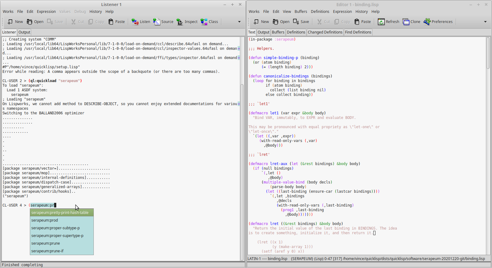

The editor of choice is still [Emacs](https://www.gnu.org/software/emacs/), but it is not the only one.

## Emacs

[SLIME](https://github.com/slime/slime/) is the Superior Lisp
Interaction Mode for Emacs. It has support for interacting with a
running Common Lisp process for compilation, debugging, documentation
lookup, cross-references, and so on. It works with many implementations.

[Portacle](https://shinmera.github.io/portacle/) is a portable and
multi-platform Common Lisp environment. It ships Emacs, SBCL,
Quicklisp, SLIME and Git.

### Installing SLIME

SLIME is in the official GNU ELPA repository of Emacs Lisp packages
(in Emacs24 and forward). Install with:

    M-x package-install RET slime RET

Since SLIME is heavily modular and the defaults only do the bare minimum (not
even the SLIME REPL), you might want to enable more features with

~~~lisp
(slime-setup '(slime-fancy slime-quicklisp slime-asdf))
~~~

For more details, consult the
[documentation](https://common-lisp.net/project/slime/doc/html/) (also available
as an Info page).

Now you can run SLIME with `M-x slime` and/or `M-x slime-connect`.

See also:

* [https://wikemacs.org/wiki/SLIME](https://wikemacs.org/wiki/SLIME) - configuration examples and extensions.

### Using Emacs as an IDE

See ["Using Emacs as an IDE"](emacs-ide.html).

## Vim & Neovim

[Slimv](https://github.com/kovisoft/slimv) is a full-blown
environment for Common Lisp inside of Vim.

[Vlime](https://github.com/vlime/vlime) is a Common Lisp dev
environment for Vim (and Neovim), similar to SLIME for Emacs and SLIMV
for Vim.

[cl-neovim](https://github.com/adolenc/cl-neovim/) makes it possible to write
Neovim plugins in Common Lisp.

[quicklisp.nvim](https://gitlab.com/HiPhish/quicklisp.nvim) is a Neovim
frontend for Quicklisp.

[Slimv_box](https://github.com/justin2004/slimv_box) brings Vim, SBCL, ABCL,
and tmux in a Docker container for a quick installation.

See also:

* [Lisp in Vim](https://susam.net/blog/lisp-in-vim.html) demonstrates usage and
  compares both Slimv and Vlime

## Pulsar (ex Atom)

See [SLIMA](https://github.com/neil-lindquist/slima). This package
allows you to interactively develop Common Lisp code, turning Atom, or
now [Pulsar](https://github.com/pulsar-edit/pulsar), into a pretty
good Lisp IDE. It features:

* REPL
* integrated debugger
  * (not a stepping debugger yet)
* jump to definition
* autocomplete suggestions based on your code
* compile this function, compile this file
* function arguments order
* integrated profiler
* interactive object inspection.

It is based on the Swank backend, like Slime for Emacs.

## VSCode

[Alive](https://marketplace.visualstudio.com/items?itemName=rheller.alive) makes
VSCode a powerful Common Lisp development. It hooks directly into the Swank
server that Emacs Slime uses and is fully compatible with VSCode's ability to
develop remotely in containers, WSL, Remote machines, etc. It has no
dependencies beyond a version of Common Lisp on which to run the Swank server.
It can be configured to run with Quicklisp, CLPM, and Roswell. It currently
supports:

- Syntax highlighting
- Code completion
- Code formatter
- Jump to definition
- Snippets
- REPL integration
- Interactive Debugger
- REPL history
- Inline evaluation
- Macro expand
- Disassemble
- Inspector
- Hover Text
- Rename function args and let bindings
- Code folding

[commonlisp-vscode
extension](https://marketplace.visualstudio.com/items?itemName=ailisp.commonlisp-vscode)
works via the [cl-lsp](https://github.com/ailisp/cl-lsp) language server and
it's possible to write LSP client that works in other editors. It depends
heavily on [Roswell](https://roswell.github.io/Home.html). It currently
supports:

- running a REPL
- evaluate code
- auto indent,
- code completion
- go to definition
- documentation on hover

### Using VSCode with Alive

See [Using VSCode with Alive](vscode-alive.html).

## JetBrains - NEW in Jan, 2023!

[SLT](https://github.com/Enerccio/SLT) is a new (published on January,
2023) plugin for the suite of JetBrains' IDEs. It uses a modified SLIME/Swank
protocol to commmunicate with SBCL, providing IDE capabilities for
Common Lisp.

It has a very good [user guide](https://github.com/Enerccio/SLT/wiki/User-Guide).

At the time of writing, for its version 0.4, it supports:

- REPL
- symbol completion
- send expressions to the REPL
- interactive debugging, breakpoints
- documentation display
- cross-references
- find symbol by name, global class/symbol search
- inspector (read-only)
- graphical threads list
- SDK support, automatic download for Windows users
- multiple implementations support: SBCL, CCL, ABCL and AllegroCL.

## Eclipse

[Dandelion](https://github.com/Ragnaroek/dandelion) is a plugin for the
Eclipse IDE.

Available for Windows, Mac and Linux, built-in SBCL and CLISP support
and possibility to connect other environments, interactive debugger
with restarts, macro-expansion, parenthesis matching,…

## Lem

[Lem](https://github.com/lem-project/lem/wiki) is an editor tailored for Common Lisp development. Once you
install it, you can start developing. Its interface resembles Emacs
and SLIME (same shortcuts). It comes with an ncurses and an Electron
frontend, and other programming modes: Python, Go, Rust, JS, Nim,
Scheme, HTML, CSS, directory mode, a vim layer, and more.

It can be started as a REPL right away in the terminal. Run it with:

    lem --eval "(lem-lisp-mode:start-lisp-repl t)"

So you probably want a shell alias:

    alias ilem='lem --eval "(lem-lisp-mode:start-lisp-repl t)"'

## Sublime Text

[Sublime Text](http://www.sublimetext.com/3) has now good support for
Common Lisp.

First install the "SublimeREPL" package and then see the options
in Tools/SublimeREPL to choose your CL implementation.

Then [Slyblime](https://github.com/s-clerc/slyblime) ships IDE-like
features to interact with the running Lisp image. It is an
implementation of SLY and it uses the same backend (SLYNK). It
provides advanced features including a debugger with stack frame
inspection.

## LispWorks (proprietary)

[LispWorks](http://www.lispworks.com/) is a Common Lisp implementation that
comes with its own Integrated Development Environment (IDE) and its share of
unique features, such as the CAPI GUI toolkit. It is **proprietary** and
provides a **free limited version**.

You can [read our LispWorks review here](lispworks.html).

## Geany (experimental)

[Geany-lisp](https://github.com/jasom/geany-lisp) is an experimental
lisp mode for the [Geany](https://geany.org/) editor. It features completion of symbols,
smart indenting, jump to definition, compilation of the current file and
highlighting of errors and warnings, a REPL, and a project skeleton creator.

## Notebooks

[common-lisp-jupyter](https://github.com/yitzchak/common-lisp-jupyter) is a Common Lisp
kernel for Jupyter notebooks.

You can [see a live Jupyter notebook written in Lisp here](https://nbviewer.jupyter.org/github/yitzchak/common-lisp-jupyter/blob/master/examples/about.ipynb). It is easy to install (Roswell, repo2docker and Docker recipes).

There is also [Darkmatter](https://github.com/tamamu/darkmatter), a notebook-style
Common Lisp environment, built in Common Lisp.

## REPLs

[cl-repl](https://github.com/koji-kojiro/cl-repl) is an ipython-like REPL. It supports symbol completion, magic and shell commands, editing command in a file and a simple debugger.

You might also like [sbcli](https://github.com/hellerve/sbcli), an even simpler REPL with readline capabilities. It handles errors gracefully instead of showing a debugger.

## Others

There are some more editors out there, more or less discontinued, and
free versions of other Lisp vendors, such as Allegro CL.
