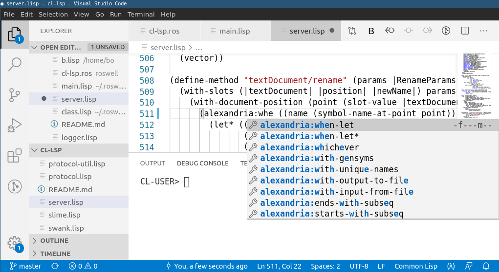

The editor of choice is still [Emacs](https://www.gnu.org/software/emacs/), but it is not the only one.

## Emacs

[SLIME](https://github.com/slime/slime/) is the Superior Lisp
Interaction Mode for Emacs. It has support for interacting with a
running Common Lisp process for compilation, debugging, documentation
lookup, cross-references, and so on. It works with many implementations.

[IDEmacs](https://codeberg.org/IDEmacs/IDEmacs) is an attempt at
making Emacs beginner friendly. It ships Sly for Common Lisp. With
Emacs v29 or higher, you can try IDEmacs temporarily without messing
with your .emacs configuration, thanks to the new `--init-directory`
option. Other Emacs distributions such as [Doom](https://github.com/doomemacs/doomemacs/blob/3e15fb36d7f94f0a218bda977be4d3f5da983a71/modules/lang/common-lisp/README.org#L9) or
[Spacemacs](https://www.spacemacs.org/layers/LAYERS.html#lisp-dialects)
ship CL support (Sly and Slime, respectively).

[plain-common-lisp](https://github.com/pascalcombier/plain-common-lisp/)
is a crafted, easy-to-install Common Lisp environment for
**Windows**. It ships Emacs, SBCL, Slime, Quicklisp. It also shows how
to display GUI windows with Win32, Tk, IUP, ftw and Opengl.

<!-- pdf-include-start

   pdf-include-end -->

<!-- todo: PDF generation: lacks IMG images -->

### Using Emacs as an IDE

See ["Using Emacs as an IDE"](emacs-ide.html).

## Vim & Neovim

[Slimv](https://github.com/kovisoft/slimv) is a full-blown
environment for Common Lisp inside of Vim.

[Vlime](https://github.com/vlime/vlime) is a Common Lisp dev
environment for Vim (and Neovim), similar to SLIME for Emacs and SLIMV
for Vim.

<!-- pdf-include-start

   pdf-include-end -->

[cl-neovim](https://github.com/adolenc/cl-neovim/) makes it possible to write
Neovim plugins in Common Lisp.

[quicklisp.nvim](https://gitlab.com/HiPhish/quicklisp.nvim) is a Neovim
frontend for Quicklisp.

[Slimv_box](https://github.com/justin2004/slimv_box) brings Vim, SBCL, ABCL,
and tmux in a Docker container for a quick installation.

See also:

* [Lisp in Vim](https://susam.net/blog/lisp-in-vim.html) demonstrates usage and
  compares both Slimv and Vlime

## Pulsar (ex Atom)

See [SLIMA](https://github.com/neil-lindquist/slima). This package
allows you to interactively develop Common Lisp code, turning Atom, or
now [Pulsar](https://github.com/pulsar-edit/pulsar), into a pretty
good Lisp IDE. It features:

* REPL
* integrated debugger
  * (not a stepping debugger yet)
* jump to definition
* autocomplete suggestions based on your code
* compile this function, compile this file
* function arguments order
* integrated profiler
* interactive object inspection.

It is based on the Swank backend, like Slime for Emacs.

<!-- pdf-include-start

   pdf-include-end -->

## VSCode

[Alive](https://marketplace.visualstudio.com/items?itemName=rheller.alive) makes
VSCode a powerful Common Lisp development. It hooks directly into the Swank
server that Emacs Slime uses and is fully compatible with VSCode's ability to
develop remotely in containers, WSL, Remote machines, etc. It has no
dependencies beyond a version of Common Lisp on which to run the Swank server.
It can be configured to run with Quicklisp, CLPM, and Roswell. It currently
supports:

- Syntax highlighting
- Code completion
- Code formatter
- Jump to definition
- Snippets
- REPL integration
- Interactive Debugger
- REPL history
- Inline evaluation
- Macro expand
- Disassemble
- Inspector
- Hover Text
- Rename function args and let bindings
- Code folding

<!-- pdf-include-start

   pdf-include-end -->

[commonlisp-vscode
extension](https://marketplace.visualstudio.com/items?itemName=ailisp.commonlisp-vscode)
works via the [cl-lsp](https://github.com/ailisp/cl-lsp) language server and
it's possible to write LSP client that works in other editors. It depends
heavily on [Roswell](https://roswell.github.io/Home.html). It currently
supports:

- running a REPL
- evaluate code
- auto indent,
- code completion
- go to definition
- documentation on hover

<!-- pdf-include-start

   pdf-include-end -->

### Using VSCode with Alive

See [Using VSCode with Alive](vscode-alive.html).

## JetBrains - NEW in Jan, 2023!

[SLT](https://github.com/Enerccio/SLT) is a new (published on January,
2023) plugin for the suite of JetBrains' IDEs. It uses a modified SLIME/Swank
protocol to commmunicate with SBCL, providing IDE capabilities for
Common Lisp.

It has a very good [user guide](https://github.com/Enerccio/SLT/wiki/User-Guide).

At the time of writing, for its version 0.4, it supports:

- REPL
- symbol completion
- send expressions to the REPL
- interactive debugging, breakpoints
- documentation display
- cross-references
- find symbol by name, global class/symbol search
- inspector (read-only)
- graphical threads list
- SDK support, automatic download for Windows users
- multiple implementations support: SBCL, CCL, ABCL and AllegroCL.

<!-- pdf-include-start

   pdf-include-end -->

## Eclipse

[Dandelion](https://github.com/Ragnaroek/dandelion) is a plugin for the
Eclipse IDE.

Available for Windows, Mac and Linux, built-in SBCL and CLISP support
and possibility to connect other environments, interactive debugger
with restarts, macro-expansion, parenthesis matching,…

<!-- pdf-include-start

   pdf-include-end -->

## Lem

[Lem](https://github.com/lem-project/lem/) is a general-purpose
editor. It is built in Common Lisp, it is extensible interactively from the ground
up in Common Lisp, and it is tailored for Common Lisp
development. Once you install it, you can start working.
It supports [many programming languages out of the box](https://lem-project.github.io/modes/)
thanks to
its built-in LSP client: Python, Go, Rust, JS, Clojure, Kotlin, Scheme, HTML, CSS…
It has a directory mode, a good vim layer, an interactive Git mode, and more.

Its interface resembles Emacs and SLIME (same shortcuts). It comes with an
ncurses frontend, a web view and a (deprecated) SDL2 frontend.
You can download pre-built binaries for the three platforms.

<!-- pdf-include-start

   pdf-include-end -->

It can be started as a REPL right away in the terminal. Run it with:

    lem --eval "(lem-lisp-mode:start-lisp-repl t)"

So you probably want a shell alias:

    alias ilem='lem --eval "(lem-lisp-mode:start-lisp-repl t)"'

There is more:

* 🚀 [Lem on the cloud](https://www.youtube.com/watch?v=IMN7feOQOak) (video presentation) Rooms is a product that runs Lem, a text editor created in Common Lisp, in the Cloud and can be used by multiple users.
  * Lem on the cloud is NEW as of April, 2024. In private beta at the time of writing.

<!-- pdf-include-start

   pdf-include-end -->

## Sublime Text

[Sublime Text](http://www.sublimetext.com/3) has now good support for
Common Lisp.

First install the "SublimeREPL" package and then see the options
in Tools/SublimeREPL to choose your CL implementation.

Then [Slyblime](https://github.com/s-clerc/slyblime) ships IDE-like
features to interact with the running Lisp image. It is an
implementation of SLY and it uses the same backend (SLYNK). It
provides advanced features including a debugger with stack frame
inspection.

<!-- pdf-include-start

   pdf-include-end -->

## LispWorks (proprietary)

[LispWorks](http://www.lispworks.com/) is a Common Lisp implementation that
comes with its own Integrated Development Environment (IDE) and its share of
unique features, such as the CAPI GUI toolkit. It is **proprietary** and
provides a **free limited version**.

You can [read our LispWorks review here](lispworks.html).

<!-- pdf-include-start

   pdf-include-end -->

## Zed (new as of 2026)

[zed-cl](https://github.com/etyurkin/zed-cl) is an extension for the [Zed](https://zed.dev) editor.

It provides:

- smart type-aware code completion
- smart parameter completion (includes type information when available)
- LSP, tree-sitter
- Jupyter REPL integration
- rainbow brackets support

## Geany (experimental)

[Geany-lisp](https://github.com/jasom/geany-lisp) is an experimental
lisp mode for the [Geany](https://geany.org/) editor. It features completion of symbols,
smart indenting, jump to definition, compilation of the current file and
highlighting of errors and warnings, a REPL, and a project skeleton creator.

<!-- pdf-include-start

   pdf-include-end -->

## Notebooks

[common-lisp-jupyter](https://github.com/yitzchak/common-lisp-jupyter) is a Common Lisp
kernel for Jupyter notebooks.

You can [see a live Jupyter notebook written in Lisp here](https://nbviewer.jupyter.org/github/yitzchak/common-lisp-jupyter/blob/master/examples/about.ipynb). It is easy to install (Roswell, repo2docker and Docker recipes).

<!-- pdf-include-start

   pdf-include-end -->

There is also [Darkmatter](https://github.com/tamamu/darkmatter), a notebook-style
Common Lisp environment, built in Common Lisp.

## REPLs

[ICL](https://github.com/atgreen/icl), Interactive Common Lisp, is an
enhanced REPL for the terminal. It works with any implementation you
have on your system. It brings a *lot* of nice features, such as:

- easy to use terminal-based REPL (code completion, etc)
- browser REPL
  - with a packages and systems browser,
  - documentation browser
  - inspector
  - variable "watcher"
  - data visualization
  - flame graph profiling
- integration with Emacs and Slime or SLY, so you can control the browser-based tools from your favorite editor.

It comes with pre-built binaries. Try it out!

<!-- epub-exclude-start -->

<!-- epub-exclude-end -->

[cl-repl](https://github.com/lisp-maintainers/cl-repl) is an ipython-like REPL. It supports symbol completion, magic and shell commands, multi-line editing, editing command in a file and a simple debugger.

It is available as a binary.

<!-- pdf-include-start

   pdf-include-end -->

## Others

There are some more editors out there, more or less discontinued, and
free versions of other Lisp vendors, such as Allegro CL.

See also [CLOG](https://github.com/rabbibotton/clog), the Common Lisp
Omnificent GUI, a web-based GUI builder that comes with a Lisp editor.
