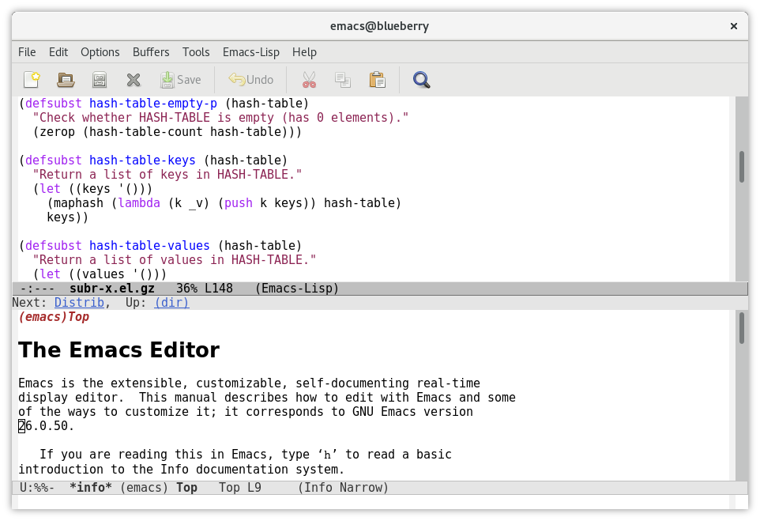
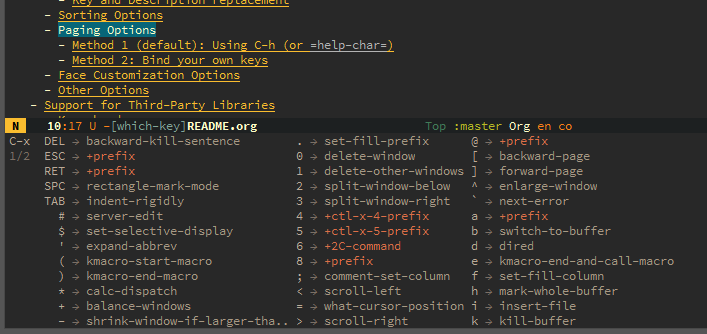
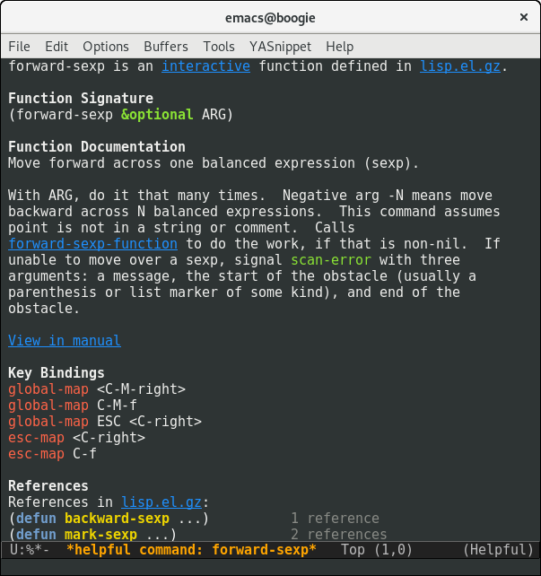
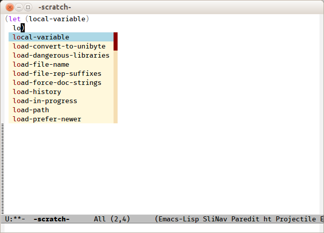

## Using Emacs as an IDE

This page is meant to provide an introduction to using [Emacs](https://www.gnu.org/software/emacs/) as a Lisp IDE.




**Note**: [Portacle](https://shinmera.github.io/portacle/) is a
portable and multi-platform CL development environment, a
straightforward way to get going.


<a name="Slide-2"></a>

### Why Use Emacs?

*   Emacs has fantastic support for working with Lisp code
*   Not tying yourself into a single CL vendor's editor
*   Runs on virtually every OS and CL implementation
*   Extensible: [awesome-emacs](https://github.com/emacs-tw/awesome-emacs).
*   Can be customized to do many common tasks
*   Built-in support for different source code version control systems
*   Vast number of add-on packages
*   Emacs will probably always be around
*   Emacs works well either with a mouse or without a mouse
*   Emacs works well either in GUI mode or in the terminal
*   Emacs has a large user base with multiple newsgroups
*   Benefits of using Emacs far outweigh the effort spent in learning it
*   Because [Org-mode](http://orgmode.org)
*   Because [Magit](https://magit.vc/)
*   Because [Emacs Rocks !](http://emacsrocks.com)

<a name="Slide-3"></a>

### Emacs Lisp vs Common Lisp

*   Learning Emacs Lisp is useful and similar (but different from CL):
    *   Dynamic scope is everywhere
    *   There are no reader (or reader-related) functions
    *   Does not support all the types that are supported in CL
    *   Incomplete implementation of CLOS (with the add-on EIEIO package)
    *   Not all of CL is supported
    *   No numerical tower support

*   Some good Emacs Lisp learning resources:
    *   [An Introduction to Programming in Emacs Lisp](https://www.gnu.org/software/emacs/manual/eintr.html)
    *   [Writing GNU Emacs Extensions](http://www.oreilly.com/catalog/gnuext/)
    *   [Wikemacs](http://wikemacs.org/wiki/Category:Emacs_Lisp)


<a name="Slide-slime"></a>

#### SLIME: Superior Lisp Interaction Mode for Emacs

[SLIME](http://common-lisp.net/project/slime/) is the goto major mode
for CL programming.

*   Pros:
    *   Provides REPL which is hooked to implementation directly in Emacs
    *   Has integrated Common Lisp debugger with Emacs interface
    *   Interactive object-inspector in Emacs buffer
    *   Has its own minor mode which enhances lisp-mode in many ways
    *   Supports every common Common Lisp implementation
    *   Readily available from MELPA
    *   Actively maintained
    *   Symbol completion
    *   Cross-referencing
    *   Can perform macroexpansions

*   Cons:
    *   Installing SLIME without MELPA can be tricky

*   Setup:
    *   Installing it from [MELPA](http://wikemacs.org/wiki/Melpa) is straightforward. Search package-list-packages for 'slime' and click to install. If MELPA is configured correctly, it will install itself and all dependencies.
    *   Enable the desired contribs (SLIME does very little by defaults), e.g. `(slime-setup '(slime-fancy slime-quicklisp slime-asdf))`.
    *   Run SLIME with `M-x slime`.

Check out this **[video tutorial](https://www.youtube.com/watch?v=sBcPNr1CKKw)** ! (and the author's channel, full of great stuff)

##### SLIME fancy, contrib packages and other extensions

SLIME's functionalities live in packages and so-called [contrib
modules](https://common-lisp.net/project/slime/doc/html/Contributed-Packages.html)
must be loaded to add further functionalities. The default
`slime-fancy` includes:


- slime-autodoc
- slime-c-p-c
- slime-editing-commands
- slime-fancy-inspector
- slime-fancy-trace
- slime-fontifying-fu
- slime-fuzzy
- slime-mdot-fu
- slime-macrostep
- slime-presentations
- slime-references
- slime-repl
- slime-scratch
- slime-package-fu
- slime-trace-dialog

SLIME also has some nice extensions like
[Helm-SLIME](https://github.com/emacs-helm/helm-slime) which features, among
others:

- Fuzzy completion,
- REPL and connection listing,
- Fuzzy-search of the REPL history,
- Fuzzy-search of the _apropos_ documentation.

##### REPL interactions

From the SLIME REPL, press `,` to prompt for commands.  There is completion
over the available systems and packages.  Examples:

- `,load-system`
- `,reload-system`
- `,in-package`
- `,restart-inferior-lisp`

and many more.

With the `slime-quicklisp` contrib, you can also `,ql` to list all systems
available for installation.

#### SLY: Sylvester the Cat's Common Lisp IDE

[SLY](https://github.com/joaotavora/sly) is a SLIME fork that contains
the following improvements:

* Completely redesigned REPL based on Emacs's own full-featured comint.el
* Live code annotations via a new [sly-stickers](https://joaotavora.github.io/sly/#Stickers) contrib
* Consistent interactive button interface. Everything can be copied to the REPL.
* Multiple inspectors with independent history
* Regexp-capable M-x sly-apropos
* Contribs are first class SLY citizens, enabled by default, loaded with ASDF on demand.
* Support for [NAMED-READTABLES](https://github.com/joaotavora/sly-named-readtables), [macrostep.el](https://github.com/joaotavora/sly-macrostep) and [quicklisp](https://github.com/joaotavora/sly-quicklisp).

### Finding one's way into Emacs' built-in documentation

Emacs comes with built-in tutorials and documentation. Moreover, it is
a self-documented and self-discoverable editor, capable of introspection to let you
know about the current keybindings, to let you search about function documentation,
available variables,source code, tutorials, etc. Whenever you ask yourself questions like
"what are the available shortcuts to do x" or "what does this
keybinding really do", the answer is most probably a keystroke away,
right inside Emacs. You should learn a few keybindings to be able to
discover Emacs with Emacs flawlessly.

The help on the topic is here:

- [Help page: commands for asking Emacs about its commands](https://www.gnu.org/software/emacs/manual/html_node/emacs/Help.html#Help)

The help keybindings start with either `C-h` or `F1`. Important ones are:

- `C-h k <keybinding>`: what function does this keybinding call?
- `C-h f <function name>`: what keybinding is linked to this function?
- `C-h a <topic>`: show a list of commands whose name match the given *topic*. It accepts a keyword, a list of keywords or a regular expression.
- `C-h i`: show the Info page, a menu of major topics.

Some Emacs packages give even more help.

#### More help and discoverability packages

Sometimes, you start typing a key sequence but you can't remember it
completely. Or, you wonder what other keybindings are related. Comes
[which-key-mode](https://github.com/justbur/emacs-which-key). This
packages will display all possible keybindings starting with the key(s) you just typed.

For example, I know there are useful keybindings under `C-x` but I don't remember which ones… I just type `C-x`, I wait for half a second, and which-key shows all the ones available.



Just try it with `C-h` too!

See also [Helpful](https://github.com/Wilfred/helpful), an alternative to the built-in Emacs help that provides much more contextual information.




#### Learn Emacs with the built-in tutorial

Emacs ships its own tutorial. You should give it a look to learn the most important keybindings and concepts.

Call it with `M-x help-with-tutorial` (where `M-x` is `alt-x`).


<a name="Slide-9"></a>

### Working with Lisp Code

In this short tutorial we'll see how to:

*   edit Lisp code
*   evaluate and compile Lisp code
*   search Lisp code

#### Packages for structured editing

In addition to the built-in Emacs commands, you have several packages at your disposal
that will help to keep the parens and/or the indentation balanced.
The list below is somewhat sorted by age of the
extension, according to the
[history of Lisp editing](https://github.com/shaunlebron/history-of-lisp-editing):

- [Paredit](https://www.emacswiki.org/emacs/ParEdit) - Paredit is a
  classic. It defines the must-have commands (move, kill, split, join
  a sexp,…).
  ([visual tutorial](http://danmidwood.com/content/2014/11/21/animated-paredit.html))
- [Smartparens](https://github.com/Fuco1/smartparens) - Smartparens
  not only deals with parens but with everything that comes in pairs
  (html tags,…) and thus has features for non-lispy languages.
- [Lispy](https://github.com/abo-abo/lispy) - Lispy reimagines Paredit
  with the goal to have the shortest bindings (mostly one key) that
  only act depending on the point position.
- [Paxedit](https://github.com/promethial/paxedit) - Paxedit adds
  commands based on the context (in a symbol, a sexp,… ) and puts
  efforts on whitespace cleanup and context refactoring.
- [Parinfer](http://shaunlebron.github.io/parinfer/) - Parinfer
  automatically fixes the parens depending on the indentation, or the
  other way round (or both !).

We personally advice to try Parinfer and the famous Paredit, then to
go up the list. See explanations and even more on
[Wikemacs](http://wikemacs.org/wiki/Lisp_editing).


<a name="Slide-10"></a>

#### Editing

Emacs has, of course, built-in commands to deal with s-expressions.

##### Forward/Backward/Up/Down movement and selection by s-expressions

Use `C-M-f` and `C-M-b` (`forward-sexp` and `backward-sexp`) to move
in units of s-expressions.

Use `C-M-t` to swap
the first addition sexp and the second one. Put the cursor on the open
parens of "(+ x" in defun c and press

Use `C-M-@` to highlight an entire sexp. Then press `C-M-u` to expand
the selection "upwards" and `C-M-d` to move forward down one level of
parentheses.

##### Deleting s-expressions

Use `C-M-k` (`kill-sexp`) and `C-M-backspace` (`backward-kill-sexp`) (but caution: this keybinding may restart the system on GNU/Linux).

For example, if point is before `(progn` (I’ll use [] as an indication where the cursor is):

~~~lisp
(defun d ()
  (if t
      (+ 3 3)
     [](progn
        (+ 1 1)
        (if t
            (+ 2 2)
            (+ 3 3)))
      (+ 4 4)))
~~~

and you press `C-M-k`, you get:

~~~lisp
(defun d ()
  (if t
      (+ 3 3)
      []
      (+ 4 4)))
~~~


##### Indenting s-expressions

Indentation is automatic for Lisp forms.

Pressing TAB will indent incorrectly indented code. For example, put
the point at the beginning of the `(+ 3 3)` form and press TAB:

~~~lisp
(progn
(+ 3 3))
~~~

you correctly get

~~~lisp
(progn
  (+ 3 3))
~~~

Use `C-M-q` (`slime-reindent-defun`) to indent the current function definition:

~~~lisp
;; Put the cursor on the open parens of "(defun ..." and press "C-M-q"
;; to indent the code:
(defun e ()
"A badly indented function."
(let ((x 20))
(loop for i from 0 to x
do (loop for j from 0 below 10
do (print j))
(if (< i 10)
(let ((z nil) )
(setq z (format t "x=~d" i))
(print z))))))

;; This is the result:

(defun e ()
  "A badly indented function (now correctly indented)."
  (let ((x 20))
    (loop for i from 0 to x
       do (loop for j from 0 below 10
             do (print j))
         (if (< i 10)
             (let ((z nil) )
               (setq z (format t "x=~d" i))
               (print z))))))
~~~

You can also select a region and call `M-x indent-region`.

##### Support for parenthesis

Use `M-(` to insert a pair of parenthesis (`()`) and the same
keybinding with a prefix argument, `C-u M-(`, to enclose the
expression in front of the cursor with a pair of parens.

For example, we start with the cursor before the first paren:

~~~lisp
CL-USER> |(- 2 2)
~~~

Press `C-u M-(` to enclose it with parens:

~~~lisp
CL-USER> (|(- 2 2))
;; now write anything.
CL-USER> (zerop (- 2 2))
~~~

With a numbered prefix argument (`C-u 2 M-(`), wrap around this number of s-expressions.

Additionnaly, use `M-x check-parens` to spot malformed s-exps and `C-c
C-]` (`slime-close-all-parens-in-sexp`) to insert the required number
of closing parenthesis.

##### Code completion

Use the built-in `C-c TAB` to complete symbols in SLIME. You can get tooltips
with [company-mode](http://company-mode.github.io/).



In the REPL, it's simply TAB.

Use Emacs' hippie-expand, bound to `M-/`, to complete any string
present in other open buffers.

##### Hiding/showing code

Use `C-x n n` (narrow-to-region) and `C-x n w` to widen back.

See also [code folding](http://wikemacs.org/wiki/Folding).

##### Comments

Insert a comment, comment a region with `M-;`, adjust text with `M-q`.


<a name="Slide-11"></a>

#### Evaluating and Compiling Lisp in SLIME

Compile the entire **buffer** by pressing `C-c C-k` (`slime-compile-and-load-file`).

Compile a **region** with `M-x slime-compile-region`.

Compile a **defun** by putting the cursor inside it and pressing `C-c C-c` (`slime-compile-defun`).


To **evaluate** rather than compile:

- evaluate the **sexp** before the point by putting the cursor after
  its closing paren and pressing `C-x C-e`
  (`slime-eval-last-expression`). The result is printed in the minibuffer.
- similarly, use `C-c C-p` (`slime-pprint-eval-last-expression`) to eval and pretty-print the expression before point. It shows the result in a new "slime-description" window.
- evaluate a region with `C-c C-r`,
- evaluate a defun with `C-M-x`,
- type `C-c C-e` (`slime-interactive-eval`) to get a prompt that asks for code to eval in the current context. It prints the result in the minibuffer. With a prefix argument, insert the result into the current buffer.
- type `C-c C-j` (`slime-eval-last-expression-in-repl`), when the cursor is after the closing parenthesis of an expression, to send this expression to the REPL and evaluate it.

See also other commands in the menu.

---

**EVALUATION VS COMPILATION**

There are a couple of pragmatic differences when choosing between compiling or evaluating.
In general, it is better to *compile* top-level forms, for two reasons:

* Compiling a top-level form highlights warnings and errors in the editor, whereas evaluation does not.
* SLIME keeps track of line-numbers of compiled forms, but when a top-level form is evaluated, the file line number information is lost. That's problematic for code navigation afterwards.

`eval` is still useful to observe results from individual non top-level forms. For example, say you have this function:


~~~lisp
(defun foo ()
  (let ((f (open "/home/mariano/test.lisp")))
    ...))
~~~

Go to the end of the OPEN expression and evaluate it (`C-x C-e`), to observe the result:

```
=> #<SB-SYS:FD-STREAM for "file /mnt/e6b00b8f-9dad-4bf4-bd40-34b1e6d31f0a/home/marian/test.lisp" {1003AAAB53}>
```

Or on this example, with the cursor on the last parentheses, press `C-x C-e` to evaluate the `let`:

~~~lisp
(let ((n 20))
  (loop for i from 0 below n
     do (print i)))
~~~

You should see numbers printed in the REPL.

See also [eval-in-repl](https://github.com/kaz-yos/eval-in-repl) to send any form to the repl.

---

<a name="Slide-12"></a>

#### Searching Lisp Code

##### Standard Emacs text search (isearch forward/backward, regexp searches, search/replace)

`C-s` does an incremental search forward (e.g. - as each key is
the search string is entered, the source file is searched for the
first match. This can make finding specific text much quicker as
you only need to type in the unique characters. Repeat searches
(using the same search characters) can be done by repeatedly
pressing `C-s`

`C-r` does an incremental search backward

`C-s RET` and `C-r RET` both do conventional string searches
(forward and backward respectively)

`C-M-s` and `C-M-r` both do regular expression searches (forward
and backward respectively)

`M-%` does a search/replace while `C-M-%` does a regular
expression search/replace


##### Finding occurrences (occur, grep)

Use `M-x grep`, `rgrep`, `occur`…

See also interactive versions with
[helm-swoop](http://wikemacs.org/wiki/Helm-swoop), helm-occur,
[ag.el](https://github.com/Wilfred/ag.el).

##### Go to definition

Put the cursor on any symbol and press `M-.` (`slime-edit-definition`) to go to its
definition. Press `M-,` to come back.

##### Go to symbol, list symbols in current source

Use `C-u M-.` (`slime-edit-definition` with a prefix argument, also available as `M-- M-.`) to autocomplete the symbol and navigate to it. This command always asks for a symbol even if the cursor is on one. It works with any loaded definition. Here's a little [demonstration video](https://www.youtube.com/watch?v=ZAEt73JHup8).

You can think of it as a `imenu` completion that always work for any Lisp symbol. Add in [Slime's fuzzy completion][slime-fuzzy] for maximum powerness!


##### Crossreferencing: find who's calling, referencing, setting a symbol

Slime has nice cross-referencing facilities. For example, you can ask
what calls a particular function, what expands a macro, or where a global variable is being used.

Results are presented in a new buffer, listing the places which reference a particular entity.
From there, we can press Enter to go to the corresponding source line,
or more interestingly we can recompile the place at point by pressing **C-c C-c** on that
line. Likewise, **C-c C-k** will recompile all the references. This is useful when
modifying macros, inline functions, or constants.

The bindings are the following (they are also shown in Slime's menu):

- **C-c C-w c** (`slime-who-calls`) callers of a function
- **C-c C-w m** (`slime-who-macroexpands`) places where a macro is expanded
- **C-c C-w r** (`slime-who-references`) global variable references
- **C-c C-w b** (`slime-who-bind`) global variable bindings
- **C-c C-w s** (`slime-who-sets`) global variable setters
- **C-c C-w a** (`slime-who-specializes`) methods specialized on a symbol

And when the `slime-asdf` contrib is enabled,
**C-c C-w d** (`slime-who-depends-on`) lists dependent ASDF systems

And a general binding: **M-?** or **M-_** (`slime-edit-uses`) combines all
of the above, it lists every kind of references.

<a name="Slide-13"></a>

### Lisp Documentation in Emacs - Learning About Lisp Symbols

#### Argument lists

When you put the cursor on a function, SLIME will show its signature
in the minibuffer.

#### Documentation lookup

The main shortcut to know is:

- **C-c C-d d**  shows the symbols' documentation on a new window (same result as using `describe`).

Other bindings which may be useful:

- **C-c C-d f**  describes a function
- **C-c C-d h**  looks up the symbol documentation in CLHS by opening the web browser. But it works only on symbols, so there are two more bindings:
- **C-c C-d #** for reader macros
- **C-c C-d ~**  for format directives

You can enhance the help buffer with the Slime extension [slime-doc-contribs](https://github.com/mmontone/slime-doc-contribs). It will show more information in a nice looking buffer.


#### Inspect

You can call `(inspect 'symbol)` from the REPL or call it with `C-c I` from a source file.

#### Macroexpand

Use `C-c M-m` to macroexpand a macro call


#### Consult the Hyper Spec (CLHS) offline

The [Common Lisp Hyper Spec](http://www.lispworks.com/documentation/common-lisp.html) is the
official online version of the ANSI Common Lisp standard. We can start
browsing it from [starting points](http://www.lispworks.com/documentation/HyperSpec/Front/StartPts.htm):
a shortened [table of contents of highlights](http://www.lispworks.com/documentation/HyperSpec/Front/Hilights.htm),
a [symbols index](http://www.lispworks.com/documentation/HyperSpec/Front/Hilights.htm),
a glossary, a master index.

Since January of 2023, we have the Common Lisp Community Spec: [https://cl-community-spec.github.io/pages/index.html](https://cl-community-spec.github.io/pages/index.html), a new web rendering of the specification. It is a more modern rendering:

* it has a *search box*
* it has *syntax highlihgting*
* it is hosted on GitHub and we have the right to modify it: https://github.com/fonol/cl-community-spec

If you want other tools to do a quick look-up of symbols on the CLHS,
since the official website doesn't have a search bar, you can use:
* Xach's website search utility: [https://www.xach.com/clhs?q=with-open-file](https://www.xach.com/clhs?q=with-open-file)
* the l1sp.org website: [http://l1sp.org/search?q=with-open-file](http://l1sp.org/search?q=with-open-file),
* and we can use Duckduckgo's or Brave Search's `!clhs` "bang".

We can **browse the CLHS offline** with [Dash](https://kapeli.com/dash) on MacOS, [Zeal](https://zealdocs.org/) on GNU/Linux and [Velocity](https://velocity.silverlakesoftware.com/) on Windows.

But we can also browse it offline from Emacs. We have to install a CL package and to configure the Emacs side with one command:

~~~lisp
(ql:quickload "clhs")
(clhs:install-clhs-use-local)
~~~

Then add this to your Emacs configuration:

~~~lisp
(load "~/quicklisp/clhs-use-local.el" 'noerror)
~~~

Now, you can use `C-c C-d h` to look-up the symbol at point in the
HyperSpec. This will open your browser, but look at its URL starting
with "file://home/": it opens a local file.

Other commands are available:

* when you want to look-up a reader macro, such as `#'`
  (sharpsign-quote) or `(` (left-parenthesis), use
  `M-x common-lisp-hyperspec-lookup-reader-macro`, bound to `C-c C-d #`.
* to look-up a `format` directive, such as `~A`, use `M-x
  common-lisp-hyperspec-format`, bound to `C-c C-d ~`.
  * of course, you can TAB-complete on Emacs' minibuffer prompt to see all the available format directives.
* you can also look-up glossary terms (for example, you can look-up "function" instead of "defun"), use `M-x common-lisp-hyperspec-glossary-term`, bound to `C-c C-d g`.


### Miscellaneous

#### Synchronizing packages

**C-c ~** (`slime-sync-package-and-default-directory`): When run in a
buffer with a lisp file it will change the current package of the REPL
to the package of that file and also set the current directory of the REPL
to the parent directory of the file.

#### Calling code

**C-c C-y** (`slime-call-defun`): When the point is inside a defun and
C-c C-y is pressed,

(I’ll use [] as an indication where the cursor is)

~~~lisp
(defun foo ()
 nil[])
~~~


then `(foo [])` will be inserted into the REPL, so that you can write
additional arguments and run it.


If `foo` was in a different package than the package of the REPL,
`(package:foo )` or `(package::foo )` will be inserted.

This feature is very useful for testing a function you just wrote.

That works not only for defun, but also for defgeneric, defmethod,
defmacro, and define-compiler-macro in the same fashion as for defun.

For defvar, defparameter, defconstant: `[] *foo*` will be inserted
(the cursor is positioned before the symbol so that you can easily
wrap it into a function call).

For defclass: `(make-instance ‘class-name )`.

**Inserting calls to frames in the debugger**

**C-y** in SLDB on a frame will insert a call to that frame into the REPL, e.g.,

```
(/ 0) =>
…
1: (CCL::INTEGER-/-INTEGER 1 0)
…
```

**C-y** will insert `(CCL::INTEGER-/-INTEGER 1 0)`.

(thanks to [Slime tips](https://slime-tips.tumblr.com/page/2))

#### Exporting symbols

**C-c x** (*slime-export-symbol-at-point*) from the `slime-package-fu`
contrib: takes the symbol at point and modifies the `:export` clause of
the corresponding defpackage form. It also exports the symbol.  When
called with a negative argument (C-u C-c x) it will remove the symbol
from `:export` and unexport it.

**M-x slime-export-class** does the same but with symbols defined
by a structure or a class, like accessors, constructors, and so on.
It works on structures only on SBCL and Clozure CL so far.
Classes should work everywhere with MOP.

Customization

There are different styles of how symbols are presented in
`defpackage`, the default is to use uninterned symbols (`#:foo`).
This can be changed:

to use keywords:


~~~lisp
(setq slime-export-symbol-representation-function
      (lambda (n) (format ":%s" n)))
~~~

or strings:

~~~lisp
(setq slime-export-symbol-representation-function
 (lambda (n) (format "\"%s\"" (upcase n))))
~~~

#### Project Management

ASDF is the de-facto build facility. It is shipped in most Common Lisp implementations.

  * [ASDF](https://common-lisp.net/project/asdf/)
  * [ASDF best practices](https://gitlab.common-lisp.net/asdf/asdf/blob/master/doc/best_practices.md)

#### Searching Quicklisp libraries

From the REPL, we can use `,ql` to install a package known by name already.

In addition, we can use the [Quicklisp-systems](https://github.com/mmontone/quicklisp-systems) Slime extension to search, browse and load Quicklisp systems from Emacs.


### Questions/Answers

#### utf-8 encoding

You might want to set this to your init file:

~~~lisp
(set-language-environment "UTF-8")
(setenv "LC_CTYPE" "en_US.UTF-8")
~~~

and for Sly:

~~~lisp
(setq sly-lisp-implementations
          '((sbcl ("/usr/local/bin/sbcl") :coding-system utf-8-unix)
            ))
~~~

This will avoid getting `ascii stream decoding error`s when you have
non-ascii characters in files you evaluate with SLIME.


#### Default cut/copy/paste keybindings

*I am so used to C-c, C-v and friends to copy and paste text that
the default Emacs shortcuts don't make any sense to me.*

Luckily, you have a solution! Install [cua-mode](http://www.emacswiki.org/cgi-bin/wiki.pl?CuaMode) and you can continue to use these shortcuts.

~~~lisp
;; C-z=Undo, C-c=Copy, C-x=Cut, C-v=Paste (needs cua.el)
(require 'cua) (CUA-mode t)
~~~


### Appendix

#### All Slime REPL shortcuts

Here is the reference of all Slime shortcuts that work in the REPL.

To see them, go in a REPL, type `C-h m` and go to the Slime REPL map section.


```
REPL mode defined in ‘slime-repl.el’:
Major mode for interacting with a superior Lisp.
key             binding
---             -------

C-c             Prefix Command
C-j             slime-repl-newline-and-indent
RET             slime-repl-return
C-x             Prefix Command
ESC             Prefix Command
SPC             slime-space
  (that binding is currently shadowed by another mode)
,               slime-handle-repl-shortcut
DEL             backward-delete-char-untabify
<C-down>        slime-repl-forward-input
<C-return>      slime-repl-closing-return
<C-up>          slime-repl-backward-input
<return>        slime-repl-return

C-x C-e         slime-eval-last-expression

C-c C-c         slime-interrupt
C-c C-n         slime-repl-next-prompt
C-c C-o         slime-repl-clear-output
C-c C-p         slime-repl-previous-prompt
C-c C-s         slime-complete-form
C-c C-u         slime-repl-kill-input
C-c C-z         other-window
C-c ESC         Prefix Command
C-c I           slime-repl-inspect

M-RET           slime-repl-closing-return
M-n             slime-repl-next-input
M-p             slime-repl-previous-input
M-r             slime-repl-previous-matching-input
M-s             previous-line

C-c C-z         run-lisp
  (that binding is currently shadowed by another mode)

C-M-x           lisp-eval-defun

C-M-q           indent-sexp

C-M-q           prog-indent-sexp
  (that binding is currently shadowed by another mode)

C-c M-e         macrostep-expand
C-c M-i         slime-fuzzy-complete-symbol
C-c M-o         slime-repl-clear-buffer
```

#### All other Slime shortcuts

Here are all the default keybindings defined by Slime mode.

To see them, go in a .lisp file, type `C-h m` and go to the Slime section.

```
Commands to compile the current buffer’s source file and visually
highlight any resulting compiler notes and warnings:
C-c C-k	- Compile and load the current buffer’s file.
C-c M-k	- Compile (but not load) the current buffer’s file.
C-c C-c	- Compile the top-level form at point.

Commands for visiting compiler notes:
M-n	- Goto the next form with a compiler note.
M-p	- Goto the previous form with a compiler note.
C-c M-c	- Remove compiler-note annotations in buffer.

Finding definitions:
M-.
- Edit the definition of the function called at point.
M-,
- Pop the definition stack to go back from a definition.

Documentation commands:
C-c C-d C-d	- Describe symbol.
C-c C-d C-a	- Apropos search.
C-c M-d	- Disassemble a function.

Evaluation commands:
C-M-x	- Evaluate top-level from containing point.
C-x C-e	- Evaluate sexp before point.
C-c C-p	- Evaluate sexp before point, pretty-print result.

Full set of commands:
key             binding
---             -------

C-c             Prefix Command
C-x             Prefix Command
ESC             Prefix Command
SPC             slime-space

C-c C-c         slime-compile-defun
C-c C-j         slime-eval-last-expression-in-repl
C-c C-k         slime-compile-and-load-file
C-c C-s         slime-complete-form
C-c C-y         slime-call-defun
C-c ESC         Prefix Command
C-c C-]         slime-close-all-parens-in-sexp
C-c x           slime-export-symbol-at-point
C-c ~           slime-sync-package-and-default-directory

C-M-a           slime-beginning-of-defun
C-M-e           slime-end-of-defun
M-n             slime-next-note
M-p             slime-previous-note

C-M-,           slime-previous-location
C-M-.           slime-next-location

C-c TAB         completion-at-point
C-c RET         slime-expand-1
C-c C-p         slime-pprint-eval-last-expression
C-c C-u         slime-undefine-function
C-c ESC         Prefix Command

C-c C-b         slime-interrupt
C-c C-d         slime-doc-map
C-c C-e         slime-interactive-eval
C-c C-l         slime-load-file
C-c C-r         slime-eval-region
C-c C-t         slime-toggle-fancy-trace
C-c C-v         Prefix Command
C-c C-w         slime-who-map
C-c C-x         Prefix Command
C-c C-z         slime-switch-to-output-buffer
C-c ESC         Prefix Command
C-c :           slime-interactive-eval
C-c <           slime-list-callers
C-c >           slime-list-callees
C-c E           slime-edit-value
C-c I           slime-inspect

C-x C-e         slime-eval-last-expression
C-x 4           Prefix Command
C-x 5           Prefix Command

C-M-x           slime-eval-defun
M-,             slime-pop-find-definition-stack
M-.             slime-edit-definition
M-?             slime-edit-uses
M-_             slime-edit-uses

C-c M-c         slime-remove-notes
C-c M-e         macrostep-expand
C-c M-i         slime-fuzzy-complete-symbol
C-c M-k         slime-compile-file
C-c M-q         slime-reindent-defun

C-c M-m         slime-macroexpand-all

C-c C-v C-d     slime-describe-presentation-at-point
C-c C-v TAB     slime-inspect-presentation-at-point
C-c C-v C-n     slime-next-presentation
C-c C-v C-p     slime-previous-presentation
C-c C-v C-r     slime-copy-presentation-at-point-to-repl
C-c C-v C-w     slime-copy-presentation-at-point-to-kill-ring
C-c C-v ESC     Prefix Command
C-c C-v SPC     slime-mark-presentation
C-c C-v d       slime-describe-presentation-at-point
C-c C-v i       slime-inspect-presentation-at-point
C-c C-v n       slime-next-presentation
C-c C-v p       slime-previous-presentation
C-c C-v r       slime-copy-presentation-at-point-to-repl
C-c C-v w       slime-copy-presentation-at-point-to-kill-ring
C-c C-v C-SPC   slime-mark-presentation

C-c C-w C-a     slime-who-specializes
C-c C-w C-b     slime-who-binds
C-c C-w C-c     slime-who-calls
C-c C-w RET     slime-who-macroexpands
C-c C-w C-r     slime-who-references
C-c C-w C-s     slime-who-sets
C-c C-w C-w     slime-calls-who
C-c C-w a       slime-who-specializes
C-c C-w b       slime-who-binds
C-c C-w c       slime-who-calls
C-c C-w d       slime-who-depends-on
C-c C-w m       slime-who-macroexpands
C-c C-w r       slime-who-references
C-c C-w s       slime-who-sets
C-c C-w w       slime-calls-who

C-c C-d C-a     slime-apropos
C-c C-d C-d     slime-describe-symbol
C-c C-d C-f     slime-describe-function
C-c C-d C-g     common-lisp-hyperspec-glossary-term
C-c C-d C-p     slime-apropos-package
C-c C-d C-z     slime-apropos-all
C-c C-d #       common-lisp-hyperspec-lookup-reader-macro
C-c C-d a       slime-apropos
C-c C-d d       slime-describe-symbol
C-c C-d f       slime-describe-function
C-c C-d g       common-lisp-hyperspec-glossary-term
C-c C-d h       slime-documentation-lookup
C-c C-d p       slime-apropos-package
C-c C-d z       slime-apropos-all
C-c C-d ~       common-lisp-hyperspec-format
C-c C-d C-#     common-lisp-hyperspec-lookup-reader-macro
C-c C-d C-~     common-lisp-hyperspec-format

C-c C-x c       slime-list-connections
C-c C-x n       slime-next-connection
C-c C-x p       slime-prev-connection
C-c C-x t       slime-list-threads

C-c M-d         slime-disassemble-symbol
C-c M-p         slime-repl-set-package

C-x 5 .         slime-edit-definition-other-frame

C-x 4 .         slime-edit-definition-other-window

C-c C-v M-o     slime-clear-presentations
```

[slime-fuzzy]: https://common-lisp.net/project/slime/doc/html/Fuzzy-Completion.html

### See also

- [Common Lisp REPL exploration guide](https://bnmcgn.github.io/lisp-guide/lisp-exploration.html) - a concise and curated set of highlights to find one's way in the REPL.
