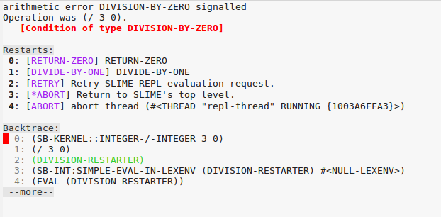
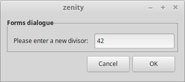

Common Lisp has mechanisms for error and condition handling as found
in other languages, and can do more.

What is a condition ?

> Just like in languages that support exception handling (Java, C++,
> Python, etc.), a condition represents, for the most part, an
> “exceptional” situation. However, even more so that those languages,
> *a condition in Common Lisp can represent a general situation where
> some branching in program logic needs to take place*, not
> necessarily due to some error condition. Due to the highly
> interactive nature of Lisp development (the Lisp image in
> conjunction with the REPL), this makes perfect sense in a language
> like Lisp rather than say, a language like Java or even Python,
> which has a very primitive REPL. In most cases, however, we may not
> need (or even allow) the interactivity that this system offers
> us. Thankfully, the same system works just as well even in
> non-interactive mode.
>
> [z0ltan](https://z0ltan.wordpress.com/2016/08/06/conditions-and-restarts-in-common-lisp/)


Let's dive into it step by step. More resources are given afterwards.


## Ignoring all errors, returning nil

Sometimes you know that a function can fail and you just want to
ignore it: use [ignore-errors][ignore-errors]:

~~~lisp
(ignore-errors
  (/ 3 0))
; in: IGNORE-ERRORS (/ 3 0)
;     (/ 3 0)
;
; caught STYLE-WARNING:
;   Lisp error during constant folding:
;   arithmetic error DIVISION-BY-ZERO signalled
;   Operation was (/ 3 0).
;
; compilation unit finished
;   caught 1 STYLE-WARNING condition
NIL
#<DIVISION-BY-ZERO {1008FF5F13}>
~~~

We get a welcome `division-by-zero` warning but the code runs well and
it returns two things: `nil` and the condition that was signaled. We
could not choose what to return.

Remember that we can `inspect` the condition with a right click in Slime.


## Catching any condition (handler-case)

<!-- we will say "handling" for handler-bind -->

`ignore-errors` is built from [handler-case][handler-case]. We can write the previous
example by catching the general `error` but now we can return whatever
we want:

~~~lisp
(handler-case (/ 3 0)
  (error (c)
    (format t "We caught a condition.~&")
    (values 0 c)))
; in: HANDLER-CASE (/ 3 0)
;     (/ 3 0)
;
; caught STYLE-WARNING:
;   Lisp error during constant folding:
;   Condition DIVISION-BY-ZERO was signalled.
;
; compilation unit finished
;   caught 1 STYLE-WARNING condition
We caught a condition.
0
#<DIVISION-BY-ZERO {1004846AE3}>
~~~

We also returned two values, 0 and the signaled condition.

The general form of `handler-case` is

~~~lisp
(handler-case (code that errors out)
   (condition-type (the-condition) ;; <-- optional argument
      (code))
   (another-condition (the-condition)
       ...))
~~~

We can also catch all conditions by matching `t`, like in a `cond`:

~~~lisp
(handler-case
    (progn
      (format t "This won't work…~%")
      (/ 3 0))
  (t (c)
    (format t "Got an exception: ~a~%" c)
    (values 0 c)))
;; …
;; This won't work…
;; Got an exception: arithmetic error DIVISION-BY-ZERO signalled
;; Operation was (/ 3 0).
;; 0
;; #<DIVISION-BY-ZERO {100608F0F3}>
~~~


## Catching a specific condition

We can specify what condition to handle:

~~~lisp
(handler-case (/ 3 0)
  (division-by-zero (c)
    (format t "Caught division by zero: ~a~%" c)))
;; …
;; Caught division by zero: arithmetic error DIVISION-BY-ZERO signalled
;; Operation was (/ 3 0).
;; NIL
~~~

This workflow is similar to a try/catch as found in other languages, but we can do more.


## handler-case VS handler-bind

`handler-case` is similar to the `try/catch` forms that we find in
other languages.

[handler-bind][handler-bind] (see the next examples), is what to use
when we need absolute control over what happens when a signal is
raised. It allows us to use the debugger and restarts, either
interactively or programmatically.

If some library doesn't catch all conditions and lets some bubble out
to us, we can see the restarts (established by `restart-case`)
anywhere deep in the stack, including restarts established by other
libraries that this library called.  And *we can see the stack
trace*, with every frame that was called and, in some lisps, even see
local variables and such. Once we `handler-case`, we "forget" about
this, everything is unwound. `handler-bind` does *not* rewind the
stack.

Before we properly see `handler-bind`, let's study conditions and restarts.


## Defining and making conditions

We define conditions with [define-condition][define-condition] and we make (initialize) them with [make-condition][make-condition].

~~~lisp
(define-condition my-division-by-zero (error)
  ())

(make-condition 'my-division-by-zero)
;; #<MY-DIVISION-BY-ZERO {1005A5FE43}>
~~~


It's better if we give more information to it when we create a condition, so let's use slots:

~~~lisp
(define-condition my-division-by-zero (error)
  ((dividend :initarg :dividend
             :initform nil
             :reader dividend)) ;; <-- we'll get the dividend with (dividend condition). See the CLOS tutorial if needed.
  (:documentation "Custom error when we encounter a division by zero.")) ;; good practice ;)
~~~

Now when we'll "signal" or "throw" the condition in our code we'll be
able to populate it with information to be consumed later:

~~~lisp
(make-condition 'my-division-by-zero :dividend 3)
;; #<MY-DIVISION-BY-ZERO {1005C18653}>
~~~

Note: here's a quick reminder on classes, if you are not fully operational
on the [Common Lisp Object System](clos.html):

~~~lisp
(make-condition 'my-division-by-zero :dividend 3)
;;                                   ^^ this is the ":initarg"
~~~

and `:reader dividend` created a *generic function* that is a "getter"
for the dividend of a `my-division-by-zero` object:

~~~lisp
(make-condition 'my-division-by-zero :dividend 3)
;; #<MY-DIVISION-BY-ZERO {1005C18653}>
(dividend *)
;; 3
~~~

an ":accessor" would be both a getter and a setter.


So, the general form of `define-condition` looks and feels like a
regular class definition, but despite the similarities, conditions are
not standard objects.

A difference is that we can't use `slot-value` on slots.


## Signaling (throwing) conditions: error, warn, signal

We can use [error][error] in two ways:

- `(error "some text")`: signals a condition of type [simple-error][simple-error], and opens-up the interactive debugger.
- `(error 'my-error :message "We did this and that and it didn't work.")`: creates and throws a custom condition with its slot "message" and opens-up the interactive debugger.

With our own condition we can do:

~~~lisp
(error 'my-division-by-zero :dividend 3)
;; which is a shortcut for
(error (make-condition 'my-division-by-zero :dividend 3))
~~~

Throwing these conditions will enter the interactive debugger, where
the user may select a restart.

`warn` will not enter the debugger (create warning conditions by subclassing [simple-warning][simple-warning]).

Use [signal][signal] if you do not want to enter the debugger, but you still want to signal to the upper levels that something *exceptional* happened.

And that can be anything. For example, it can be used to track
progress during an operation. You would create a condition with a
`percent` slot, signal one when progress is made, and the
higher level code would handle it and display it to the user. See the
resources below for more.

### Conditions hierarchy

The class precedence list of `simple-error` is `simple-error, simple-condition, error, serious-condition, condition, t`.

The class precedence list of `simple-warning` is  `simple-warning, simple-condition, warning, condition, t`.


### Custom error messages (:report)


So far, when throwing our error, we saw this default text in the
debugger:

```
Condition COMMON-LISP-USER::MY-DIVISION-BY-ZERO was signalled.
   [Condition of type MY-DIVISION-BY-ZERO]
```

We can do better by giving a `:report` function in our condition declaration:

~~~lisp
(define-condition my-division-by-zero (error)
  ((dividend :initarg :dividend
             :initform nil
             :accessor dividend))
  ;; the :report is the message into the debugger:
  (:report (lambda (condition stream)
     (format stream "You were going to divide ~a by zero.~&" (dividend condition)))))
~~~

Now:

~~~lisp
(error 'my-division-by-zero :dividend 3)
;; Debugger:
;;
;; You were going to divide 3 by zero.
;;    [Condition of type MY-DIVISION-BY-ZERO]
~~~


## Inspecting the stacktrace

That's another quick reminder, not a Slime tutorial. In the debugger,
you can inspect the stacktrace, the arguments to the function calls,
go to the erroneous source line (with `v` in Slime), execute code in
the context (`e`), etc.

Often, you can edit a buggy function, compile it (with the `C-c C-c`
shortcut in Slime), choose the "RETRY" restart and see your code pass.

All this depends on compiler options, wether it is optimized for
debugging, speed or security.

See our [debugging section](debugging.html).


# Restarts, interactive choices in the debugger

Restarts are the choices we get in the debugger, which always has the
`RETRY` and `ABORT` ones.

By *handling* restarts we can start over the operation as if the error
didn't occur (as seen in the stack).


## Using assert's optional restart

In its simple form `assert` does what we know:

~~~lisp
(assert (realp 3))
;; NIL = passed
~~~

When the assertion fails, we are prompted into the debugger:

~~~lisp
(defun divide (x y)
  (assert (not (zerop y)))
  (/ x y))

(divide 3 0)
;; The assertion (NOT #1=(ZEROP Y)) failed with #1# = T.
;;    [Condition of type SIMPLE-ERROR]
;;
;; Restarts:
;;  0: [CONTINUE] Retry assertion.
;;  1: [RETRY] Retry SLIME REPL evaluation request.
;;  …
~~~

It also accepts an optional parameter to offer to change values:

~~~lisp
(defun divide (x y)
  (assert (not (zerop y))
          (y)   ;; list of values that we can change.
          "Y can not be zero. Please change it") ;; custom error message.
  (/ x y))
~~~

Now we get a new restart that offers to change the value of Y:

~~~lisp
(divide 3 0)
;; Y can not be zero. Please change it
;;    [Condition of type SIMPLE-ERROR]
;;
;; Restarts:
;;  0: [CONTINUE] Retry assertion with new value for Y.  <--- new restart
;;  1: [RETRY] Retry SLIME REPL evaluation request.
;;  …
~~~

and when we choose it, we are prompted for a new value in the REPL:

```
The old value of Y is 0.
Do you want to supply a new value?  (y or n) y

Type a form to be evaluated:
2
3/2  ;; and our result.
```


## Defining restarts (restart-case)

All this is good but we might want more custom choices.  We can add
restarts on the top of the list by wrapping our function call inside
[restart-case][restart-case].

~~~lisp
(defun divide-with-restarts (x y)
  (restart-case (/ x y)
    (return-zero ()  ;; <-- creates a new restart called "RETURN-ZERO"
      0)
    (divide-by-one ()
      (/ x 1))))
(divide-with-restarts 3 0)
~~~

In case of *any error* (we'll improve on that with `handler-bind`),
we'll get those two new choices at the top of the debugger:



That's allright but let's just write more human-friendy "reports":

~~~lisp
(defun divide-with-restarts (x y)
  (restart-case (/ x y)
    (return-zero ()
      :report "Return 0"  ;; <-- added
      0)
    (divide-by-one ()
      :report "Divide by 1"
      (/ x 1))))
(divide-with-restarts 3 0)
;; Nicer restarts:
;;  0: [RETURN-ZERO] Return 0
;;  1: [DIVIDE-BY-ONE] Divide by 1
~~~

That's better, but we lack the ability to change an operand, as we did
with the `assert` example above.


## Changing a variable with restarts

The two restarts we defined didn't ask for a new value. To do this, we
add an `:interactive` lambda function to the restart, that asks for
the user a new value with the input method of its choice. Here, we'll
use the regular `read`.

~~~lisp
(defun divide-with-restarts (x y)
  (restart-case (/ x y)
    (return-zero ()
      :report "Return 0"
      0)
    (divide-by-one ()
      :report "Divide by 1"
      (/ x 1))
    (set-new-divisor (value)
      :report "Enter a new divisor"
      ;;
      ;; Ask the user for a new value:
      :interactive (lambda () (prompt-new-value "Please enter a new divisor: "))
      ;;
      ;; and call the divide function with the new value…
      ;; … possibly catching bad input again!
      (divide-with-restarts x value))))

(defun prompt-new-value (prompt)
  (format *query-io* prompt)  ;; *query-io*: the special stream to make user queries.
  (force-output *query-io*)   ;; Ensure the user sees what he types.
  (list (read *query-io*)))   ;; We must return a list.

(divide-with-restarts 3 0)
~~~

When calling it, we are offered a new restart, we enter a new value,
and we get our result:

~~~
(divide-with-restarts 3 0)
;; Debugger:
;;
;; 2: [SET-NEW-DIVISOR] Enter a new divisor
;;
;; Please enter a new divisor: 10
;;
;; 3/10
~~~

Oh, you prefer a graphical user interface? We can use the `zenity`
command line interface on GNU/Linux.

~~~lisp
(defun prompt-new-value (prompt)
  (list
   (let ((input
          ;; We capture the program's output to a string.
          (with-output-to-string (s)
            (let* ((*standard-output* s))
              (uiop:run-program `("zenity"
                                  "--forms"
                                  ,(format nil "--add-entry=~a" prompt))
                                :output s)))))
     ;; We get a string and we want a number.
     ;; We could also use parse-integer, the parse-number library, etc.
     (read-from-string input))))
~~~

Now try again and you should get a little window asking for a new number:




That's fun, but that's not all. Choosing restarts manually is not always (or often?)
satisfactory.  And by *handling* restarts we can start over the
operation as if the error didn't occur, as seen in the stack.


## Calling restarts programmatically (handler-bind, invoke-restart)

We have a piece of code that we know can throw conditions. Here,
`divide-with-restarts` can signal an error about a division by
zero. What we want to do, is our higher-level code to automatically
handle it and call the appropriate restart.

We can do this with `handler-bind` and [invoke-restart][invoke-restart]:

~~~lisp
(defun divide-and-handle-error (x y)
  (handler-bind
      ((division-by-zero (lambda (c)
                (format t "Got error: ~a~%" c) ;; error-message
                (format t "and will divide by 1~&")
                (invoke-restart 'divide-by-one))))
    (divide-with-restarts x y)))

(divide-and-handle-error 3 0)
;; Got error: arithmetic error DIVISION-BY-ZERO signalled
;; Operation was (/ 3 0).
;; and will divide by 1
;; 3
~~~


## Using other restarts (find-restart)

Use [find-restart][find-restart].

`find-restart 'name-of-restart` will return the most recent bound
restart with the given name, or `nil`.


## Hiding and showing restarts

Restarts can be hidden. In `restart-case`, in addition to `:report`
and `:interactive`, they also accept a `:test` key:

~~~lisp
(restart-case
   (return-zero ()
     :test (lambda ()
             (some-test))
    ...
~~~


# Handling conditions (handler-bind)

We just saw a use for [handler-bind][handler-bind].

Its general form is:

~~~lisp
(handler-bind ((a-condition #'function-to-handle-it)
               (another-one #'another-function))
    (code that can...)
    (...error out))
~~~


We can study a real example with the
[`unix-opts`](https://github.com/mrkkrp/unix-opts) library, that
parses command line arguments. It defined some conditions:
`unknown-option`, `missing-arg` and `arg-parser-failed`, and it is up
to us to write what to do in these cases.

~~~lisp
(handler-bind ((opts:unknown-option #'unknown-option)
               (opts:missing-arg #'missing-arg)
               (opts:arg-parser-failed #'arg-parser-failed))
  (opts:get-opts))
~~~

Our `unknown-option` function is simple and looks like this:

~~~lisp
(defun unknown-option (condition)
  (format t "~s option is unknown.~%" (opts:option condition))
  (opts:describe)
  (exit)) ;; <-- we return to the command line, no debugger.
~~~

it takes the condition as parameter, so we can read information from
it if needed. Here we get the name of the erroneous option with the
condition's reader `(opts:option condition)`.


# Running some code, condition or not ("finally") (unwind-protect)

The "finally" part of others `try/catch/finally` forms is done with [unwind-protect][unwind-protect].

It is the construct used in "with-" macros, like `with-open-file`,
which always closes the file after it.

With this example:

~~~lisp
(unwind-protect (/ 3 0)
  (format t "This place is safe.~&"))
~~~

We *do* get the interactive debugger (we didn't use handler-bind or
anything), but our message is printed afterwards anyway.


# Conclusion

You're now more than ready to write some code and to dive into other resources!


## Resources

* [Practical Common Lisp: "Beyond Exception Handling: Conditions and Restarts"](http://gigamonkeys.com/book/beyond-exception-handling-conditions-and-restarts.html) - the go-to tutorial, more explanations and primitives.
* Common Lisp Recipes, chap. 12, by E. Weitz
* [language reference](https://www.cs.cmu.edu/Groups/AI/html/cltl/clm/node317.html)
* [Video tutorial: introduction on conditions and restarts](http://nklein.com/2011/03/tutorial-introduction-to-conditions-and-restarts/), by Patrick Stein.
* [Condition Handling in the Lisp family of languages](http://www.nhplace.com/kent/Papers/Condition-Handling-2001.html)
* [z0ltan.wordpress.com](https://z0ltan.wordpress.com/2016/08/06/conditions-and-restarts-in-common-lisp/) (the article this recipe is heavily based upon)

## See also

* [Algebraic effects - You can touch this !](http://jacek.zlydach.pl/blog/2019-07-24-algebraic-effects-you-can-touch-this.html) - how to use conditions and restarts to implement progress reporting and aborting of a long-running calculation, possibly in an interactive or GUI context.
* [A tutorial on conditions and restarts](https://github.com/stylewarning/lisp-random/blob/master/talks/4may19/root.lisp),  based around computing the roots of a real function. It was presented by the author at a Bay Area Julia meetup on may 2019 ([talk slides here](https://github.com/stylewarning/talks/blob/master/4may19-julia-meetup/Bay%20Area%20Julia%20Users%20Meetup%20-%204%20May%202019.pdf)).
* [lisper.in](https://lisper.in/restarts#signaling-validation-errors) - example with parsing a csv file and using restarts with success, [in a flight travel company](https://www.reddit.com/r/lisp/comments/7k85sf/a_tutorial_on_conditions_and_restarts/drceozm/).
* [https://github.com/svetlyak40wt/python-cl-conditions](https://github.com/svetlyak40wt/python-cl-conditions) - implementation of the CL conditions system in Python.

[ignore-errors]: http://www.lispworks.com/documentation/HyperSpec/Body/m_ignore.htm
[handler-case]: http://www.lispworks.com/documentation/HyperSpec/Body/m_hand_1.htm
[handler-bind]: http://www.lispworks.com/documentation/HyperSpec/Body/m_handle.htm
[define-condition]: http://www.lispworks.com/documentation/HyperSpec/Body/m_defi_5.htm
[make-condition]: http://www.lispworks.com/documentation/HyperSpec/Body/f_mk_cnd.htm
[error]: http://www.lispworks.com/documentation/HyperSpec/Body/e_error.htm#error
[simple-error]: http://www.lispworks.com/documentation/HyperSpec/Body/e_smp_er.htm
[simple-warning]: http://www.lispworks.com/documentation/HyperSpec/Body/e_smp_wa.htm
[signal]: http://www.lispworks.com/documentation/HyperSpec/Body/f_signal.htm
[restart-case]: http://www.lispworks.com/documentation/HyperSpec/Body/m_rst_ca.htm
[invoke-restart]: http://www.lispworks.com/documentation/HyperSpec/Body/f_invo_1.htm#invoke-restart
[find-restart]: http://www.lispworks.com/documentation/HyperSpec/Body/f_find_r.htm#find-restart
[unwind-protect]: http://www.lispworks.com/documentation/HyperSpec/Body/s_unwind.htm
