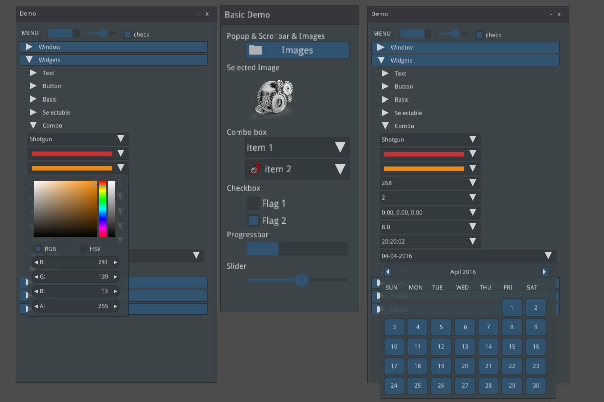
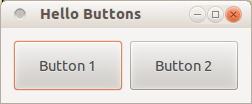
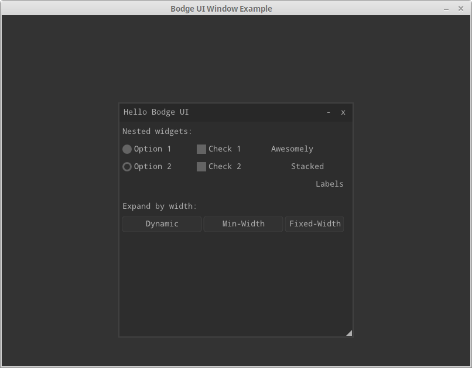

Lisp has a long and rich history and so does the development of
Graphical User Interfaces in Lisp. In fact, the first GUI builder was
written in Lisp (and sold to Apple. It is now Interface Builder).

Lisp is also famous and unrivalled for its interactive development
capabilities, a feature even more worth having to develop GUI
applications. Can you imagine compiling one function and seeing your
GUI update instantly? We can do this with many GUI frameworks today,
even though the details differ from one to another.

Finally, a key part in building software is how to build it and ship
it to users. Here also, we can build self-contained binaries, for
the three main operating systems, that users can run with a double
click.

We aim here to give you the relevant information to help you choose
the right GUI framework and to put you on tracks. Don't hesitate to
[contribute](https://github.com/LispCookbook/cl-cookbook/issues/), to
send more examples and to furnish the upstream documentations.


# Introduction

In this recipe, we'll present the following GUI toolkits:

- [Tk][tk] with [Ltk][ltk]
- [Qt4][qt4] with [Qtools][qtools]
- [IUP][iup-tecgraf] with [lispnik/iup][iup-lisp]
- [Gtk3][gtk] with [cl-cffi-gtk][cl-cffi-gtk]
- [Nuklear][nuklear] with [Bodge-Nuklear][bodge-nuklear]

In addition, you might want to have a look to:

- the [CAPI][capi] toolkit (Common Application Programming Interface),
  which is proprietary and made by LispWorks. It is a complete and cross-platform
  toolkit (Windows, Gtk+, Cocoa), very praised by its users. LispWorks
  also has [iOS and Android
  runtimes](http://www.lispworks.com/products/lw4mr.html). Example
  software built with CAPI include [Opusmodus](https://opusmodus.com/)
  or again [ScoreCloud](https://scorecloud.com/). It is possible to
  try it with the LispWorks free demo.
- [CocoaInterface](https://github.com/plkrueger/CocoaInterface/), a
Cocoa interface for Clozure Common Lisp. Build Cocoa user interface
windows dynamically using Lisp code and bypass the typical Xcode
processes.
* [McCLIM](https://common-lisp.net/project/mcclim/) and [Garnet](https://github.com/earl-ducaine/cl-garnet) are toolkit in 100% Common Lisp. McClim even has [a prototype](https://techfak.de/~jmoringe/mcclim-broadway-7.ogv) running in the browser with the Broadway protocol and Garnet has an ongoing interface to Gtk.
* [Alloy](https://github.com/Shirakumo/alloy), another very new toolkit in 100% Common Lisp, used for example in the [Kandria](https://github.com/shinmera/kandria) game.
* [nodgui](https://notabug.org/cage/nodgui), a fork of Ltk, with syntax sugar and additional widgets.
* [eql, eql5, eql5-android](https://gitlab.com/eql), embedded Qt4 and Qt5 Lisp, embedded in ECL, embeddable in Qt. Port of EQL5 to the Android platform.
* this [demo using Java Swing from ABCL](https://github.com/defunkydrummer/abcl-jazz)
* [examples of using Gtk without C files with SBCL](https://github.com/mifpasoti/Gtk-Demos), as well as GTK-server.
* and, last but not least, [Ceramic][ceramic], to ship a cross-platform web app with Electron.

as well as the other ones listed on [awesome-cl#gui](https://github.com/CodyReichert/awesome-cl#Gui) and [Cliki](https://www.cliki.net/GUI).

## Tk (Ltk)

[Tk][tk] (or Tcl/Tk, where Tcl is the programming language) has the
infamous reputation of having an outdated look. This is not (so) true
anymore since its version 8 of 1997 (!). It is probably better than
you think:


Tk doesn't have a great choice of widgets, but it has a useful canvas,
and it has a couple of unique features: we can develop a graphical
interface **fully interactively** and we can run the GUI **remotely**
from the core app.

So, Tk isn't fancy, but it is an used and proven GUI toolkit (and
programming language) still used in the industry. It can be a great
choice to quickly create simple GUIs, to leverage its ease of deployment, or
when stability is required.

The Lisp binding is [Ltk][ltk].

- **Written in**: Tcl
- **Portability**: cross-platform (Windows, macOS, Linux).

- **Widgets**: this is not the fort of Tk. It has a **small set** of
  default widgets, and misses important ones, for example a calendar. We
  can find some in extensions (such as in **Nodgui**), but they don't
  feel native, at all.

- **Interactive development**: very much.

- **Graphical builder**: no

- **Other features**:
  - **remote execution**: the connection between Lisp and Tcl/Tk is
    done via a stream. It is thus possible to run the Lisp program on
    one computer, and to display the GUI on another one. The only
    thing required on the client computer is tcl/tk installed and the
    remote.tcl script. See [Ltk-remote](http://www.peter-herth.de/ltk/ltkdoc/node46.html).

- **Bindings documentation**: short but complete. Nodgui too.
- **Bindings stability**: very stable
- **Bindings activity**: low to non-existent.
- **Licence**: Tcl/Tk is BSD-style, Ltk is LGPL.
- Example applications:
  - [Fulci](https://notabug.org/cage/fulci/) - a program to organise your movie collections.
  - [Ltk small games](https://github.com/mijohnson99/ltk-small-games) - snake and tic-tac-toe.
  - [cl-torrents](https://github.com/vindarel/cl-torrents) - searching torrents on popular trackers. CLI, readline and a simple Tk GUI.


**List of widgets**

(please don't suppose the list is exhaustive)

```
Button Canvas Check-button Entry Frame Label Labelframe Listbox
Menu Menubutton Message
Paned-window
Radio-button Scale
Scrollbar Spinbox Text
Toplevel Widget Canvas

Ltk-megawidgets:
    progress
    history-entry
    menu-entry
```

Nodgui adds:

```
treelist tooltip searchable-listbox date-picker calendar autocomplete-listbox
password-entry progress-bar-star notify-window
dot-plot bar-chart equalizer-bar
swap-list
```

## Qt4 (Qtools)

Do we need to present Qt and [Qt4][qt4]? Qt is huge and contains
everything and the kitchen sink. Qt not only provides UI widgets, but
numerous other layers (networking, D-BUS…).

Qt is free for open-source software, however you'll want to check the
conditions to ship proprietary ones.

The [Qtools][qtools] bindings target Qt4. The Qt5 Lisp bindings are
yet to be created.

<!-- possible future: gobject-introspection -->

- **Framework written in**: C++
- **Framework Portability**: multi-platform, Android, embedded systems, WASM.
- **Bindings Portability**: Qtools runs on x86 desktop platforms on Windows, macOS and GNU/Linux.

- **Widgets choice**: large.

- **Graphical builder**: yes.

- **Other features**: Web browser, a lot more.

- **Bindings documentation**: lengthy explanations, a few examples. Prior Qt knowledge is required.
- **Bindings stability**: stable
- **Bindings activity**: active
- **Qt Licence**: both commercial and open source licences.
- Example applications:
  - https://github.com/Shinmera/qtools/tree/master/examples
  - https://github.com/Shirakumo/lionchat
  - https://github.com/shinmera/halftone - a simple image viewer


## Gtk+3 (cl-cffi-gtk)

[Gtk+3][gtk] is the primary library used to build [GNOME][gnome]
applications. Its (currently most advanced) lisp bindings is
[cl-cffi-gtk][cl-cffi-gtk]. While primarily created for GNU/Linux, Gtk
works fine under macOS and can now also be used on Windows.


- **Framework written in**: C
- **Portability**: GNU/Linux and macOS, also Windows.

- **Widgets choice**: large.

- **Graphical builder**: yes: Glade.
- **Other features**: web browser (WebKitGTK)

- **Bindings documentation**: very good: http://www.crategus.com/books/cl-gtk/gtk-tutorial.html
- **Bindings stability**: stable
- **Bindings activity**: low activity, active development.
- **Licence**: LGPL
- Example applications:
  - an [Atmosphere Calculator](https://github.com/ralph-schleicher/atmosphere-calculator), built with Glade.


## IUP (lispnik/IUP)

[IUP][iup-tecgraf] is a cross-platform GUI toolkit actively developed
at the PUC university of Rio de Janeiro, Brazil. It uses **native
controls**: the Windows API for Windows, Gtk3 for GNU/Linux. At the
time of writing, it has a Cocoa port in the works (as well as iOS,
Android and WASM ones). A particularity of IUP is its **small API**.

The Lisp bindings are [lispnik/iup](https://github.com/lispnik/iup/). They are nicely
done in that they are automatically generated from the C sources. They
can follow new IUP versions with a minimal work and the required steps
are documented. All this gives us good guarantee over the bus
factor.

IUP stands as a great solution in between Tk and Gtk or Qt.

- **Framework written in**: C (official API also in Lua and LED)
- **Portability**: Windows and Linux, work started for
  Cocoa, iOS, Android, WASM.

- **Widgets choice**: medium.

- **Graphical builder**: yes: [IupVisualLED](http://webserver2.tecgraf.puc-rio.br/iup/en/iupvisualled.html)

- **Other features**: OpenGL, Web browser (WebKitGTK on GNU/Linux), plotting, Scintilla text editor

- **Bindings documentation**: good examples and good readme, otherwise low.
- **Bindings stability**: alpha (but fully generated and working nicely).
- **Bindings activity**: low but steady, and reactive to new IUP versions.
- **Licence**: IUP and the bindings are MIT licenced.


**List of widgets**

```
Radio, Tabs, FlatTabs, ScrollBox, DetachBox,
Button, FlatButton, DropButton, Calendar, Canvas, Colorbar, ColorBrowser, DatePick, Dial, Gauge, Label, FlatLabel,
FlatSeparator, Link, List, FlatList, ProgressBar, Spin, Text, Toggle, Tree, Val,
listDialog, Alarm, Color, Message, Font, Scintilla, file-dialog…
Cells, Matrix, MatrixEx, MatrixList,
GLCanvas, Plot, MglPlot, OleControl, WebBrowser (WebKit/Gtk+)…
drag-and-drop
```

<!-- editor's note: found missing a list view with columns. -->


## Nuklear (Bodge-Nuklear)

[Nuklear][nuklear] is a small [immediate-mode](https://en.wikipedia.org/wiki/Immediate_mode_GUI) GUI toolkit:

> [Nuklear] is a minimal-state, immediate-mode graphical user interface toolkit written in ANSI C and licensed under public domain. It was designed as a simple embeddable user interface for application and does not have any dependencies, a default render backend or OS window/input handling but instead provides a highly modular, library-based approach, with simple input state for input and draw commands describing primitive shapes as output. So instead of providing a layered library that tries to abstract over a number of platform and render backends, it focuses only on the actual UI.

its Lisp binding is [Bodge-Nuklear][bodge-nuklear], and its higher level companions [bodge-ui](https://github.com/borodust/bodge-ui) and [bodge-ui-window](https://github.com/borodust/bodge-ui-window).

Unlike traditional UI frameworks, Nuklear allows the developer to take
over the rendering loop or the input management. This might require
more setup, but it makes Nuklear particularly well suited for games,
or for applications where you want to create new controls.


- **Framework written in**: ANSI C, single-header library.
- **Portability**: where C runs. Nuklear doesn't contain
  platform-specific code. No direct OS or window handling is done in
  Nuklear. Instead *all input state has to be provided by platform
  specific code*.

- **Widgets choice**: small.

- **Graphical builder**: no.

- **Other features**: fully skinnable and customisable.

- **Bindings stability**: stable
- **Bindings activity**: active
- **Licence**: MIT or Public Domain (unlicence).
- Example applications:
  - [Trivial-gamekit](https://github.com/borodust/trivial-gamekit)
  - [Obvius](https://github.com/thicksteadTHpp/Obvius/) - a resurrected image processing library.
  - [Notalone](https://github.com/borodust/notalone) - an autumn 2017 Lisp Game Jam entry.

**List of widgets**

Non-exhaustive list:

```
buttons, progressbar, image selector, (collapsable) tree, list, grid, range, slider, color picker,
date-picker
```



# Getting started

## Tk

Ltk is quick and easy to grasp.

~~~lisp
(ql:quickload :ltk)
(in-package :ltk-user)
~~~


**How to create widgets**

All widgets are created with a regular `make-instance` and the widget name:

~~~lisp
(make-instance 'button)
(make-instance 'treeview)
~~~

This makes Ltk explorable with the default symbol completion.

**How to start the main loop**

As with most bindings, the GUI-related code must be started inside a macro that
handles the main loop, here `with-ltk`:

~~~lisp
(with-ltk ()
  (let ((frame (make-instance 'frame)))
    …))
~~~

**How to display widgets**

After we created some widgets, we must place them on the layout. There
are a few Tk systems for that, but the most recent one and the one we
should start with is the `grid`. `grid` is a function that takes as
arguments the widget, its column, its row, and a few optional
parameters.

As with any Lisp code in a regular environment, the functions'
signatures are indicated by the editor. It makes Ltk explorable.

Here's how to display a button:

~~~lisp
(with-ltk ()
  (let ((button (make-instance 'button :text "hello")))
    (grid button 0 0)))
~~~

That's all there is to it.


### Reacting to events

Many widgets have a `:command` argument that accept a lambda which is
executed when the widget's event is started. In the case of a button,
that will be on a click:

~~~lisp
(make-instance 'button
  :text "Hello"
  :command (lambda ()
             (format t "clicked")))
~~~


### Interactive development

When we start the Tk process in the background with `(start-wish)`, we
can create widgets and place them on the grid interactively.

See [the documentation](http://www.peter-herth.de/ltk/ltkdoc/node8.html).

Once we're done, we can `(exit-wish)`.


### Nodgui

To try the Nodgui demo, do:

~~~lisp
(ql:quickload :nodgui)
(nodgui.demo:demo)
~~~

## Qt4

~~~lisp
(ql:quickload '(:qtools :qtcore :qtgui))
~~~

~~~lisp
(defpackage #:qtools-test
  (:use #:cl+qt)
  (:export #:main))
(in-package :qtools-test)
(in-readtable :qtools)
~~~

We create our main widget that will contain the rest:

~~~lisp
(define-widget main-window (QWidget)
  ())
~~~

We create an input field and a button inside this main widget:

~~~lisp
(define-subwidget (main-window name) (q+:make-qlineedit main-window)
  (setf (q+:placeholder-text name) "Your name please."))
~~~

~~~lisp
(define-subwidget (main-window go-button) (q+:make-qpushbutton "Go!" main-window))
~~~

We stack them horizontally:

~~~lisp
(define-subwidget (main-window layout) (q+:make-qhboxlayout main-window)
  (q+:add-widget layout name)
  (q+:add-widget layout go-button))
~~~

and we show them:

~~~lisp
(with-main-window
  (window 'main-window))
~~~


That's cool, but we don't react to the click event yet.

### Reacting to events

Reacting to events in Qt happens through signals and slots. **Slots** are
functions that receive or "connect to" signals, and **signals** are event carriers.

Widgets already send their own signals: for example, a button sends a
"pressed" event. So, most of the time, we only need to connect to them.

However, had we extra needs, we can create our own set of signals.

#### Built-in events

We want to connect our `go-button` to the `pressed` and
`return-pressed` events and display a message box.

- we need to do this inside a `define-slot` function,
- where we establish the connection to those events,
- and where we create the message box. We grab the text of the `name`
  input field with `(q+:text name)`.

~~~lisp
(define-slot (main-window go-button) ()
  (declare (connected go-button (pressed)))
  (declare (connected name (return-pressed)))
  (q+:qmessagebox-information main-window
                              "Greetings"  ;; title
                              (format NIL "Good day to you, ~a!" (q+:text name))))
~~~

And voilà. Run it with

~~~lisp
(with-main-window (window 'main-window))
~~~

#### Custom events

We'll implement the same functionality as above, but for demonstration
purposes we'll create our own signal named `name-set` to throw when
the button is clicked.

We start by defining the signal, which happens inside the
`main-window`, and which is of type `string`:

~~~lisp
(define-signal (main-window name-set) (string))
~~~

We create a **first slot** to make our button react to the `pressed`
and `return-pressed` events. But instead of creating the message box
here, as above, we send the `name-set` signal, with the value of our
input field..

~~~lisp
(define-slot (main-window go-button) ()
  (declare (connected go-button (pressed)))
  (declare (connected name (return-pressed)))
  (signal! main-window (name-set string) (q+:text name)))
~~~

So far, nobody reacts to `name-set`. We create a **second slot** that
connects to it, and displays our message. Here again, we precise the
parameter type.

~~~lisp
(define-slot (main-window name-set) ((new-name string))
  (declare (connected main-window (name-set string)))
  (q+:qmessagebox-information main-window "Greetings" (format NIL "Good day to you, ~a!" new-name)))
~~~

and run it:

~~~lisp
(with-main-window (window 'main-window))
~~~

### Building and deployment

It is possible to build a binary and bundle it together with all the
necessary shared libraries.

Please read [https://github.com/Shinmera/qtools#deployment](https://github.com/Shinmera/qtools#deployment).

You might also like [this Travis CI script](https://github.com/phoe-trash/furcadia-post-splitter/blob/master/.travis.yml) to build a self-contained binary for the three OSes.


## Gtk3

The
[documentation](http://www.crategus.com/books/cl-gtk/gtk-tutorial.html)
is exceptionally good, including for beginners.

The library to quickload is `cl-cffi-gtk`. It is made of numerous
ones, that we have to `:use` for our package.

~~~lisp
(ql:quickload :cl-cffi-gtk)

(defpackage :gtk-tutorial
  (:use :gtk :gdk :gdk-pixbuf :gobject
   :glib :gio :pango :cairo :common-lisp))

(in-package :gtk-tutorial)
~~~

**How to run the main loop**

As with the other libraries, everything happens inside the main loop
wrapper, here `with-main-loop`.

**How to create a window**

`(make-instance 'gtk-window :type :toplevel :title "hello" ...)`.

**How to create a widget**

All widgets have a corresponding class. We can create them with
`make-instance 'widget-class`, but we preferably use the constructors.

The constructors end with (or contain) "new":

```lisp
(gtk-label-new)
(gtk-button-new-with-label "Label")
```

**How to create a layout**

~~~lisp
(let ((box (make-instance 'gtk-box :orientation :horizontal :spacing 6))) ...)
~~~

then pack a widget onto the box:

~~~lisp
(gtk-box-pack-start box mybutton-1)
~~~

and add the box to the window:

~~~lisp
(gtk-container-add window box)
~~~

and display them all:

~~~lisp
(gtk-widget-show-all window)
~~~

### Reacting to events

Use `g-signal-connect` + the concerned widget + the event name (as a
string) + a lambda, that takes the widget as argument:

~~~lisp
(g-signal-connect window "destroy"
  (lambda (widget)
    (declare (ignore widget))
    (leave-gtk-main)))
~~~

Or again:

~~~lisp
(g-signal-connect button "clicked"
  (lambda (widget)
    (declare (ignore widget))
    (format t "Button was pressed.~%")))
~~~

### Full example

~~~lisp
(defun hello-world ()
  ;; in the docs, this is example-upgraded-hello-world-2.
  (within-main-loop
    (let ((window (make-instance 'gtk-window
                                 :type :toplevel
                                 :title "Hello Buttons"
                                 :default-width 250
                                 :default-height 75
                                 :border-width 12))
          (box (make-instance 'gtk-box
                              :orientation :horizontal
                              :spacing 6)))
      (g-signal-connect window "destroy"
                        (lambda (widget)
                          (declare (ignore widget))
                          (leave-gtk-main)))
      (let ((button (gtk-button-new-with-label "Button 1")))
        (g-signal-connect button "clicked"
                          (lambda (widget)
                            (declare (ignore widget))
                            (format t "Button 1 was pressed.~%")))
        (gtk-box-pack-start box button))
      (let ((button (gtk-button-new-with-label "Button 2")))
        (g-signal-connect button "clicked"
                          (lambda (widget)
                            (declare (ignore widget))
                            (format t "Button 2 was pressed.~%")))
        (gtk-box-pack-start box button))
      (gtk-container-add window box)
      (gtk-widget-show-all window))))
~~~




## IUP

Please check the installation instructions upstream. You may need one
system dependency on GNU/Linux, and to modify an environment variable
on Windows.

Finally, do:

~~~lisp
(ql:quickload :iup)
~~~

We are not going to `:use` IUP (it is a bad practice generally after all).

~~~lisp
(defpackage :test-iup
  (:use :cl))
(in-package :test-iup)
~~~

The following snippet creates a dialog frame to display a text label.

~~~lisp
(defun hello ()
  (iup:with-iup ()
    (let* ((label (iup:label :title (format nil "Hello, World!~%IUP ~A~%~A ~A"
                                            (iup:version)
                                            (lisp-implementation-type)
                                            (lisp-implementation-version))))
           (dialog (iup:dialog label :title "Hello, World!")))
      (iup:show dialog)
      (iup:main-loop))))
(hello)
~~~

Important note for SBCL: we currently must trap division-by-zero
errors (see advancement on [this
issue](https://github.com/lispnik/iup/issues/30)). So, run snippets
like so:

~~~lisp
(defun run-gui-function ()
  #-sbcl (gui-function)
  #+sbcl
  (sb-int:with-float-traps-masked
      (:divide-by-zero :invalid)
    (gui-function)))
~~~


**How to run the main loop**

As with all the bindings seen so far, widgets are shown inside a
`with-iup` macro, and with a call to `iup:main-loop`.

**How to create widgets**

The constructor function is the name of the widget: `iup:label`,
`iup:dialog`.

**How to display a widget**

Be sure to "show" it: `(iup:show dialog)`.

You can group widgets on `frame`s, and stack them vertically or
horizontally (with `vbox` or `hbox`, see the example below).

To allow a widget to be expanded on window resize, use `:expand
:yes` (or `:horizontal` and `:vertical`).

Use also the `:alignement` properties.

**How to get and set a widget's attributes**

Use `(iup:attribute widget attribute)` to get the attribute's value,
and use `setf` on it to set it.


### Reacting to events

Most widgets take an `:action` parameter that takes a lambda function
with one parameter (the handle).

~~~lisp
(iup:button :title "Test &1"
            :expand :yes
            :tip "Callback inline at control creation"
            :action (lambda (handle)
                      (iup:message "title" "button1's action callback")
                      iup:+default+))
~~~

Below we create a label and put a button below it. We display a
message dialog when we click on the button.

~~~lisp
(defun click-button ()
  (iup:with-iup ()
    (let* ((label (iup:label :title (format nil "Hello, World!~%IUP ~A~%~A ~A"
                                            (iup:version)
                                            (lisp-implementation-type)
                                            (lisp-implementation-version))))
           (button (iup:button :title "Click me"
                               :expand :yes
                               :tip "yes, click me"
                               :action (lambda (handle)
                                         (declare (ignorable handle))
                                         (iup:message "title" "button clicked")
                                         iup:+default+)))
           (vbox
            (iup:vbox (list label button)
                      :gap "10"
                      :margin "10x10"
                      :alignment :acenter))
           (dialog (iup:dialog vbox :title "Hello, World!")))
      (iup:show dialog)
      (iup:main-loop))))

#+sbcl
(sb-int:with-float-traps-masked
      (:divide-by-zero :invalid)
    (click-button))
~~~

Here's a similar example to make a counter of clicks.  We use a label
and its title to hold the count. The title is an integer.

~~~lisp
(defun counter ()
  (iup:with-iup ()
    (let* ((counter (iup:label :title 0))
           (label (iup:label :title (format nil "The button was clicked ~a time(s)."
                                            (iup:attribute counter :title))))
           (button (iup:button :title "Click me"
                               :expand :yes
                               :tip "yes, click me"
                               :action (lambda (handle)
                                         (declare (ignorable handle))
                                         (setf (iup:attribute counter :title)
                                               (1+ (iup:attribute counter :title 'number)))
                                         (setf (iup:attribute label :title)
                                               (format nil "The button was clicked ~a times."
                                                       (iup:attribute counter :title)))
                                         iup:+default+)))
           (vbox
            (iup:vbox (list label button)
                      :gap "10"
                      :margin "10x10"
                      :alignment :acenter))
           (dialog (iup:dialog vbox :title "Counter")))
      (iup:show dialog)
      (iup:main-loop))))

(defun run-counter ()
  #-sbcl
  (counter)
  #+sbcl
  (sb-int:with-float-traps-masked
      (:divide-by-zero :invalid)
    (counter)))
~~~

### List widget example

Below we create three list widgets with simple and multiple selection, we
set their default value (the pre-selected row) and we place them
horizontally side by side.

~~~lisp
(defun list-test ()
  (iup:with-iup ()
    (let*  ((list-1 (iup:list :tip "List 1"  ;; tooltip
                              ;; multiple selection
                              :multiple :yes
                              :expand :yes))
            (list-2 (iup:list :value 2   ;; default index of the selected row
                              :tip "List 2" :expand :yes))
            (list-3 (iup:list :value 9 :tip "List 3" :expand :yes))
            (frame (iup:frame
                    (iup:hbox
                     (progn
                       ;; populate the lists: display integers.
                       (loop for i from 1 upto 10
                          do (setf (iup:attribute list-1 i)
                                   (format nil "~A" i))
                          do (setf (iup:attribute list-2 i)
                                   (format nil "~A" (+ i 10)))
                          do (setf (iup:attribute list-3 i)
                                   (format nil "~A" (+ i 50))))
                       ;; hbox wants a list of widgets.
                       (list list-1 list-2 list-3)))
                    :title "IUP List"))
            (dialog (iup:dialog frame :menu "menu" :title "List example")))

      (iup:map dialog)
      (iup:show dialog)
      (iup:main-loop))))

(defun run-list-test ()
  #-sbcl (hello)
  #+sbcl
  (sb-int:with-float-traps-masked
      (:divide-by-zero :invalid)
    (list-test)))
~~~

## Nuklear

**Disclaimer**: as per the author's words at the time of writing,
bodge-ui is in early stages of development and not ready for general
use yet. There are some quirks that need to be fixed, which might
require some changes in the API.

`bodge-ui` is not in Quicklisp but in its own Quicklisp distribution. Let's install it:

~~~lisp
(ql-dist:install-dist "http://bodge.borodust.org/dist/org.borodust.bodge.txt" :replace t :prompt nil)
~~~

Uncomment and evaluate this line only if you want to enable the OpenGL 2
renderer:

~~~lisp
;; (cl:pushnew :bodge-gl2 cl:*features*)
~~~

Quickload `bodge-ui-window`:

~~~lisp
(ql:quickload :bodge-ui-window)
~~~

We can run the built-in example:

~~~lisp
(ql:quickload :bodge-ui-window/examples)
(bodge-ui-window.example.basic:run)
~~~

Now let's define a package to write a simple application.

~~~lisp
(cl:defpackage :bodge-ui-window-test
  (:use :cl :bodge-ui :bodge-host))
(in-package :bodge-ui-window-test)
~~~

~~~lisp
(defpanel (main-panel
            (:title "Hello Bodge UI")
            (:origin 200 50)
            (:width 400) (:height 400)
            (:options :movable :resizable
                      :minimizable :scrollable
                      :closable))
  (label :text "Nested widgets:")
  (horizontal-layout
   (radio-group
    (radio :label "Option 1")
    (radio :label "Option 2" :activated t))
   (vertical-layout
    (check-box :label "Check 1" :width 100)
    (check-box :label "Check 2"))
   (vertical-layout
    (label :text "Awesomely" :align :left)
    (label :text "Stacked" :align :centered)
    (label :text "Labels" :align :right)))
  (label :text "Expand by width:")
  (horizontal-layout
   (button :label "Dynamic")
   (button :label "Min-Width" :width 80)
   (button :label "Fixed-Width" :expandable nil :width 100))
  )

(defun run ()
  (bodge-host:open-window (make-instance 'main-window)))
~~~

and run it:

~~~lisp
(run)
~~~



To react to events, use the following signals:

```
:on-click
:on-hover
:on-leave
:on-change
:on-mouse-press
:on-mouse-release
```

They take as argument a function with one argument, the panel. But
beware: they will be called on each rendering cycle when the widget is
on the given state, so potentially a lot of times.


### Interactive development

If you ran the example in the REPL, you couldn't see what's cool. Put
the code in a lisp file and run it, so than you get the window. Now
you can change the panel widgets and the layout, and your changes will
be immediately applied while the application is running!


# Conclusion

Have fun, and don't hesitate to share your experience and your apps.


[tk]: https://www.tcl.tk
[ltk]: http://www.peter-herth.de/ltk/ltkdoc/
[qt4]: https://doc.qt.io/archives/qt-4.8/index.html
[gtk]: https://www.gtk.org/
[qtools]: https://github.com/Shinmera/qtools
[cl-cffi-gtk]: https://github.com/Ferada/cl-cffi-gtk/
[iup-tecgraf]: http://webserver2.tecgraf.puc-rio.br/iup/
[iup-lisp]: https://github.com/lispnik/iup/
[gnome]: https://www.gnome.org/
[nuklear]: https://github.com/Immediate-Mode-UI/Nuklear
[bodge-nuklear]: https://github.com/borodust/bodge-nuklear
[capi]: http://www.lispworks.com/products/capi.html
[ceramic]: http://ceramic.github.io/
