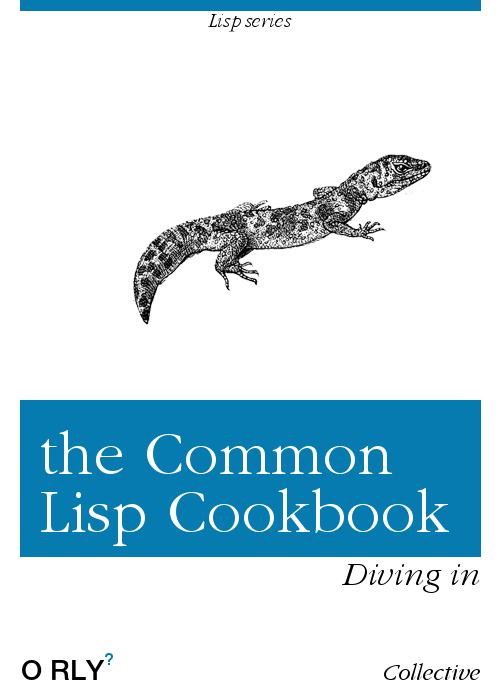

> Cookbook, n.
> a book containing recipes and other information about the preparation and cooking of food.

*now with extra Lisp*

# Content

* [License](license.html)
* [Getting started](getting-started.html)
* [Editor support](editor-support.html)
* [Functions](functions.html)
* [Data Structures](data-structures.html)
* [Strings](strings.html)
* [Numbers](numbers.html)
* [Loops, iteration, mapping](iteration.html)
* [Multidimensional Arrays](arrays.html)
* [Dates and Times](dates_and_times.html)
* [Pattern Matching](pattern_matching.html)
* [Regular Expressions](regexp.html)
* [Input/Output](io.html)
* [Files and Directories](files.html)
* [Error and condition handling](error_handling.html)
* [Packages](packages.html)
* [Macros and Backquote](macros.html)
* [CLOS (the Common Lisp Object System)](clos.html)
* [Type System](type.html)
* [Sockets](sockets.html)
* [Interfacing with your OS](os.html)
* [Foreign Function Interfaces](ffi.html)
* [Threads](process.html)
* [Defining Systems](systems.html)
* [Using the Win32 API](win32.html)
* [Debugging](debugging.html)
* [Performance Tuning](performance.html)
* [Scripting. Building executables](scripting.html)
* [Testing and Continuous Integration](testing.html)
* [Databases](databases.html)
* [GUI programming](gui.html)
* [Web development](web.html)
* [Web Scraping](web-scraping.html)
* [WebSockets](websockets.html)
* [Experimental CL21](cl21.html)
* [Miscellaneous](misc.html)

## Other CL Resources

* [lisp-lang.org](http://lisp-lang.org/)
* [List of Lisp Communities](https://github.com/CodyReichert/awesome-cl#community)
* The [Awesome-cl](https://github.com/CodyReichert/awesome-cl) list
* [The Common Lisp HyperSpec](http://www.lispworks.com/documentation/HyperSpec/Front/index.htm) by Kent M. Pitman (also available in [Dash](https://kapeli.com/dash), [Zeal](https://zealdocs.org/) and [Velocity](https://velocity.silverlakesoftware.com/))
* [The Common Lisp UltraSpec](http://phoe.tymoon.eu/clus/doku.php)
* [Practical Common Lisp](http://www.gigamonkeys.com/book/) by Peter Seibel
* [Common Lisp Recipes](http://weitz.de/cl-recipes/) by Edmund Weitz, published in 2016,
* [Cliki](http://www.cliki.net/), Common Lisp's wiki
* [Articulate Common Lisp](http://articulate-lisp.com/), an initiation manual for the uninitiated
* [Common Lisp](https://en.wikibooks.org/wiki/Common_Lisp) on Wikibooks
* [The old comp.lang.lisp FAQ](https://common-lisp.net/project/lispfaq/FAQ/) by Mark Kantrowitz, Barry Margolin, and Christophe Rhodes
* [Common Lisp: A Gentle Introduction to Symbolic Computation](http://www-2.cs.cmu.edu/~dst/LispBook/) by David S. Touretzky
* [Successful Lisp: How to Understand and Use Common Lisp](https://successful-lisp.blogspot.com/p/httpsdrive.html) by David B. Lamkins
* [On Lisp](http://www.paulgraham.com/onlisptext.html) by Paul Graham
* [Common Lisp the Language, 2nd Edition](http://www-2.cs.cmu.edu/Groups/AI/html/cltl/cltl2.html) by Guy L. Steele
* [Common Lisp Hints](http://www.n-a-n-o.com/lisp/cmucl-tutorials/LISP-tutorial.html) by Geoffrey J. Gordon
* [Common Lisp Pitfalls](https://raw.githubusercontent.com/ebzzry/cl-pitfalls/master/cl-pitfalls.txt) by Jeff Dalton
* [A Tutorial on Good Lisp Style](https://www.cs.umd.edu/%7Enau/cmsc421/norvig-lisp-style.pdf) by Peter Norvig and Kent Pitman
* [Lisp and Elements of Style](http://web.archive.org/web/20190316190256/https://www.nicklevine.org/declarative/lectures/) by Nick Levine
* Pascal Costanza's [Highly Opinionated Guide to Lisp](http://www.p-cos.net/lisp/guide.html)
* [Loving Lisp - the Savy Programmer's Secret Weapon](https://leanpub.com/lovinglisp/) by Mark Watson
* [FranzInc](https://franz.com/), a company selling Common Lisp and Graph Database solutions.

## Further remarks

This is a collaborative project that aims to provide for Common Lisp something
similar to the [Perl Cookbook][perl] published by O'Reilly. More details about
what it is and what it isn't can be found in this [thread][thread] from
[comp.lang.lisp][cll].

If you want to contribute to the CL Cookbook, please send a pull request in or
file a ticket!

Yes, we're talking to you! We need contributors - write a chapter that's missing
and add it, find an open question and provide an answer, find bugs and report
them, (If you have no idea what might be missing but would like to help, take a
look at the [table of contents][toc] of the Perl Cookbook.) Don't worry about
the formatting, just send plain text if you like - we'll take care about that
later.

Thanks in advance for your help!

The pages here on Github are kept up to date. You can also download a
[up to date zip file][zip] for offline browsing. More info can be found at the
[Github project page][gh].

    

[cll]: news:comp.lang.lisp
[perl]: http://www.oreilly.com/catalog/cookbook/
[thread]: http://groups.google.com/groups?threadm=m3it9soz3m.fsf%40bird.agharta.de
[toc]: http://www.oreilly.com/catalog/cookbook/
[zip]: https://github.com/LispCookbook/cl-cookbook/archive/master.zip
[gh]: https://github.com/LispCookbook/cl-cookbook
