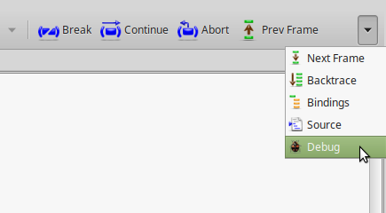
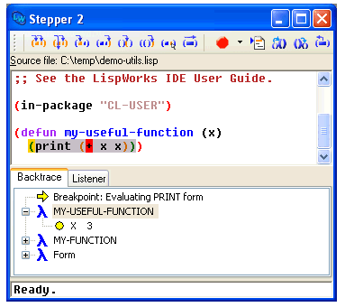
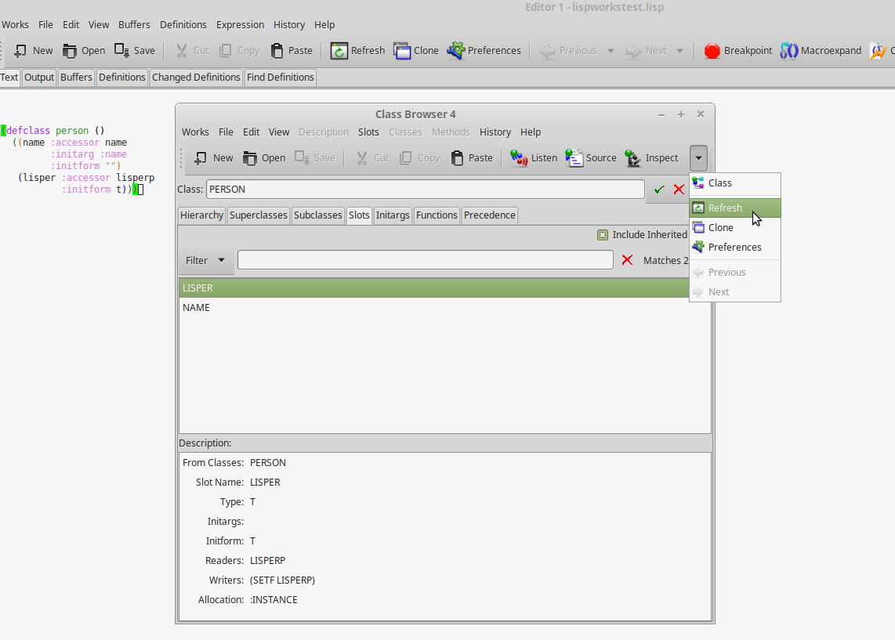
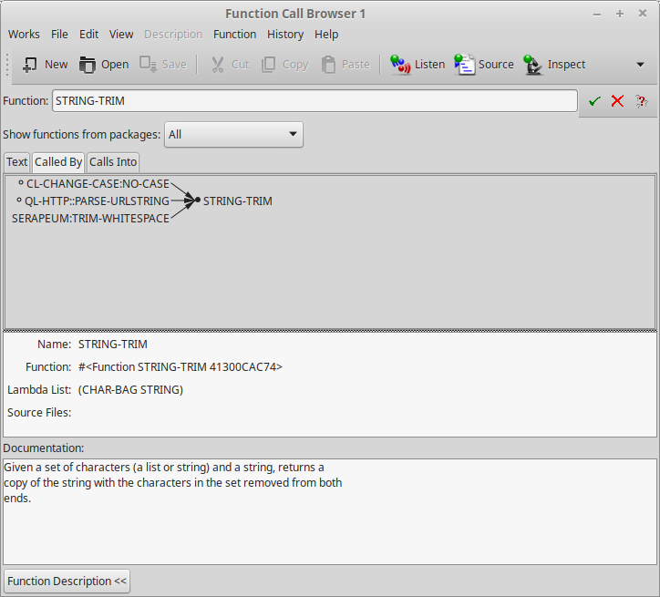
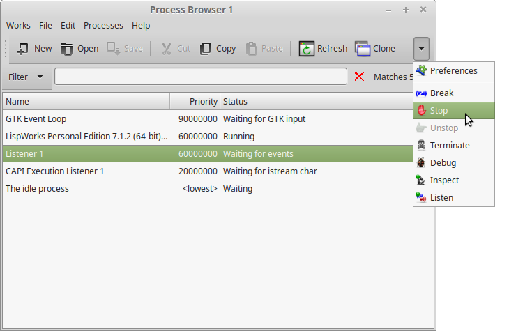

[LispWorks](http://www.lispworks.com/) is a Common Lisp implementation
that comes with its own Integrated Development Environment (IDE) and
its share of unique features, such as the CAPI GUI toolkit.  It is
**proprietary** and provides a **free limited version**.

Here, we will mainly explore its IDE, asking ourselves what it can
offer to a seasoned lisper used to Emacs and Slime. The short answer
is: more graphical tools, such as an easy to use graphical stepper, a
tracer, a code coverage browser or again a class browser. Setting and
using breakpoints was easier than on Slime.

LispWorks also provides more integrated tools (the Process browser
lists all processes running in the Lisp image and we can
stop, break or debug them) and presents many information in the form of
graphs (for example, a graph of function calls or a graph of all the
created windows).


## LispWorks features

We can see TODO URL

- CAPI GUI toolkit: provides native look-and-feel on Windows, Cocoa, GTK+ and Motif.
  - comes with a graphical "Interface Builder" (think QtCreator).

- [LispWorks for mobile](http://www.lispworks.com/products/lw4mr.html) runtime, for Android and iOS.

- tree shaker

### Free edition limitations

The download instructions and the limitations are given [on the download page](http://www.lispworks.com/downloads/index.html).

The limitations are the following:

- There is a **heap size limit** which, if exceeded, causes the image to exit. A warning is provided when the limit is approached.

What does it prevent us to do? As an illustration, we can not load this set of libraries together in the same image:

~~~lisp
(ql:quickload '("alexandria" "serapeum" "bordeaux-threads" "lparallel" "dexador" "hunchentoot" "quri" "ltk" "cl-ppcre" "mito"))
~~~

- There is a **time limit of 5 hours** for each session, after which LispWorks Personal exits, possibly without saving your work or performing cleanups such as removing temporary files. You are warned after 4 hours of use.

- It is **impossible to build a binary**. Indeed, the functions [save-image](http://www.lispworks.com/documentation/lw71/LW/html/lw-95.htm), [deliver](http://www.lispworks.com/documentation/lw71/DV/html/delivery-4.htm#pgfId-852223) (*the* function to create a stand-alone executable), and load-all-patches are not available.

- **Initialization files are not loaded**. If you are used to initializing Quicklisp from your `~/.sbclrc` on Emacs, you'll have to load an init file manually every time you start LispWorks (`(load #p"~/.your-init-file`)).

For the record, the snippet provided by Quicklisp to put in one's startup file is the following:

~~~lisp
;; provided you installed quicklisp in ~/quicklisp/
(let ((quicklisp-init (merge-pathnames "quicklisp/setup.lisp" (user-homedir-pathname))))
  (when (probe-file quicklisp-init)
    (load quicklisp-init)))
~~~

You'll have to paste it to the listener window (with the `C-y` key, y as "yank").

- Layered products that are part of LispWorks Professional and Enterprise Editions (CLIM, KnowledgeWorks, Common SQL and LispWorks ORB) are not included. But **we can try the CAPI toolkit**.

The installation process requires you to fill an HTML form to receive
a download link, then to run a first script that makes you accept the
terms and the licence, then to run a second script that installs the software.

### Licencing model

LispWorks actually comes in four paid editions. It's all explained by themselves here: [http://www.lispworks.com/products/lispworks.html](http://www.lispworks.com/products/lispworks.html). In short, there is:

- a Hobbyist edition with `save-image` and `load-all-patches`, to apply updates of minor versions, without the obvious limitations, for non-commercial and non-academic use,
- a HobbyistDV edition with the `deliver` function to create executables (still for non-commercial and non-academic uses),
- a Professional edition, with the `deliver` function, for commercial and academic uses,
- an Enterprise one, with their enterprise modules: the Common SQL interface, LispWorks ORB, KnowledgeWorks.

At the time of writing, the licence of the hobbyist edition costs 750 USD, the pro version the double. They are bought for a LW version, per platform. They have no limit of time.

<div class="info-box info">
<!-- if inside a <p> then bootstrap adds 10px padding to the bottom -->
<strong>NB:</strong> Please double check their upstream resources and don't hesitate to contact them.
</div>


## LispWorks IDE

The LispWorks IDE is self-contained, but it is also possible to use LispWorks-the-implementation from Emacs and Slime.

### The editor

The editor offers what's expected: a TAB-completion pop-up, syntax
highlighting, Emacs-like keybindings (including the `M-x` extended
command). The menus help the discovery.

We personally found the editing experience a bit "raw". For example:
- indention after a new line is not automatic, one has to press TAB
again.
- the auto-completion is not fuzzy.
- there are no plugins similar to Paredit or Lispy, nor a Vim layer.

We also had an issue, in that the go-to-source function bound to `M-.`
did not work out for built-in Lisp symbols. This is probably a free
edition limitation too.

The editor provides an interesting tab: Changed Definitions. It lists the functions and methods that were redefined since, at our choosing: the first edit of the session, the last save, the last compile.

See also:

- the [Editor User Guide](http://www.lispworks.com/documentation/lw71/EDUG-U/html/eduser-u.htm).

### Keybindings

Most of the keybindings are similar to Emacs, but not all. Here are some differences:

- to **compile a function**, use `C-S-c` (control, shift and c), instead of C-c C-c.
- to **compile the current buffer**, use `C-S-b` (instead of C-c C-k).

Similar ones include:

- `C-g` to cancel what you're doing,
- `C-x C-s` to save the current buffer,
- `M-w` and `C-y` to copy and paste,
- `M-b`, `M-f`, `C-a`, `C-e`… to move around words, to go to the beginning or the end of the line,
- `C-k` to kill until the end of the line, `C-w` to kill a selected region,
- `M-.` to find the source of a symbol,
- `C-x C-e` to evaluate the current defun,
- …

Some useful functions don't have a keybinding by default, for example:

<!-- - delete selected text with `M-x delete-region` (or kill the region with `C-w`) -->
- clear the REPL with `M-x Clear Listener`
- `Backward Kill Line`

It is possible to use **classical keybindings**, à la KDE/Gnome. Go to the
Preferences menu, Environment and in the Emulation tab.

There is **no Vim layer**.

### Searching keybindings by name

It is possible to search for a keybinding associated to a function, or
a function name from its keybinding, with the menu (Help -> Editing ->
Key to Command / Command to Key) or with `C-h` followed by a key,
as in Emacs. For example type `C-h k` then enter a keybinding to
get the command name. See more with `C-h ?`.

### Tweaking the IDE

It is possible to change keybindings. The editor's state is accessible
from the `editor` package, and the editor is built with the CAPI
framework, so we can use the `capi` interface too. Useful functions
include:

~~~lisp
`
editor:bind-key
editor:defcommand
editor:current-point
editor:with-point  ;; save point location
editor:move-point
editor:*buffer-list*
editor:*in-listener* ;; returns T when we are in the REPL
…
~~~

Here's how you can bind keys:

~~~lisp
;; Indent new lines.
;; By default, the point is not indented after a Return.
(editor:bind-key "Indent New Line" #\Return :mode "Lisp")

;; Insert pairs.
(editor:bind-key "Insert Parentheses For Selection" #\( :mode "Lisp") ;;
(editor:bind-key "Insert Double Quotes For Selection" #\" :mode "Lisp")
~~~

Here's how to define a new command. We make the `)` key
to go past the next closing parenthesis.


~~~lisp
(editor:defcommand "Move Over ()" (p)
  "Move past the next close parenthesis.
Any indentation preceeding the parenthesis is deleted."
  "Move past the next close parenthesis."
  ;; thanks to Thomas Hermann
  ;; https://github.com/ThomasHermann/LispWorks/blob/master/editor.lisp
  (declare (ignore p))
  (let ((point (editor:current-point)))
    (editor:with-point ((m point))
      (cond ((editor::forward-up-list m)
	     (editor:move-point point m)
             (editor::point-before point)
             (loop (editor:with-point ((back point))
                     (editor::back-to-indentation back)
                     (unless (editor:point= back point)
                       (return)))
                   (editor::delete-indentation point))
	     (editor::point-after point))
	    (t (editor:editor-error))))))

(editor:bind-key "Move Over ()" #\) :mode "Lisp")
~~~

And here's how you can change indentation for special forms:

~~~lisp
(editor:setup-indent "if" 1 4 1)
~~~

See also:

- a list of LispWork keybindings: https://www.nicklevine.org/declarative/lectures/additional/key-binds.html

### The listener

The listener is the REPL.

Its interactive debugger is primarily textual but you can also
interact with it with graphical elements. For example, you can use the
Abort button of the menu bar, which brings you back to the top
level. You can invoke the graphical debugger to see the stacktraces
and interact with them. See the Debugger button at the very end of the
toolbar.



If you see the name of your function in the stacktraces (you will if
you wrote and compiled your code in a file, and not directly wrote it
in the REPL), you can double-click on its name to go back to the
editor and have it highlight the part of your code that triggered the
error.


<div class="info-box info">
<!-- if inside a <p> then bootstrap adds 10px padding to the bottom -->
<strong>NB:</strong> this is equivalent of pressing <code>M-v</code> in Slime.
</div>


### The stepper. Breakpoints.

The [stepper](http://www.lispworks.com/documentation/lw61/IDE-W/html/ide-w-496.htm) is one
of the areas where LispWorks shines.

When your are writing code in the editor window, you can set
breakpoints with the big red "Breakpoint" button (or by calling `M-x Stepper Breakpoint`).
This puts a red mark in your code.

The next time your code is executed, you'll get a comprehensive Stepper pop-up window showing:

- your source code, with an indicator showing what expression is being evaluated
- a lower pane with two tabs:
  - the backtrace, showing the intermediate variables, thus showing their evolution during the execution of the program
  - the listener, in the context of this function call, where you can evaluate expressions
- and the menu bar with the stepper controls: you can step into the next expression, step on the next function call, continue execution until the position of the cursor, continue the execution until the next breakpoint, etc.



### The class browser

The class browser allows us to examine a class's slots, parent classes, available methods, and some more.

Let's create a simple class:

~~~lisp
(defclass person ()
  ((name :accessor name
         :initarg :name
         :initform "")
   (lisper :accessor lisperp
           :initform t)))
~~~

Now call the class browser:

- use the "Class" button from the listener,
- or use the menu Expression -> Class,
- or put the cursor on the class and call `M-x Describe class`.



It is composed of several panes:

- the **class hierarchy**, showing the superclasses on the left and the subclasses on the right, with their description to the bottom,
- the **superclasses viewer**, in the form of a simple schema, and the same for subclasses,
- the **slots pane** (the default),
- the available **initargs**,
- the existing **generic functions** for that class
- and the **class precedence list**.

The Functions pane lists all methods applicable to that class, so we can discover public methods provided by the CLOS object system: `initialize-instance`, `print-object`, `shared-initialize`, etc. We can double-click on them to go to their source. We can choose not to include the inherited methods too (see the "include inherited" checkbox).

You'll find buttons on the toolbar (for example, Inspect a generic
function) and more actions on the Methods menu, such as a way to see
the **functions calls**, a menu to **undefine** or **trace** a function.

See more:

* [Chapter 8 of the documentation: the Class Browser](http://www.lispworks.com/documentation/lw71/IDE-U/html/ide-u-55.htm#pgfId-871798)

### The tracer

### The function call browser

The function call browser allows us to see a graph of the callers and
the callees of a function. It provides several ways to filter the
displayed information and to further inspect the call stack.

<div class="info-box info">
<!-- if inside a <p> then bootstrap adds 10px padding to the bottom -->
<strong>NB:</strong> The Slime functions to find such cross-references are <code>slime-who-[calls, references, binds, sets, depends-on, specializes, macroexpands]</code>.
</div>

After loading a couple packages, here's a simple example showing who calls the `string-trim` function.



It shows functions from all packages, but there is a select box to restrict it further, for example to the "current and used" or only to the current packages.

Double click on a function shown in the graph to go to its source. Again, as in many LispWorks views, the Function menu allows to further manipulate selected functions: trace, undefine, listen (paste the object to the Listener)…

The Text tab shows the same information, but textually, the callers and callees side by side.

We can see cross references for compiled code, and we must ensure the feature is on. When we you compile code, LispWorks shows a compilation output likes this:

```
;;; Safety = 3, Speed = 1, Space = 1, Float = 1, Interruptible = 1
;;; Compilation speed = 1, Debug = 2, Fixnum safety = 3
;;; Source level debugging is on
;;; Source file recording is  on
;;; Cross referencing is on
```

We see that cross referencing is on. Otherwise, activate it with `(toggle-source-debugging t)`.

See more:

- [Chapter 15: the function call browser](http://www.lispworks.com/documentation/lw71/IDE-U/html/ide-u-114.htm#pgfId-852601)


### The Process Browser

The Process Browser shows us a list of all threads running. The input area allows to filter by name. It accepts regular expressions. Then we can stop, inspect, listen, break into these processes.



See more:

* [Chapter 28: the Process Browser](http://www.lispworks.com/documentation/lw71/IDE-U/html/ide-u-178.htm#pgfId-852666)


## See also

- [LispWorks IDE User Guide](http://www.lispworks.com/documentation/lw71/IDE-U/html/ide-u.htm) (check out the sections we didn't cover)
- the [Awesome LispWorks](https://github.com/fourier/awesome-lispworks) list
