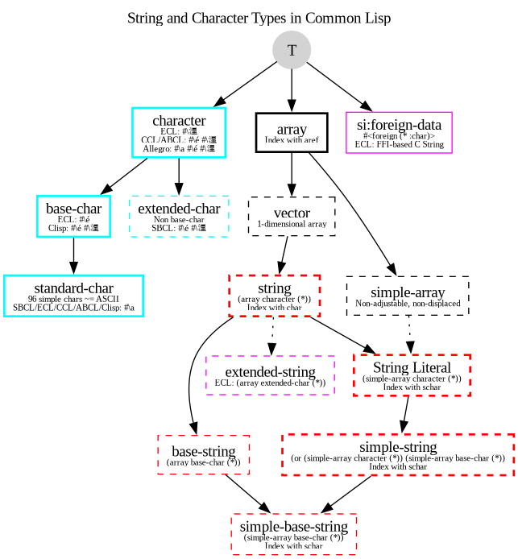

The most important thing to know about strings in Common Lisp is probably that
they are arrays and thus also sequences. This implies that all concepts that are
applicable to arrays and sequences also apply to strings. If you can't find a
particular string function, make sure you've also searched for the more general
[array or sequence functions](http://www.gigamonkeys.com/book/collections.html).
We'll only cover a fraction of what can be done with and to strings here.

ASDF3, which is included with almost all Common Lisp implementations,
includes
[Utilities for Implementation- and OS- Portability (UIOP)](https://gitlab.common-lisp.net/asdf/asdf/blob/master/uiop/README.md),
which defines functions to work on strings (`strcat`,
`string-prefix-p`, `string-enclosed-p`, `first-char`, `last-char`,
`split-string`, `stripln`).

Some external libraries available on Quicklisp bring some more
functionality or some shorter ways to do.

- [str](https://github.com/vindarel/cl-str) defines `trim`, `words`,
  `unwords`, `lines`, `unlines`, `concat`, `split`, `shorten`, `repeat`,
  `replace-all`, `starts-with?`, `ends-with?`, `blankp`, `emptyp`, …
- [Serapeum](https://github.com/ruricolist/serapeum/blob/master/REFERENCE.md#strings) is a large set of utilities with many string manipulation functions.
- [cl-change-case](https://github.com/rudolfochrist/cl-change-case)
  has functions to convert strings between camelCase, param-case,
  snake_case and more. They are also included into `str`.
- [mk-string-metrics](https://github.com/cbaggers/mk-string-metrics)
  has functions to calculate various string metrics efficiently
  (Damerau-Levenshtein, Hamming, Jaro, Jaro-Winkler, Levenshtein, etc),
- and `cl-ppcre` can come in handy, for example
  `ppcre:replace-regexp-all`. See the [regexp](regexp.html) section.


Last but not least, when you'll need to tackle the `format` construct,
don't miss the following resources:

* the official [CLHS documentation](http://www.lispworks.com/documentation/HyperSpec/Body/22_c.htm)
* a [quick reference](http://clqr.boundp.org/)
* a [CLHS summary on HexstreamSoft](https://www.hexstreamsoft.com/articles/common-lisp-format-reference/clhs-summary/#subsections-summary-table)
* the list of all format directives at the end of this document.
* plus a Slime tip: type `C-c C-d ~` plus a letter of a format directive to open up its documentation. Use TAB-completion to list them all. Again more useful with `ivy-mode` or `helm-mode`.

## Creating strings

A string is created with double quotes, all right, but we can recall
these other ways:

- using `format nil` doesn't *print* but returns a new string (see
  more examples of `format` below):

~~~lisp
(defparameter *person* "you")
(format nil "hello ~a" *person*) ;; => "hello you"
~~~

- `make-string count` creates a string of the given length. The
  `:initial-element` character is repeated `count` times:

~~~lisp
(make-string 3 :initial-element #\♥) ;; => "♥♥♥"
~~~


## Accessing Substrings

As a string is a sequence, you can access substrings with the SUBSEQ
function. The index into the string is, as always, zero-based. The third,
optional, argument is the index of the first character which is not a part of
the substring, it is not the length of the substring.

~~~lisp
CL-USER> (defparameter *my-string* (string "Groucho Marx"))
*MY-STRING*
CL-USER> (subseq *my-string* 8)
"Marx"
CL-USER> (subseq *my-string* 0 7)
"Groucho"
CL-USER> (subseq *my-string* 1 5)
"rouc"
~~~

You can also manipulate the substring if you use SUBSEQ together with SETF.

~~~lisp
CL-USER> (defparameter *my-string* (string "Harpo Marx"))
*MY-STRING*
CL-USER> (subseq *my-string* 0 5)
"Harpo"
CL-USER> (setf (subseq *my-string* 0 5) "Chico")
"Chico"
CL-USER> *my-string*
"Chico Marx"
~~~

But note that the string isn't "stretchable". To cite from the HyperSpec: "If
the subsequence and the new sequence are not of equal length, the shorter length
determines the number of elements that are replaced." For example:

~~~lisp
CL-USER> (defparameter *my-string* (string "Karl Marx"))
*MY-STRING*
CL-USER> (subseq *my-string* 0 4)
"Karl"
CL-USER> (setf (subseq *my-string* 0 4) "Harpo")
"Harpo"
CL-USER> *my-string*
"Harp Marx"
CL-USER> (subseq *my-string* 4)
" Marx"
CL-USER> (setf (subseq *my-string* 4) "o Marx")
"o Marx"
CL-USER> *my-string*
"Harpo Mar"
~~~

## Accessing Individual Characters

You can use the function CHAR to access individual characters of a string. CHAR
can also be used in conjunction with SETF.

~~~lisp
CL-USER> (defparameter *my-string* (string "Groucho Marx"))
*MY-STRING*
CL-USER> (char *my-string* 11)
#\x
CL-USER> (char *my-string* 7)
#\Space
CL-USER> (char *my-string* 6)
#\o
CL-USER> (setf (char *my-string* 6) #\y)
#\y
CL-USER> *my-string*
"Grouchy Marx"
~~~

Note that there's also SCHAR. If efficiency is important, SCHAR can be a bit
faster where appropriate.

Because strings are arrays and thus sequences, you can also use the more generic
functions `aref` and `elt` (which are more general while CHAR might be implemented
more efficiently).

~~~lisp
CL-USER> (defparameter *my-string* (string "Groucho Marx"))
*MY-STRING*
CL-USER> (aref *my-string* 3)
#\u
CL-USER> (elt *my-string* 8)
#\M
~~~

Each character in a string has an integer code. The range of recognized codes
and Lisp's ability to print them is directed related to your implementation's
character set support, e.g. ISO-8859-1, or Unicode. Here are some examples in
SBCL of UTF-8 which encodes characters as 1 to 4 8 bit bytes. The first example
shows a character outside the first 128 chars, or what is considered the normal
Latin character set. The second example shows a multibyte encoding (beyond the
value 255). Notice the Lisp reader can round-trip characters by name.

~~~lisp
CL-USER> (stream-external-format *standard-output*)

:UTF-8
CL-USER> (code-char 200)

#\LATIN_CAPITAL_LETTER_E_WITH_GRAVE
CL-USER> (char-code #\LATIN_CAPITAL_LETTER_E_WITH_GRAVE)

200
CL-USER> (code-char 2048)
#\SAMARITAN_LETTER_ALAF

CL-USER> (char-code #\SAMARITAN_LETTER_ALAF)
2048
~~~

Check out the UTF-8 Wikipedia article for the range of supported characters and
their encodings.

## Remove or replace characters from a string

There's a slew of (sequence) functions that can be used to manipulate a string
and we'll only provide some examples here. See the sequences dictionary in the
HyperSpec for more.

`remove` one character from a string:

~~~lisp
CL-USER> (remove #\o "Harpo Marx")
"Harp Marx"
CL-USER> (remove #\a "Harpo Marx")
"Hrpo Mrx"
CL-USER> (remove #\a "Harpo Marx" :start 2)
"Harpo Mrx"
CL-USER> (remove-if #'upper-case-p "Harpo Marx")
"arpo arx"
~~~

Replace one character with `substitute` (non destructive) or `replace` (destructive):

~~~lisp
CL-USER> (substitute #\u #\o "Groucho Marx")
"Gruuchu Marx"
CL-USER> (substitute-if #\_ #'upper-case-p "Groucho Marx")
"_roucho _arx"
CL-USER> (defparameter *my-string* (string "Zeppo Marx"))
*MY-STRING*
CL-USER> (replace *my-string* "Harpo" :end1 5)
"Harpo Marx"
CL-USER> *my-string*
"Harpo Marx"
~~~


## Concatenating Strings

The name says it all: `concatenate` is your friend. Note that this is a generic
sequence function and you have to provide the result type as the first argument.

~~~lisp
CL-USER> (concatenate 'string "Karl" " " "Marx")
"Karl Marx"
CL-USER> (concatenate 'list "Karl" " " "Marx")
(#\K #\a #\r #\l #\Space #\M #\a #\r #\x)
~~~

With UIOP, use `strcat`:

~~~lisp
CL-USER> (uiop:strcat "karl" " " "marx")
~~~

or with the library `str`, use `concat`:

~~~lisp
CL-USER> (str:concat "foo" "bar")
~~~

If you have to construct a string out of many parts, all of these calls to
`concatenate` seem wasteful, though. There are at least three other good ways to
construct a string piecemeal, depending on what exactly your data is. If you
build your string one character at a time, make it an adjustable vector (a
one-dimensional array) of type character with a fill-pointer of zero, then use
`vector-push-extend` on it. That way, you can also give hints to the system if you
can estimate how long the string will be. (See the optional third argument to
`vector-push-extend`.)

~~~lisp
CL-USER> (defparameter *my-string* (make-array 0
                              :element-type 'character
                              :fill-pointer 0
                              :adjustable t))
*MY-STRING*
CL-USER> *my-string*
""
CL-USER> (dolist (char '(#\Z #\a #\p #\p #\a))
    (vector-push-extend char *my-string*))
NIL
CL-USER> *my-string*
"Zappa"
~~~

If the string will be constructed out of (the printed representations of)
arbitrary objects, (symbols, numbers, characters, strings, ...), you can use
`format` with an output stream argument of `nil`. This directs `format` to return the
indicated output as a string.

~~~lisp
CL-USER> (format nil "This is a string with a list ~A in it"
             '(1 2 3))
"This is a string with a list (1 2 3) in it"
~~~

We can use the looping constructs of the `format` mini language to emulate
`concatenate`.

~~~lisp
CL-USER> (format nil "The Marx brothers are:~{ ~A~}."
             '("Groucho" "Harpo" "Chico" "Zeppo" "Karl"))
"The Marx brothers are: Groucho Harpo Chico Zeppo Karl."
~~~

`format` can do a lot more processing but it has a relatively arcane syntax. After
this last example, you can find the details in the CLHS section about formatted
output.

~~~lisp
CL-USER> (format nil "The Marx brothers are:~{ ~A~^,~}."
             '("Groucho" "Harpo" "Chico" "Zeppo" "Karl"))
"The Marx brothers are: Groucho, Harpo, Chico, Zeppo, Karl."
~~~

Another way to create a string out of the printed representation of various
object is using `with-output-to-string`. The value of this handy macro is a string
containing everything that was output to the string stream within the body to
the macro. This means you also have the full power of `format` at your disposal,
should you need it.

~~~lisp
CL-USER> (with-output-to-string (stream)
           (dolist (char '(#\Z #\a #\p #\p #\a #\, #\Space))
             (princ char stream))
           (format stream "~S - ~S" 1940 1993))
"Zappa, 1940 - 1993"
~~~

## Processing a String One Character at a Time

Use the MAP function to process a string one character at a time.

~~~lisp
CL-USER> (defparameter *my-string* (string "Groucho Marx"))
*MY-STRING*
CL-USER> (map 'string (lambda (c) (print c)) *my-string*)
#\G
#\r
#\o
#\u
#\c
#\h
#\o
#\Space
#\M
#\a
#\r
#\x
"Groucho Marx"
~~~

Or do it with LOOP.

~~~lisp
CL-USER> (loop for char across "Zeppo"
               collect char)
(#\Z #\e #\p #\p #\o)
~~~

## Reversing a String by Word or Character

Reversing a string by character is easy using the built-in `reverse` function (or
its destructive counterpart `nreverse`).

~~~lisp
CL-USER> (defparameter *my-string* (string "DSL"))
*MY-STRING*
CL-USER> (reverse *my-string*)
"LSD"
~~~

There's no one-liner in CL to reverse a string by word (like you would do it in
Perl with split and join). You either have to use functions from an external
library like SPLIT-SEQUENCE or you have to roll your own solution.

Here's an attempt with the `str` library:

~~~lisp
CL-USER> (defparameter *singing* "singing in the rain")
*SINGING*
CL-USER> (str:words *SINGING*)
("singing" "in" "the" "rain")
CL-USER> (reverse *)
("rain" "the" "in" "singing")
CL-USER> (str:unwords *)
"rain the in singing"
~~~

And here's another one with no external dependencies:

~~~lisp
CL-USER> (defun split-by-one-space (string)
    "Returns a list of substrings of string
    divided by ONE space each.
    Note: Two consecutive spaces will be seen as
    if there were an empty string between them."
    (loop for i = 0 then (1+ j)
          as j = (position #\Space string :start i)
          collect (subseq string i j)
          while j))
SPLIT-BY-ONE-SPACE
CL-USER> (split-by-one-space "Singing in the rain")
("Singing" "in" "the" "rain")
CL-USER> (split-by-one-space "Singing in the  rain")
("Singing" "in" "the" "" "rain")
CL-USER> (split-by-one-space "Cool")
("Cool")
CL-USER> (split-by-one-space " Cool ")
("" "Cool" "")
CL-USER> (defun join-string-list (string-list)
    "Concatenates a list of strings
and puts spaces between the elements."
    (format nil "~{~A~^ ~}" string-list))
JOIN-STRING-LIST
CL-USER> (join-string-list '("We" "want" "better" "examples"))
"We want better examples"
CL-USER> (join-string-list '("Really"))
"Really"
CL-USER> (join-string-list '())
""
CL-USER> (join-string-list
          (nreverse
           (split-by-one-space
            "Reverse this sentence by word")))
"word by sentence this Reverse"
~~~

## Dealing with unicode strings

We'll use here [SBCL's string operations](http://www.sbcl.org/manual/index.html#String-operations). More generally, see [SBCL's unicode support](http://www.sbcl.org/manual/index.html#Unicode-Support).


### Sorting unicode strings alphabetically

Sorting unicode strings with `string-lessp` as the comparison function
isn't satisfying:

~~~lisp
CL-USER> (sort '("Aaa" "Ééé" "Zzz") #'string-lessp)
("Aaa" "Zzz" "Ééé")
~~~

With [SBCL](http://www.sbcl.org/manual/#String-operations), use `sb-unicode:unicode<`:

~~~lisp
CL-USER> (sort '("Aaa" "Ééé" "Zzz") #'sb-unicode:unicode<)
("Aaa" "Ééé" "Zzz")
~~~

### Breaking strings into graphemes, sentences, lines and words

These functions use SBCL's [`sb-unicode`](http://www.sbcl.org/manual/#String-operations): they are SBCL specific.

Use `sb-unicode:sentences` to break a string into sentences according
to the default sentence breaking rules.

Use `sb-unicode:lines` to break a string into lines that are no wider
than the `:margin` keyword argument. Combining marks will always be kept together with their base characters, and spaces (but not other types of whitespace) will be removed from the end of lines. If `:margin` is unspecified, it defaults to 80 characters

~~~lisp
CL-USER> (sb-unicode:lines "A first sentence. A second somewhat long one." :margin 10)
("A first"
 "sentence."
 "A second"
 "somewhat"
 "long one.")
~~~

See also `sb-unicode:words` and `sb-unicode:graphemes`.

Tip: you can ensure these functions are run only in SBCL with a feature flag:

    #+sbcl
    (runs on sbcl)
    #-sbcl
    (runs on other implementations)

## Controlling Case

Common Lisp has a couple of functions to control the case of a string.

~~~lisp
CL-USER> (string-upcase "cool")
"COOL"
CL-USER> (string-upcase "Cool")
"COOL"
CL-USER> (string-downcase "COOL")
"cool"
CL-USER> (string-downcase "Cool")
"cool"
CL-USER> (string-capitalize "cool")
"Cool"
CL-USER> (string-capitalize "cool example")
"Cool Example"
~~~

These functions take the `:start` and `:end` keyword arguments so you can optionally
only manipulate a part of the string. They also have destructive counterparts
whose names starts with "N".

~~~lisp
CL-USER> (string-capitalize "cool example" :start 5)
"cool Example"
CL-USER> (string-capitalize "cool example" :end 5)
"Cool example"
CL-USER> (defparameter *my-string* (string "BIG"))
*MY-STRING*
CL-USER> (defparameter *my-downcase-string* (nstring-downcase *my-string*))
*MY-DOWNCASE-STRING*
CL-USER> *my-downcase-string*
"big"
CL-USER> *my-string*
"big"
~~~

Note this potential caveat: according to the HyperSpec,

> for STRING-UPCASE, STRING-DOWNCASE, and STRING-CAPITALIZE, string is not modified. However, if no characters in string require conversion, the result may be either string or a copy of it, at the implementation's discretion.

This implies that the last result in
the following example is implementation-dependent - it may either be "BIG" or
"BUG". If you want to be sure, use `copy-seq`.

~~~lisp
CL-USER> (defparameter *my-string* (string "BIG"))
*MY-STRING*
CL-USER> (defparameter *my-upcase-string* (string-upcase *my-string*))
*MY-UPCASE-STRING*
CL-USER> (setf (char *my-string* 1) #\U)
#\U
CL-USER> *my-string*
"BUG"
CL-USER> *my-upcase-string*
"BIG"
~~~

### With the format function

The format function has directives to change the case of words:

#### To lower case: ~( ~)

~~~lisp
CL-USER> (format t "~(~a~)" "HELLO WORLD")
hello world
~~~


#### Capitalize every word: ~:( ~)

~~~lisp
CL-USER> (format t "~:(~a~)" "HELLO WORLD")
Hello World
NIL
~~~

#### Capitalize the first word: ~@( ~)

~~~lisp
CL-USER> (format t "~@(~a~)" "hello world")
Hello world
NIL
~~~

#### To upper case: ~@:( ~)

Where we re-use the colon and the @:

~~~lisp
CL-USER> (format t "~@:(~a~)" "hello world")
HELLO WORLD
NIL
~~~


## Trimming Blanks from the Ends of a String

Not only can you trim blanks, but you can get rid of arbitrary characters. The
functions `string-trim`, `string-left-trim` and `string-right-trim` return a substring
of their second argument where all characters that are in the first argument are
removed off the beginning and/or the end. The first argument can be any sequence
of characters.

~~~lisp
CL-USER> (string-trim " " " trim me ")
"trim me"
CL-USER> (string-trim " et" " trim me ")
"rim m"
CL-USER> (string-left-trim " et" " trim me ")
"rim me "
CL-USER> (string-right-trim " et" " trim me ")
" trim m"
CL-USER> (string-right-trim '(#\Space #\e #\t) " trim me ")
" trim m"
CL-USER> (string-right-trim '(#\Space #\e #\t #\m) " trim me ")
~~~

Note: The caveat mentioned in the section about Controlling Case also applies
here.

## Converting between Symbols and Strings

The function `intern` will "convert" a string to a symbol. Actually, it will check
whether the symbol denoted by the string (its first argument) is already
accessible in the package (its second, optional, argument which defaults to the
current package) and enter it, if necessary, into this package. It is beyond the
scope of this chapter to explain all the concepts involved and to address the
second return value of this function. See the CLHS chapter about packages for
details.

Note that the case of the string is relevant.

~~~lisp
CL-USER> (in-package "COMMON-LISP-USER")
#<The COMMON-LISP-USER package, 35/44 internal, 0/9 external>
CL-USER> (intern "MY-SYMBOL")
MY-SYMBOL
NIL
CL-USER> (intern "MY-SYMBOL")
MY-SYMBOL
:INTERNAL
CL-USER> (export 'MY-SYMBOL)
T
CL-USER> (intern "MY-SYMBOL")
MY-SYMBOL
:EXTERNAL
CL-USER> (intern "My-Symbol")
|My-Symbol|
NIL
CL-USER> (intern "MY-SYMBOL" "KEYWORD")
:MY-SYMBOL
NIL
CL-USER> (intern "MY-SYMBOL" "KEYWORD")
:MY-SYMBOL
:EXTERNAL
~~~

To do the opposite, convert from a symbol to a string, use `symbol-name` or
`string`.

~~~lisp
CL-USER> (symbol-name 'MY-SYMBOL)
"MY-SYMBOL"
CL-USER> (symbol-name 'my-symbol)
"MY-SYMBOL"
CL-USER> (symbol-name '|my-symbol|)
"my-symbol"
CL-USER> (string 'howdy)
"HOWDY"
~~~

## Converting between Characters and Strings

You can use `coerce` to convert a string of length 1 to a character. You can also
use `coerce` to convert any sequence of characters into a string. You can not use
`coerce` to convert a character to a string, though - you'll have to use `string`
instead.

~~~lisp
CL-USER> (coerce "a" 'character)
#\a
CL-USER> (coerce (subseq "cool" 2 3) 'character)
#\o
CL-USER> (coerce "cool" 'list)
(#\c #\o #\o #\l)
CL-USER> (coerce '(#\h #\e #\y) 'string)
"hey"
CL-USER> (coerce (nth 2 '(#\h #\e #\y)) 'character)
#\y
CL-USER> (defparameter *my-array* (make-array 5 :initial-element #\x))
*MY-ARRAY*
CL-USER> *my-array*
#(#\x #\x #\x #\x #\x)
CL-USER> (coerce *my-array* 'string)
"xxxxx"
CL-USER> (string 'howdy)
"HOWDY"
CL-USER> (string #\y)
"y"
CL-USER> (coerce #\y 'string)
#\y can't be converted to type STRING.
   [Condition of type SIMPLE-TYPE-ERROR]
~~~

## Finding an Element of a String

Use `find`, `position`, and their `…-if` counterparts to find characters in a string, with the appropriate `:test` parameter:

~~~lisp
CL-USER> (find #\t "Tea time." :test #'equal)
#\t
CL-USER> (find #\t "Tea time." :test #'equalp)
#\T
CL-USER> (find #\z "Tea time." :test #'equalp)
NIL
CL-USER> (find-if #'digit-char-p "Tea time.")
#\1
CL-USER> (find-if #'digit-char-p "Tea time." :from-end t)
#\0

CL-USER> (position #\t "Tea time." :test #'equal)
4   ;; <= the first lowercase t
CL-USER> (position #\t "Tea time." :test #'equalp)
0    ;; <= the first capital T
CL-USER> (position-if #'digit-char-p "Tea time is at 5'00.")
15
CL-USER> (position-if #'digit-char-p "Tea time is at 5'00." :from-end t)
18
~~~

Or use `count` and friends to count characters in a string:

~~~lisp
CL-USER> (count #\t "Tea time." :test #'equal)
1  ;; <= equal ignores the capital T
CL-USER> (count #\t "Tea time." :test #'equalp)
2  ;; <= equalp counts the capital T
CL-USER> (count-if #'digit-char-p "Tea time is at 5'00.")
3
CL-USER> (count-if #'digit-char-p "Tea time is at 5'00." :start 18)
1
~~~

## Finding a Substring of a String

The function `search` can find substrings of a string.

~~~lisp
CL-USER> (search "we" "If we can't be free we can at least be cheap")
3
CL-USER> (search "we" "If we can't be free we can at least be cheap"
          :from-end t)
20
CL-USER> (search "we" "If we can't be free we can at least be cheap"
          :start2 4)
20
CL-USER> (search "we" "If we can't be free we can at least be cheap"
          :end2 5 :from-end t)
3
CL-USER> (search "FREE" "If we can't be free we can at least be cheap")
NIL
CL-USER> (search "FREE" "If we can't be free we can at least be cheap"
          :test #'char-equal)
15
~~~

## Converting a String to a Number

### To an integer: parse-integer

CL provides the `parse-integer` function to convert a string representation of an integer
to the corresponding numeric value. The second return value is the index into
the string where the parsing stopped.

~~~lisp
CL-USER> (parse-integer "42")
42
2
CL-USER> (parse-integer "42" :start 1)
2
2
CL-USER> (parse-integer "42" :end 1)
4
1
CL-USER> (parse-integer "42" :radix 8)
34
2
CL-USER> (parse-integer " 42 ")
42
3
CL-USER> (parse-integer " 42 is forty-two" :junk-allowed t)
42
3
CL-USER> (parse-integer " 42 is forty-two")

Error in function PARSE-INTEGER:
   There's junk in this string: " 42 is forty-two".
~~~

`parse-integer` doesn't understand radix specifiers like `#X`, nor is there a
built-in function to parse other numeric types. You could use `read-from-string`
in this case.

### Extracting many integers from a string: `ppcre:all-matches-as-strings`

We show this in the Regular Expressions chapter but while we are on this topic, you can find it super useful:

~~~lisp
CL-USER> (ppcre:all-matches-as-strings "-?\\d+" "42 is 41 plus 1")
;; ("42" "41" "1")

CL-USER> (mapcar #'parse-integer *)
;; (42 41 1)
~~~

### To any number: `read-from-string`

Be aware that the full reader is in effect if you're using this
function. This can lead to vulnerability issues. You should use a
library like `parse-number` or `parse-float` instead.

~~~lisp
CL-USER> (read-from-string "#X23")
35
4
CL-USER> (read-from-string "4.5")
4.5
3
CL-USER> (read-from-string "6/8")
3/4
3
CL-USER> (read-from-string "#C(6/8 1)")
#C(3/4 1)
9
CL-USER> (read-from-string "1.2e2")
120.00001
5
CL-USER> (read-from-string "symbol")
SYMBOL
6
CL-USER> (defparameter *foo* 42)
*FOO*
CL-USER> (read-from-string "#.(setq *foo* \"gotcha\")")
"gotcha"
23
CL-USER> *foo*
"gotcha"
~~~

### Protecting `read-from-string`

At the very least, if you are reading data coming from the outside, use this:

~~~lisp
(let ((cl:*read-eval* nil))
  (read-from-string "…"))
~~~

This prevents code to be evaluated at read-time. That way our last example, using the `#.` reader macro, would not work. You'll get the error "can't read #. while \*READ-EVAL\* is NIL".

And better yet, for more protection from a possibly custom readtable that would introduce another reader macro:

~~~lisp
(with-standard-io-syntax
  (let ((cl:*read-eval* nil))
    (read-from-string "…")))
~~~


### To a float: the parse-float library

There is no built-in function similar to `parse-integer` to parse
other number types. The external library
[parse-float](https://github.com/soemraws/parse-float) does exactly
that. It doesn't use `read-from-string` so it is safe to use.

~~~lisp
CL-USER> (ql:quickload "parse-float")
CL-USER> (parse-float:parse-float "1.2e2")
120.00001
5
~~~

LispWorks also has a [parse-float](http://www.lispworks.com/documentation/lw51/LWRM/html/lwref-228.htm) function.

See also [parse-number](https://github.com/sharplispers/parse-number).


## Converting a Number to a String

The general function `write-to-string` or one of its simpler variants
`prin1-to-string` or `princ-to-string` may be used to convert a number to a
string. With `write-to-string`, the `:base` keyword argument may be used to change
the output base for a single call. To change the output base globally, set
*print-base* which defaults to 10. Remember in Lisp, rational numbers are
represented as quotients of two integers even when converted to strings.

~~~lisp
CL-USER> (write-to-string 250)
"250"
CL-USER> (write-to-string 250.02)
"250.02"
CL-USER> (write-to-string 250 :base 5)
"2000"
CL-USER> (write-to-string (/ 1 3))
"1/3"
~~~

## Comparing Strings

The general functions `equal` and `equalp` can be used to test whether two strings
are equal. The strings are compared element-by-element, either in a
case-sensitive manner (`equal`) or not (`equalp`). There's also a bunch of
string-specific comparison functions. You'll want to use these if you're
deploying implementation-defined attributes of characters. Check your vendor's
documentation in this case.

Here are a few examples. Note that all functions that test for inequality return the position of the first mismatch as a generalized boolean. You can also use the generic sequence function `mismatch` if you need more versatility.

~~~lisp
CL-USER> (string= "Marx" "Marx")
T
CL-USER> (string= "Marx" "marx")
NIL
CL-USER> (string-equal "Marx" "marx")
T
CL-USER> (string< "Groucho" "Zeppo")
0
CL-USER> (string< "groucho" "Zeppo")
NIL
CL-USER> (string-lessp "groucho" "Zeppo")
0
CL-USER> (mismatch "Harpo Marx" "Zeppo Marx" :from-end t :test #'char=)
3
~~~

and also `string/=`, `string-not-equal`, `string-not-lessp`, `string-not-greaterp`.

## String formatting: `format`

The `format` function has a lot of directives to print strings,
numbers, lists, going recursively, even calling Lisp functions,
etc. We'll focus here on a few things to print and format strings.

For our examples below, we'll work with a list of movies:

~~~lisp
(defparameter *movies* '(
    (1 "Matrix" 5)
    (10 "Matrix Trilogy swe sub" 3.3)))
~~~


### Structure of format

Format directives start with `~`. A final character like `A` or `a`
(they are case insensitive) defines the directive. In between, it can
accept coma-separated options and parameters.  Further, some directives
can take colon and at-sign modifiers, which change the behavior of the
directive in some way.  For example, with the `D` directive, the colon
adds commas every three digits, and the at-sign adds a plus sign when
the number is positive:

~~~lisp
(format nil "~d" 2025)
;; => "2025"
(format nil "~:d" 2025)
;; => "2,025"
(format nil "~@d" 2025)
;; => "+2025"
(format nil "~@:d" 2025)
;; => "+2,025"
~~~

With the at-sign modifier, the `R` directive outputs Roman numerals
rather than an English cardinal number:

~~~lisp
(format nil "~r" 2025)
;; => "two thousand twenty-five"
(format nil "~@r" 2025)
;; => "MMXXV"
~~~

If there isn't a sensible interpretation for both modifiers used
together, the result is either undefined or some additional meaning.

Print a tilde with `~~`, or 10 tildes with `~10~`.

Other directives include:

- `R`: Roman (e.g., prints in English): `(format t "~R" 20)` => "twenty".
- `$`: monetary: `(format t "~$" 21982)` => 21982.00
- `D`, `B`, `O`, `X`: Decimal, Binary, Octal, Hexadecimal.
- `F`: fixed-format Floating point.
- `P`: plural: `(format nil "~D famil~:@P/~D famil~:@P" 7 1)` => "7 families/1 family"

### Basic primitive: ~A or ~a (Aesthetics)

`(format t "~a" *movies*)` is the most basic primitive.

`t` prints to `*standard-output*`.

~~~lisp
(format nil "~a" *movies*)
;; => "((1 Matrix 5) (10 Matrix Trilogy swe sub 3.3))"
~~~

Here, `nil` tells `format` to return a new string.


### Print to standard output or return a new string: `t` or `nil`

As seen above, `(format t …)` prints to `*standard-output*` whereas
`(format nil …)` returns a new string.

Now observe:

~~~lisp
(format t "~a" *movies*)
;; =>
((1 Matrix 5) (10 Matrix Trilogy swe sub 3.3))
NIL
~~~

`format` *prints* to stdout and *returns* NIL.

But now:

~~~lisp
(format nil "~a" *movies*)
;; =>
"((1 Matrix 5) (10 Matrix Trilogy swe sub 3.3))"
~~~

`format` returned a string.


### Newlines: ~% and ~&

`~%` is the newline character. `~10%` prints 10 newlines.

`~&` does not print a newline if the output stream is already at one.

### Tabs

with `~T`. Also `~10T` works.

Also `i` for indentation.


### Justifying text / add padding on the right

Use a number as parameter, like `~2a`:

~~~lisp
(format nil "~20a" "yo")
;; "yo                  "
~~~

~~~lisp
(mapcar (lambda (it)
           (format t "~2a ~a ~a~%" (first it) (second it) (third it)))
         *movies*)
~~~

```
1  Matrix 5
10 Matrix Trilogy swe sub 3.3
```

So, expanding:

~~~lisp
(mapcar (lambda (it)
          (format t "~2a ~25a ~2a~%" (first it) (second it) (third it)))
        *movies*)
~~~

```
1  Matrix                    5
10 Matrix Trilogy swe sub    3.3
```

text is justified on the right (this would be with option `:`).

#### Justifying on the left: @

Use a `@` as in `~2@A`:

~~~lisp
(format nil "~20@a" "yo")
;; "                  yo"
~~~

~~~lisp
(mapcar (lambda (it)
           (format nil "~2@a ~25@a ~2a~%" (first it) (second it) (third it)))
        *movies*)
~~~

```
 1                    Matrix 5
10    Matrix Trilogy swe sub 3.3
```

### Justifying decimals

In `~,2F`, 2 is the number of decimals and F the floats directive:
`(format t "~,2F" 20.1)` => "20.10".

With `~2,2f`:

~~~lisp
(mapcar (lambda (it)
          (format t "~2@a ~25a ~2,2f~%" (first it) (second it) (third it)))
        *movies*)
~~~

```
 1 Matrix                    5.00
10 Matrix Trilogy swe sub    3.30
```

And we're happy with this result.

### Iteration

Create a string from a list with iteration construct `~{str~}`:

~~~lisp
(format nil "~{~A, ~}" '(a b c))
;; "A, B, C, "
~~~

using `~^` to avoid printing the comma and space after the last element:

~~~lisp
(format nil "~{~A~^, ~}" '(a b c))
;; "A, B, C"
~~~

`~:{str~}` is similar but for a list of sublists:

~~~lisp
(format nil "~:{~S are ~S. ~}" '((pigeons birds) (dogs mammals)))
;; "PIGEONS are BIRDS. DOGS are MAMMALS. "
~~~

`~@{str~}` is similar to `~{str~}`, but instead of using one argument that is a list, all the remaining arguments are used as the list of arguments for the iteration:

~~~lisp
(format nil "~@{~S are ~S. ~}" 'pigeons 'birds 'dogs 'mammals)
;; "PIGEONS are BIRDS. DOGS are MAMMALS. "
~~~

### Formatting a format string (`~v`, `~?`)

Sometimes you want to justify a string, but the length is a variable
itself. You can't hardcode its value as in `(format nil "~30a"
"foo")`. Enters the `v` directive. We can use it in place of the
comma-separated prefix parameters:

~~~lisp
(let ((padding 30))
    (format nil "~va" padding "foo"))
;; "foo                           "
~~~

Other times, you would like to insert a complete format directive
at run time. Enters the `?` directive.

~~~lisp
(format nil "~?" "~30a" '("foo"))
;;                       ^ a list
~~~

or, using `~@?`:

~~~lisp
(format nil "~@?" "~30a" "foo" )
;;                       ^ not a list
~~~

Of course, it is always possible to format a format string beforehand:

~~~lisp
(let* ((length 30)
      (directive (format nil "~~~aa" length)))
 (format nil directive "foo"))
~~~

### Conditional Formatting

Choose one value out of many options by specifying a number:

~~~lisp
(format nil "~[dog~;cat~;bird~:;default~]" 0)
;; "dog"

(format nil "~[dog~;cat~;bird~:;default~]" 1)
;; "cat"
~~~

If the number is out of range, the default option (after `~:;`) is returned:

~~~lisp
(format nil "~[dog~;cat~;bird~:;default~]" 9)
;; "default"
~~~

Combine it with `~:*` to implement irregular plural:

~~~lisp
(format nil "I saw ~r el~:*~[ves~;f~:;ves~]." 0)
;; => "I saw zero elves."
(format nil "I saw ~r el~:*~[ves~;f~:;ves~]." 1)
;; => "I saw one elf."
(format nil "I saw ~r el~:*~[ves~;f~:;ves~]." 2)
;; => "I saw two elves."
~~~

## Capturing what is is printed into a stream

Inside `(with-output-to-string (mystream) …)`, everything that is
printed into the stream `mystream` is captured and returned as a
string:

~~~lisp
(defun greet (name &key (stream t))
   ;; by default, print to standard output.
   (format stream "hello ~a" name))

(let ((output (with-output-to-string (stream)
                (greet "you" :stream stream))))
   (format t "Output is: '~a'. It is indeed a ~a, aka a string.~&" output (type-of output)))
;; Output is: 'hello you'. It is indeed a (SIMPLE-ARRAY CHARACTER (9)), aka a string.
;; NIL
~~~

## Cleaning up strings

The following examples use the
[cl-slug](https://github.com/EuAndreh/cl-slug/) library which,
internally, iterates over the characters of the string and uses
`ppcre:regex-replace-all`.

    (ql:quickload "cl-slug")

Then it can be used with the `slug` prefix.

Its main function is to transform a string to a slug, suitable for a website's url:

~~~lisp
(slug:slugify "My new cool article, for the blog (V. 2).")
;; "my-new-cool-article-for-the-blog-v-2"
~~~

### Removing accentuated letters

Use `slug:asciify` to replace accentuated letters by their ascii equivalent:

~~~lisp
(slug:asciify "ñ é ß ğ ö")
;; => "n e ss g o"
~~~

This function supports many (western) languages:

~~~
slug:*available-languages*
((:TR . "Türkçe (Turkish)") (:SV . "Svenska (Swedish)") (:FI . "Suomi (Finnish)")
 (:UK . "українська (Ukrainian)") (:RU . "Ру́сский (Russian)") (:RO . "Română (Romanian)")
 (:RM . "Rumàntsch (Romansh)") (:PT . "Português (Portuguese)") (:PL . "Polski (Polish)")
 (:NO . "Norsk (Norwegian)") (:LT . "Lietuvių (Lithuanian)") (:LV . "Latviešu (Latvian)")
 (:LA . "Lingua Latīna (Latin)") (:IT . "Italiano (Italian)") (:EL . "ελληνικά (Greek)")
 (:FR . "Français (French)") (:EO . "Esperanto") (:ES . "Español (Spanish)") (:EN . "English")
 (:DE . "Deutsch (German)") (:DA . "Dansk (Danish)") (:CS . "Čeština (Czech)")
 (:CURRENCY . "Currency"))
~~~

### Removing punctuation

Use `(str:remove-punctuation s)` or `(str:no-case s)` (same as
`(cl-change-case:no-case s)`):

~~~lisp
(str:remove-punctuation "HEY! What's up ??")
;; "HEY What s up"

(str:no-case "HEY! What's up ??")
;; "hey what s up"
~~~

They strip the punctuation with one ppcre unicode regexp
(`(ppcre:regex-replace-all "[^\\p{L}\\p{N}]+"` where `p{L}` is the
"letter" category and `p{N}` any kind of numeric character).

## Appendix

### All format directives

All directives are case-insensivite: `~A` is the same as `~a`.

```
$ - Monetary Floating-Point
% - Newline
& - Fresh-line
( - Case Conversion
) - End of Case Conversion
* - Go-To
/ - Call Function
; - Clause Separator
< - Justification
< - Logical Block
> - End of Justification
? - Recursive Processing
A - Aesthetic
B - Binary
C - Character
D - Decimal
E - Exponential Floating-Point
F - Fixed-Format Floating-Point
G - General Floating-Point
I - Indent
Missing and Additional FORMAT Arguments
Nesting of FORMAT Operations
Newline: Ignored Newline
O - Octal
P - Plural
R - Radix
S - Standard
T - Tabulate
W - Write
X - Hexadecimal
[ - Conditional Expression
] - End of Conditional Expression
^ - Escape Upward
_ - Conditional Newline
{ - Iteration
| - Page
} - End of Iteration
~ - Tilde
```

### Slime help

* to look-up a `format` directive, such as `~A`, use `M-x common-lisp-hyperspec-format`, bound to `C-c C-d ~`, and use TAB-completion.


## String and character types hierarchy

*Solid nodes are concrete types, while dashed ones are type aliases.*

<div style="text-align: center">
    
</div>

<!-- pdf-include-start

   pdf-include-end -->


## See also

* [Pretty printing table data](https://gist.github.com/WetHat/a49e6f2140b401a190d45d31e052af8f), in ASCII art, a tutorial as a Jupyter notebook.
