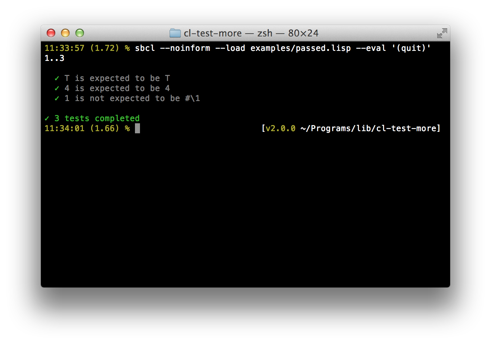
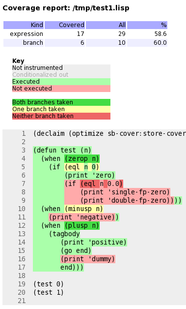
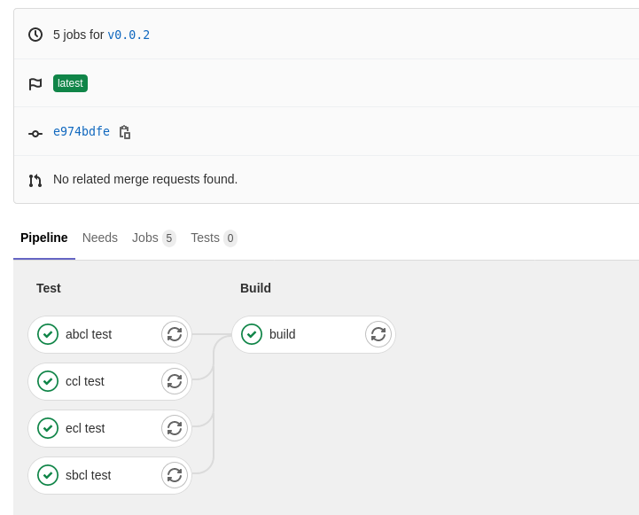

So you want to easily test the code you're writing? The following
recipes cover how to write automated tests and see their code
coverage. We also give pointers to plug those in modern continuous
integration services like Travis CI and Coveralls.

We will use an established and well-designed regression testing
framework called [Prove](https://github.com/fukamachi/prove). It is
not the only possibility though,
[FiveAM](http://quickdocs.org/fiveam/api) is a popular one (see
[this blogpost](http://turtleware.eu/posts/Tutorial-Working-with-FiveAM.html) for an
introduction) and [there are others](https://github.com/CodyReichert/awesome-cl#unit-testing) (and more again). We prefer
`Prove` for its documentation and its **extensible reporters** (it has different
report styles and we can extend them).

> warning: Prove has a couple limitations and will soon be obsolete. We advise to start with another test framework.

## Testing with Prove

### Install and load

`Prove` is in Quicklisp:

~~~lisp
(ql:quickload :prove)
~~~

This command installs `prove` if necessary, and loads it.

### Write a test file

~~~lisp
(in-package :cl-user)
(defpackage my-test
  (:use :cl
        :prove))
(in-package :my-test)

(subtest "Showing off Prove"
  (ok (not (find 4 '(1 2 3))))
  (is 4 4)
  (isnt 1 #\1))

~~~

Prove's API contains the following testing functions: `ok`, `is`,
`isnt`, `is-values`, `is-type`, `like` (for regexps), `is-print`
(checks the standard output), `is-error`, `is-expand`, `pass`, `fail`,
`skip`, `subtest`.

### Run a test file

~~~lisp
(prove:run #P"myapp/tests/my-test.lisp")
(prove:run #P"myapp/tests/my-test.lisp" :reporter :list)
~~~

We get an output like:

### Run one test

You can directly run one test by compiling it. With Slime, use the
usual `C-c C-c`.

### More about Prove

`Prove` can also:

* be run on **Travis CI**,
* **colorize** the output,
* report **tests duration**,
* change the default test function,
* set a threshold for slow tests,
* invoke the **CL debugger** whenever getting an error during running tests,
* integrate with **ASDF** so than we can execute `(asdf:test-system)` or
  `(prove:run)` in the REPL (such configuration is provided by
  [cl-project](https://github.com/fukamachi/cl-project), by the same
  author).

See [Prove's documentation](https://github.com/fukamachi/prove)!

## Interactively fixing unit tests

Common Lisp is interactive by nature (or so are most implementations),
and testing frameworks make use of it. It is possible to ask the
framework to open the debugger on a failing test, so that we can
inspect the stack trace and go to the erroneous line instantly, fix it
and re-run the test from where it left off, by choosing the suggested
*restart*.

With Prove, set `prove:*debug-on-error*` to `t`.

Below is a short screencast showing all this in action (with FiveAM):

<iframe width="560" height="315" sandbox="allow-same-origin allow-scripts" src="https://peertube.video/videos/embed/c0c82209-feaa-444d-962f-afa25745bfc0" frameborder="0" allowfullscreen></iframe>

Note that in the debugger:

- `<enter>` on a backtrace shows more of it
- `v` on a backtrace goes to the corresponding line or function.
- see more options with the menu.

## Code coverage

A code coverage tool produces a visual output that allows to see what
parts of our code were tested or not:

### Generating an html test coverage output

SBCL comes with a built-in module to do code coverage analysis:
[sb-cover](http://www.sbcl.org/manual/index.html#sb_002dcover).

Coverage reports are only generated for code compiled using
`compile-file` with the value of the `sb-cover:store-coverage-data`
optimization quality set to 3.

~~~lisp
;;; Load SB-COVER
(require :sb-cover)

;;; Turn on generation of code coverage instrumentation in the compiler
(declaim (optimize sb-cover:store-coverage-data))

;;; Load some code, ensuring that it's recompiled with the new optimization
;;; policy.
(asdf:oos 'asdf:load-op :cl-ppcre-test :force t)

;;; Run the test suite.
(prove:run :yoursystem-test)
~~~

Produce a coverage report, set the output directory:

~~~lisp
(sb-cover:report "coverage/")
~~~

Finally, turn off instrumentation:

~~~lisp
(declaim (optimize (sb-cover:store-coverage-data 0)))
~~~

You can open your browser at
`../yourproject/t/coverage/cover-index.html` to see the report like
the capture above or like
[this code coverage of cl-ppcre](https://www.snellman.net/sbcl/cover/cl-ppcre-report-3/cover-index.html).

## Continuous Integration

### Travis CI and Coveralls

[Travis](https://travis-ci.org/) is a service for running unit tests
in the cloud and [Coveralls](https://coveralls.io/) shows you the
evolution of coverage over time, and also tells you what a pull
request will do to coverage.

Thanks to `cl-travis` we can easily test our program against one or many
Lisp implementations (ABCL, Allegro CL, SBCL, CMUCL, CCL and
ECL). `cl-coveralls` helps to post our coverage to the service. It
supports SBCL and Clozure CL with Travis CI and Circle CI.

We refer you to the lengthy and illustrated explanations of the
["continuous integration" page on lisp-lang.org](http://lisp-lang.org/learn/continuous-integration).

You'll find many example projects using them in the links above, but
if you want a quick overview of what it looks like:

- Lucerne on [Coveralls](https://coveralls.io/github/eudoxia0/lucerne)
  and [Travis](https://travis-ci.org/eudoxia0/lucerne).

### Gitlab CI

[Gitlab CI](https://docs.gitlab.com/ce/ci/README.html) is part of
Gitlab and is available on [Gitlab.com](https://gitlab.com/), for
public and private repositories. Let's see straight away a simple
`.gitlab-ci.yml`:

~~~
image: daewok/lisp-devel

before_script:
  - apt-get update -qy
  - apt-get install -y git-core
  - git clone https://github.com/foo/bar ~/quicklisp/local-projects/

test:
  script:
    - make test
~~~

Gitlab CI is based on Docker. With `image` we tell it to use the
[daewok/lisp-devel](https://hub.docker.com/r/daewok/lisp-devel/)
one. It includes SBCL, ECL, CCL and ABCL, and Quicklisp is installed
in the home (`/home/lisp/`), so we can `quickload` packages right
away. If you're interested it also has a more bare bones option. Gitlab will load the
image, clone our project and put us at the project root with
administrative rights to run the rest of the commands.

`test` is a "job" we define, `script` is a
recognized keywords that takes a list of commands to run.

Suppose we must install dependencies before running our tests:
`before_script` will run before each job. Here we clone a library
where Quicklisp can find it, and for doing so we must install git
(Docker images are usually pretty bare bones).

We can try locally ourselves. If we already installed [Docker](https://docs.docker.com/) and
started its daemon (`sudo service docker start`), we can do:

    docker run --rm -it -v /path/to/local/code:/usr/local/share/common-lisp/source daewok/lisp-devel:latest bash

This will download the lisp image (±400Mo), mount some local code in
the image where indicated, and drop us in bash. Now we can try a `make
test`.

To show you a more complete example:

~~~
image: daewok/lisp-devel

stages:
  - test
  - build

before_script:
  - apt-get update -qy
  - apt-get install -y git-core
  - git clone https://github.com/foo/bar ~/quicklisp/local-projects/

test:
  stage: test
  script:
    - make test

build:
  stage: build
  only:
    - tags
  script:
    - make build
  artifacts:
    paths:
      - some-file-name
~~~

Here we defined two `stages` (see
[environments](https://docs.gitlab.com/ce/ci/environments.html)),
"test" and "build", defined to run one after another. A "build" stage
will start only if the "test" one succeeds.

"build" is asked to run `only` when a
new tag is pushed, not at every commit. When it succeeds, it will make
the files listed in `artifacts`'s `paths` available for download. We can
download them from Gitlab's Pipelines UI, or with an url. This one will download
the file "some-file-name" from the latest "build" job:

    https://gitlab.com/username/project-name/-/jobs/artifacts/master/raw/some-file-name?job=build

When the pipelines pass, you will see:

You now have a ready to use Gitlab CI.
