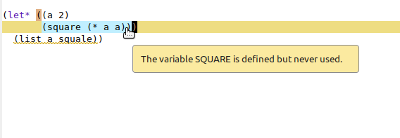

You are writing your first Common Lisp program (welcome!) and
you want to declare variables. What are your options?

When in doubt, use `defparameter` for top-level parameters.

Use `let` or `let*` for lexical scope:

```lisp
(let* ((a 2)
       (square (* a a)))
   (format t "the square of ~a is ~a" a square))
```

Use `setf` to change them.


## `defparameter`: top-level variables

Use `defparameter` to declare top-level variables, like this:

```lisp
(defparameter *name* "me")

(defun hello (&optional name)
  "Say hello."
  (format t "Hello ~a!" (or name *name*)))
```

`defparameter` accepts an optional third argument: the variable's docstring:

```lisp
(defparameter *name* "me"
   "Default name to say hello to.")
```

The inline docstrings are an important part of the Common Lisp
interactive experience. You will encounter them during your coding
sessions (and we lispers usually keep our Lisp running for a long
time). In Emacs and Slime, you can ask for a symbol's docstring with
`C-c C-d d`. You can also ask for a docstring programmatically:

~~~lisp
(documentation '*name* 'variable)
~~~

We ask the documentation of the `*name*` *symbol*, not what it holds,
hence the quote in `'*name*` (which is short for `(quote
*name*)`. Another "doc-type" is `'function`. See: in Common Lisp,
variables and functions live in different "namespaces", and it shows
here.

We'll mention the `defparameter` form with no value below.

### redefining a defparameter

A Common Lisp coding session is usually long-lasting and very
interactive. We leave a Lisp running and we interact with it while we
work. This is done with Emacs and Slime, Vim, Atom and SLIMA, VSCode
and Alive, Lem… and more editors, or from the terminal.

That means that you can do this:

1- write a first defparameter

```lisp
(defparameter *name* "me")
```

either write this in the REPL, either write this in a .lisp file and
compile+load it with a shortcut (`C-c C-c` in Slime on this
expression, or `C-c C-k` to compile and load everything you have in
the current buffer). If you work from a simple terminal REPL, you can
`(load …)` a .lisp file.

Now the `*name*` variable exists in the running image.

2- edit the defparameter line:

```lisp
(defparameter *name* "you")
```

and load the changes the same way: either with the REPL, or with a
`C-c C-c`. Now, the `*name*` variable has a new value, "you".

A `defvar` wouldn't be redefined.


## `defvar`: no redefinition

`defvar` defines top-level *variables* and protects them from redefinition.

When you re-load a `defvar`, it doesn't erase the current value, you
must use `setf` for this.


```lisp
(defvar *names-cache* (list)
  "Store a list of names we said \"hello\" to.")

(defun hello (&optional (name *name*))
   (pushnew name *names-cache* :test #'string-equal)
   (format t "hello ~a!" name))
```

Let's see it in use:

```lisp
CL-USER> (hello)
hello you!
NIL
CL-USER> *names-cache*
("you")
CL-USER> (hello "lisper")
hello lisper!
NIL
CL-USER> *names-cache*
("lisper" "you")
```

What happens to `*names-cache*` if you redefine the `defvar` line
(with `C-c C-c`, or `C-c C-k`, or on the REPL…)?

It doesn't change and *that is a good thing*.

Indeed, this variable isn't a user-visible parameter, it doesn't have
an immediate use, but it is important for the program correctness, or
strength, etc. Imagine it holds the cache of your webserver: you don't
want to erase it when you load new code. During development, we hit a
lot `C-c C-k` to reload the current file, we can as well reload our
running app in production, but there are certain things we want
untouched. If it is a database connection, you don't want to set it
back to nil, and connect again, everytime you compile your code.

You must use `setf` to change a defvar's variable value.


## The "\*earmuff\*" convention

See how we wrote `*name*` in-between "\*earmuffs\*". That is an
important convention, that helps you not override top-level variables
in lexical scopes.

```lisp
(defparameter name "lisper")

;; later…
(let ((name "something else"))
   ;;  ^^^ overrides the top-level name. This will cause bugs.
   …)
```

This becomes a feature only when using earmuffs:

```lisp
(defparameter *db-name* "db.db")

(defun connect (&optional (db-name *db-name*))
  (connect db-name))

(let ((*db-name* "another.db"))
  (connect))
  ;;^^^^  its db-name optional parameter, which defaults to *db-name*, now sees "another.db".
```

By the way, for such a use-case, you will often find `with-…` macros
that abstract the `let` binding.

```lisp
(with-db "another.db"
  (connect))
```

By the way again, an
[earmuff](https://www.wordreference.com/definition/earmuff) is a thing
that covers the ears (but only the ears) in winter. You might have
seen it in movies more than in reality. The lasting word is: take care
of yourself, stay warm and use earmuffs.

## Global variables are created in the "dynamic scope"

Our top-level parameters and variables are created in the so-called
*dynamic scope*. They can be accessed from anywhere else: from
function definitions (as we did), in `let` bindings, etc.

In Lisp, we also say these are [*dynamic variables* or *special*](https://cl-community-spec.github.io/pages/Dynamic-Variables.html).

It could also be possible to create one from anywhere by *proclaiming*
it "special". It really isn't the thing you do everydays but, you
know, in Lisp everything's possible ;)

> A dynamic variable can be referenced outside the dynamic extent of a form that binds it. Such a variable is sometimes called a "global variable" but is still in all respects just a dynamic variable whose binding happens to exist in the global environment rather than in some dynamic environment. [Hyper Spec]


## `setf`: change values

Any variable can be changed with `setf`:

```lisp
(setf *name* "Alice")
;; => "Alice"
```

It returns the new value.

Actually, `setf` accepts *pairs* of value, variable:

~~~lisp
(setf *name* "Bob"
      *db-name* "app.db")
;; => "app.db"
~~~

It returned the last value.

What happens if you `setf` a variable that wasn't declared yet? It
generally works but you have a warning:

```lisp
;; in SBCL 2.5.8
CL-USER> (setf *foo* "foo")
; in: SETF *FOO*
;     (SETF CL-USER::*FOO* "foo")
;
; caught WARNING:
;   undefined variable: CL-USER::*FOO*
;
; compilation unit finished
;   Undefined variable:
;     *FOO*
;   caught 1 WARNING condition
"foo"
```

We see the returned "foo", so it worked. Please declare variables with
`defparameter` or `defvar` first.

Let's read the full `setf` docstring because it's interesting:

```txt
Takes pairs of arguments like SETQ. The first is a place and the second
is the value that is supposed to go into that place. Returns the last
value. The place argument may be any of the access forms for which SETF
knows a corresponding setting form.
```

Note that `setq` is another macro, but now seldom used, because `setf`
works on more "places". You can setf functions and many things.


## `let`, `let*`: create lexical scopes

`let` lets you define variables in a limited scope, or override top-level variables temporarily.

Below, our two variables only exist in-between the parenthesis of the `let`:

```lisp
(let* ((a 2)
       (square (* a a)))
   (format t "the square of ~a is ~a" a square))
   ;; so far so good

(format t "the value of a is: ~a" a)
;; => ERROR: the variable A is unbound
```

"unbound" means the variable is bound to nothing, not even to NIL. Its
symbol may exist, but it isn't associated to anything.

> Food for thought: sometimes, the fact to write a variable name and have the Lisp reader read it creates the symbol, but doesn't bind it to anything.

I wanted to say that "after the let, the variable A doesn't exist",
but because I wrote it in the format expression, it was *read* and it
now does exist. It just isn't bound to anything anymore, although it
was bound to the number 2 inside the let.

Right?

Outside of the scope formed by the `let`, the variables `a` and `square` "don't exist".

They can be accessed by any form inside the `let` binding. If we
create a second `let`, its *environment* inherits the previous one (we
see variables declared above, fortunately!).

```lisp
(defparameter *name* "test")

(defun log (square)
  (format t "name is ~s and square is ~a" *name* square))

(let* ((a 2)
       (square (* a a)))
  ;; inside first environment
  (let ((*name* "inside let"))
    ;; inside second environment,
    ;; we access the dynamic scope.
    (log square)))
;; name is "inside let" and square is 4
;; NIL

(print *name*)
;; => "test"
;;    ^^^^ outside the let, back to the dynamic scope's value.
```

We could also define a function inside a let, so that this function
definition "sees" a binding from a surrounding let at compile
time. This is a closure and it's for the chapter on functions.

A "lexical scope" is simply

> a scope that is limited to a spatial or textual region within the establishing form. "The names of parameters to a function normally are lexically scoped." [Hyper Spec]

In other words, the scope of a variable is determined by its position
in the source code. It's today's best practice. It's the least
surprising way of doing: you can *see* the scope by looking at the
source code.

### `let` vs `let*`

By the way, what is the syntax of `let` and what is the difference with `let*`?

`let*` lets you declare variables that depend on each other.

`let`'s basic use is to declare a list of variables with no initial
values. They are initialized to `nil`:

```lisp
(let (variable1 variable2 variable3) ;; variables are initialized to nil by default.
  ;; use them here
  …)

;; Example:
(let (a b square)
  (setf a 2)
  (setf square (* a a))
  (list a b square))
;; => (2 NIL 4)

;; exactly the same:
(let (a
      b
      square)
  …)
```

You can give default values by using "pairs" of elements, as in `(a 2)`:

```lisp
(let ((a 2)     ;; <-- initial value
       square)  ;; <-- no "pair" but still one element: defaults to NIL.
  (setf square (* a a))
  (list a square))
```

Yes, there are two `((` in a row! This is the syntax of Common
Lisp. You don't need to count them. What appears after a `let` is
variable definitions. Usually, one per line.

The let's logic is in the body, with a meaningful indentation. You can
read Lisp code based on indentation. If the project you are looking at
doesn't respect that, it is a low quality project.

Observe that we kept `square` to nil. We want it to be the square of
`a`, so can we do this?

```lisp
(let ((a 2)
      (square (* a a))) ;; WARN:
  …)
```

You can't do that here, this is the limitation of `let`. You need `let*`.

You could write two `let`s:

```lisp
(let ((a 2))
  (let ((square (* a a)))
    (list a square)))
;; => (2 4)
```

This is equivalent to `let*`:

```lisp
(let* ((a 2)
       (square (* a a)))
  …)
```

`let` is to declare variables that don't depend on each other, `let*`
is to declare variables which are read one after the other and where
one can depend on a *previous* one.

This is *not* valid:

```lisp
(let* ((square (* a a))  ;; WARN!
       (a 2))
   (list a square))
;; => debugger:
;; The variable A is unbound.
```

The error message is clear. At the time of reading `(square (* a a))`, `a` is unknown.

### setf inside let

Let's make it even clearer: you can `setf` any value that is
*shadowed* in a `let` binding, once outside the let, the variables are
back to the value of the current *environment*.

We know this:

```lisp
(defparameter *name* "test")

(let ((*name* "inside let"))
  (format t "*name* inside let: ~s" *name*))
;; => *name* inside let: "inside let"

(format t "*name* outside let: ~s" *name*)
;; => *name* outside let: "test"
```

we setf a dynamic parameter that was shadowed by a let binding:

```lisp
(defparameter *name* "test")

(defun change-name ()
   ;; bad style though,
   ;; try to not mutate variables inside your functions,
   ;; but take arguments and return fresh data structures.
   (setf *name* "set!"))
   ;;    ^^^^^ from the dynamic environment, or from a let lexical scope.

(let ((*name* "inside let"))
  (change-name)
  (format t "*name* inside let: ~s" *name*))
;; => *name* inside let: "set!"

(format t "*name* outside let: ~s" *name*)
;; => *name* outside let: "test"
```


### When you don't use defined variables

Read your compiler's warnings :)

Below, it tells us that `b` is defined but never used. SBCL is pretty
good at giving us useful warnings at *compile time* (every time you
hit `C-c C-c`, `C-c C-k` or use `load`).

~~~lisp
(let (a b square)
  (list a square))
;; =>
; caught STYLE-WARNING:
;   The variable B is defined but never used.
~~~

This example works in the REPL because SBCL's REPL always compiles expressions.

This may vary with your implementation.

It's great to catch typos!

```lisp
(let* ((a 2)
       (square (* a a)))
  (list a squale))
  ;;         ^^^ typo
```

If you compile this in a .lisp file (or in a `M-x slime-scratch`), you
will have two warnings, and your editor will underline each in two
different colors:



- first, "square" is defined but never used
- second, "squale" is an undefined variable.

If you run the snippet in the REPL, you will get the two warnings but
because the snippet is run, and you will see the interactive debugger
with the error "The variable SQUALE is unbound".


## Unbound variables

"unbound" variables were not bound to anything, not even nil. Their
symbol might exist, but they have no associated value.

You can create such variables like this:

```lisp
(defparameter *connection*)
```

This `defparameter` form is correct. You didn't give any default
value: the parameter is unbound.

You can check if a variable (or a function) is bound with `boundp` (or
`fboundp`). The `p` is for "predicate".

You can make a variable (or function) unbound with `makunbound` (or `fmakunbound`).

## Global variables are thread safe

Don't be afraid of accessing and set-ing global bindings in
threads. Each thread will have its own copy of the
variable. Consequently, you can bind them to other values with `let`
bindings, etc. That's good.

It's only if you want one single source of truth that you'll have to
share the variable between threads and where the danger lies. You can
use a lock (very easy), but that's all another topic.

## Addendum: `defconstant`

`defconstant` is here to say something is a constant and is not
supposed to change, but in practice `defconstant` is annoying. Use
`defparameter`, and add a convention with a new style of earmuffs:

```lisp
(defparameter +pi+ pi
  "Just to show that pi exists but has no earmuffs. Now it does. You shouldn't change a variable with +-style earmuffs, it's a constant.")
```

`defconstant` is annoying because, at least on SBCL, it can't be
redefined without asking for validation through the interactive
debugger, which we may often do during development, and its default
test is `eql`, so give it a string and it will always think that the
constant was redefined. Look (evaluate each line one by one in order):

```lisp
(defconstant +best-lisper+ :me)
;; so far so good.

(defconstant +best-lisper+ :me)
;; so far so good: we didn't redefine anything.

(defconstant +best-lisper+ :you)
;; => the constant is being redefined, we get the interactive debugger (SBCL):

The constant +BEST-LISPER+ is being redefined (from :ME to :YOU)
   [Condition of type SB-EXT:DEFCONSTANT-UNEQL]
See also:
  Common Lisp Hyperspec, DEFCONSTANT [:macro]
  SBCL Manual, Idiosyncrasies [:node]

Restarts:
 0: [CONTINUE] Go ahead and change the value.
 1: [ABORT] Keep the old value.
 2: [RETRY] Retry SLIME REPL evaluation request.
 3: [*ABORT] Return to SLIME's top level.
 4: [ABORT] abort thread (#<THREAD tid=573581 "repl-thread" RUNNING {120633D123}>)

;; => presse 0 (zero) or click on the "Continue" restart to accept changing the value.
```

With constants as strings:

```lisp
(defconstant +best-name+ "me")
;; so far so good, we create a new constant.

(defconstant +best-name+ "me")
;; => interactive debugger!!

The constant +BEST-NAME+ is being redefined (from "me" to "me")
…
```

As you will see in the equality chapter, two strings are not equal by
`eql` that is a low-level equality operator (think pointers), they are
`equal` (or `string-equal`).

This is `defconstant` documentation:

> Define a global constant, saying that the value is constant and may be compiled into code. If the variable already has a value, and this is not EQL to the new value, the code is not portable (undefined behavior). The third argument is an optional documentation string for the variable.

The `eql` thing is in the spec, what an implementation should do when
redefining a constant is not defined, so it may vary with your
implementation.

We invite you to look at:

- [Alexandria's define-constant](https://alexandria.common-lisp.dev/draft/alexandria.html#Data-and-Control-Flow), which has a `:test` keyword (but still errors out on redefinition).
- [Serapeum's `defconst`](https://github.com/ruricolist/serapeum/blob/master/REFERENCE.md#defconst-symbol-init-optional-docstring)
- `cl:defparameter` ;)


## Guidelines and best practices

A few style guidelines:

- create all your top-level parameters at the top of a file
- define first parameters then variables
- use docstrings
- read your compiler's warnings
- it's better for your functions to accept arguments, rather than to rely on top-level parameters
- your functions shouldn't mutate (modify) a top-level binding. You should create a new data structure instead, and use your function's return value as the parameter to another function, and have data flow from one function to another.
- parameters are best for: a webserver port, a default value… and other user-facing parameters.
- variables are best for long-living and internal variables: caches, DB connections…
- you can forget about defconstant
- when in doubt, use a `defparameter`
- the pattern where a function parameter is by default a global variable is typical and idiomatic:

```lisp
;; from the STR library.
(defvar *whitespaces* (list #\Backspace #\Tab #\Linefeed #\Newline #\Vt #\Page
                            #\Return #\Space #\Rubout
                            ;; edited for brevity
                            ))

(defun trim-left (s &key (char-bag *whitespaces*))
  "Removes all characters in `char-bag` (default: whitespaces) at the beginning of `s`."
  (when s
   (string-left-trim char-bag s)))
```

the default value can also be a function call:

```lisp
;; from the Lem editor
(defun buffer-modified-p (&optional (buffer (current-buffer)))
  "Return T if 'buffer' has been modified, NIL otherwise."
  (/= 0 (buffer-%modified-p buffer)))
```

- these let bindings over global variables are idiomatic too: `(let ((*name* "other")) …)`.
