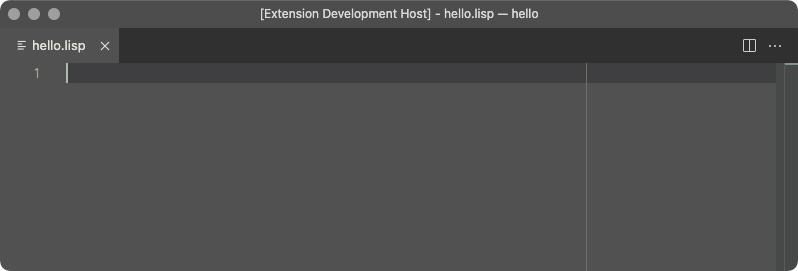
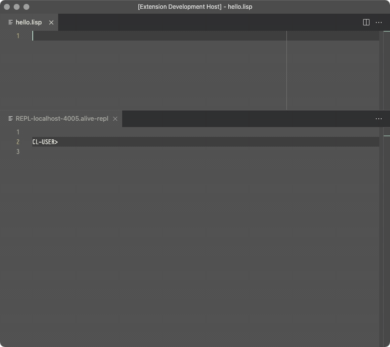
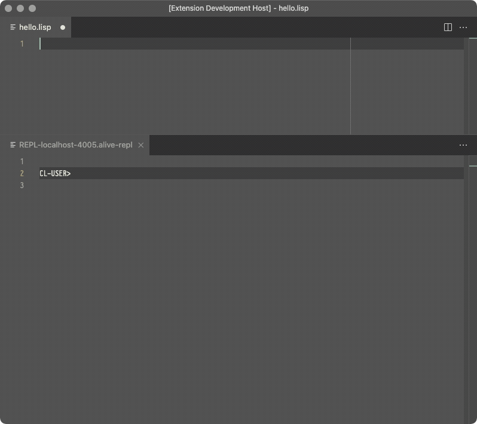
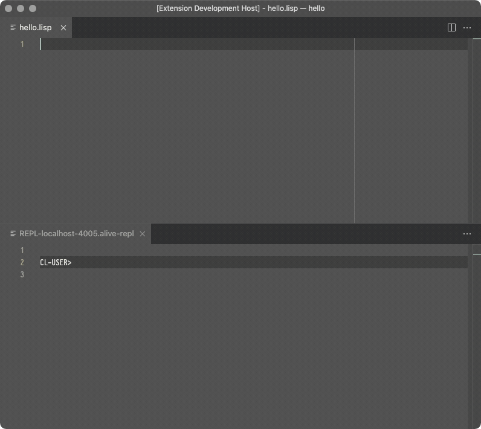
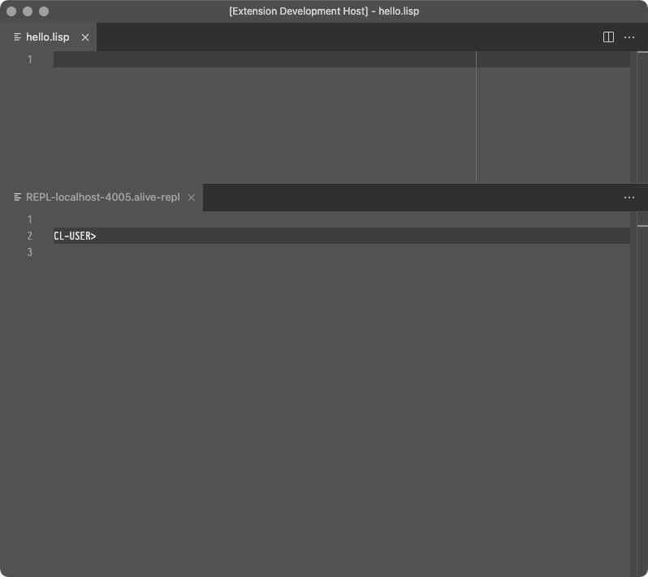
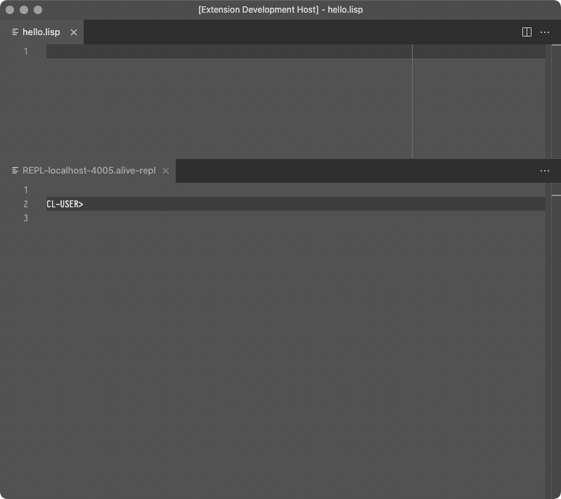
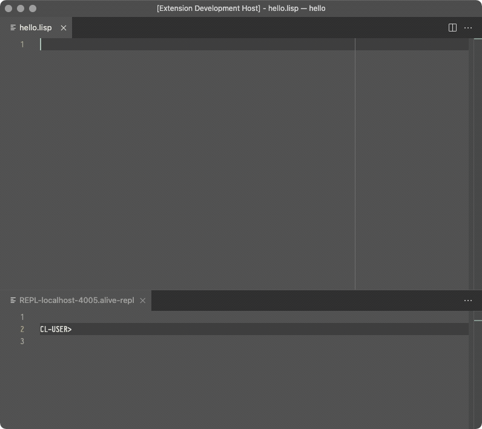
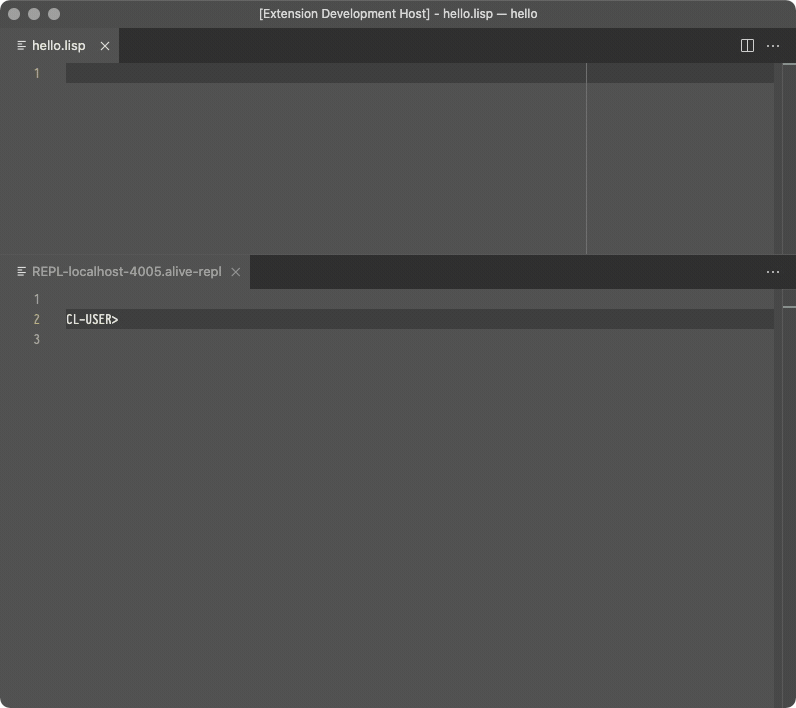
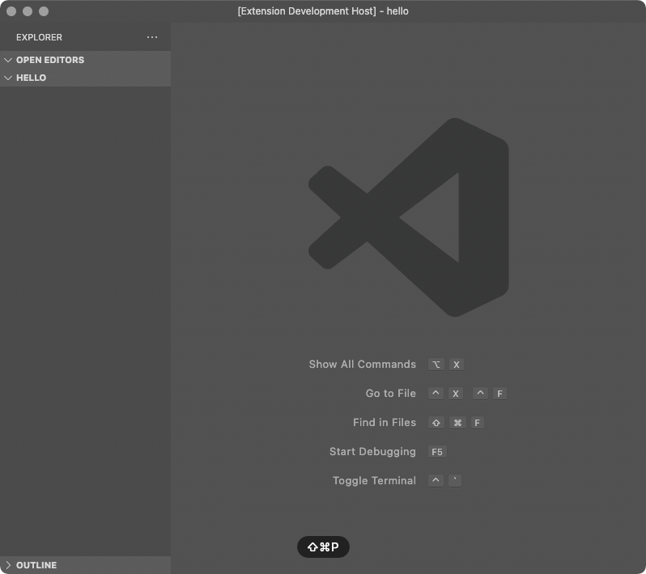
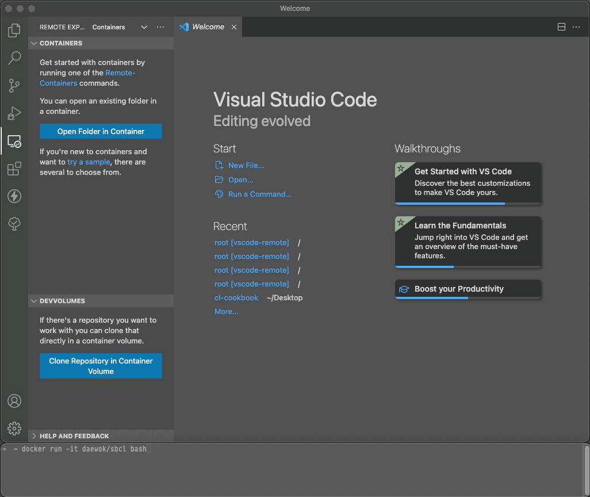

The
[Alive](https://marketplace.visualstudio.com/items?itemName=rheller.alive)
extension makes [VSCode](https://code.visualstudio.com) a powerful
Common Lisp development platform. Alive hooks directly into the Swank
server that Emacs Slime uses and is fully compatible with VSCode's
ability to develop remotely in containers, WSL, Remote machines, etc.
It has no dependencies beyond a version of Common Lisp running on the
target platform that can run the Swank server. It currently supports:

- Syntax highlighting
- Code completion
- Code formatter
- Jump to definition
- Snippets
- REPL integration
- Interactive Debugger
- REPL history
- Inline evaluation
- Macro expand
- Disassemble
- Inspector
- Hover Text
- Rename function args and let bindings
- Code folding


### Prerequisites

The Alive extension in VSCode is compatible with ANSI Common Lisp,
and these instructions should work for any of them as long as the Alive
REPL starts up successfully. The examples all use SBCL.

- [VsCode](https://code.visualstudio.com) with [command
  line](https://code.visualstudio.com/docs/setup/mac#_launching-from-the-command-line)
  installed running the
  [Alive](https://marketplace.visualstudio.com/items?itemName=rheller.alive)
  extension.
- [SBCL](http://www.sbcl.org)

#### Connect VSCode to a REPL



1. Inside of VSCode, open a lisp file that you want to edit.
   - If you don't have one, create a new one called `hello.lisp`
2. Inside of VSCode, open the Command Palette on the menu at the top
   where it says `View/Command Palette` and start an instance of SBCL
   running a Swank server attached to your VSCode REPL by choosing:
   `Alive: Start REPL And Attach`.
   - You will see a small window pop up that says `REPL Connected`
   - If you don't get a `REPL Connected` message, open up VSCode's
     Output on the menu at the top where it says `View:Output` and
     choose `Swank Trace` from the pulldown. This output is the output
     from the running lisp image and will get you started on figuring
     out what might be going wrong.

Congrats, You now have a VSCode instance running a REPL attached to a
Swank server running on port 4005 of a running SBCL image. You can
now evaluate statements in your file and they will be processed in
your running SBCL instance.

_To disconnect your REPL and shut down your SBCL instance, open the
Command Palette on the menu at the top where it says `View/Command
Palette` and choose: `Alive: Detach from REPL`_

There are keybindings for every operation, feel free to explore and
modify those as needed.

### Recipes

_All recipes assume you have a file open in VSCode running with an attached
REPL unless otherwise stated._

_When evaluating an expression, you choose the expression to evaluate by
putting your cursor anywhere in or immediately following the
s-expression that you wish to evaluate._

#### Evaluate a statement in-line



1. In your open file in your editor window, enter:

~~~lisp
(+ 2 2)
~~~

2. Open the Command Palette on the menu at the top `View/Command
   Palette` and choose `Alive: Inline Eval`
3. You will see a small pop up that says `=> 4 (3 bits, #x4, #o4,
   #b100)`, which is the result

   _Evaluating a statement in-line is exactly the same as sending it to
   the REPL. The only difference is how it is displayed._

#### Evaluate a statement



1. In your open file in your editor window, enter:

~~~lisp
(+ 2 2)
~~~

2. Open the Command Palette on the menu at the top `View/Command
   Palette` and choose `Alive: Send To REPL`
3. You will see the expression show up in the REPL along with the result.

~~~lisp
CL-USER>
(+ 2 2)
4
CL-USER>
~~~

#### Compile a file



1. In your open file in your editor window, enter:

~~~lisp
(+ 2 2)
~~~

2. Open the Command Palette on the menu at the top `View/Command
   Palette` and choose `Alive: Compile`
3. You will see details about the compile in your repl, and a fasl file
   in your filesystem.

~~~lisp
CL-USER>

; compiling file "/Users/jason/Desktop/hello.lisp" (written 14 SEP 2021 04:24:37 AM):


; wrote /Users/jason/Desktop/hello.fasl

; compilation finished in 0:00:00.001
~~~

#### Use the Interactive Debugger to abort



1. In your open file in your editor window, enter:

~~~lisp
(defun divide (x y)
  (/ x y))
~~~

2. Put your cursor after the last parenthesis if it isn't already there.
   Open the Command Palette on the menu at the top `View/Command
   Palette` and choose `Alive: Inline Eval` to load your `define`
   function into your image.
3. In your open file, add another new line and enter:

~~~lisp
(divide 1 0)
~~~

4. Put your cursor after the last parenthesis if it isn't already there.
   Open the Command Palette on the menu at the top `View/Command
   Palette` and choose `Alive: Inline Eval` to run your divide function
   in your image.
5. You will see the Interactive Debugger pop up. In the `Restarts`
   section, choose option 2 to Abort.
6. You're now back to your editor and still-running REPL and can
   continue like it never happened.

#### Use the Interactive Debugger to fix a problem at runtime



1. In your open file in your editor window, enter:

~~~lisp
(defun divide (x y)
  (assert (not (zerop y))
          (y)
          "The second argument can not be zero. Please change it.")
  (/ x y))
~~~

2. Put your cursor after the last parenthesis if it isn't already there.
   Open the Command Palette on the menu at the top `View/Command
   Palette` and choose `Alive: Inline Eval` to load your `define`
   function into your image.
3. In your open file, add another new line and enter:

~~~lisp
(divide 1 0)
~~~

4. Put your cursor after the last parenthesis if it isn't already there.
   Open the Command Palette on the menu at the top `View/Command
   Palette` and choose `Alive: Inline Eval` to run your divide function
   in your image.
5. You will see the Interactive Debugger pop up.  In the `Restarts`
   section, choose option 0 to "Retry assertion with new value for Y".
6. In the popup menu, enter `y'
7. In the next popup menu, enter `1`
8. You should now see a small pop up that says `=> 1 (1 bit, #x1, #o1,
   #b1)`, which is the result of the new value. You're now back to your
   editor and still-running REPL after crashing out into the debugger,
   having it let you change the value that caused the crash, and then
   proceeding like you never typed that bad `0` value.

_More ideas for what can be done with the debugger can be found on the [error handling](error_handling.md) page._

#### Expand a macro



1. In your open file in your editor window, enter:

~~~lisp
(loop for x in '(a b c d e) do
     (print x))
~~~

2. Put your cursor after the last parenthesis if it isn't already there.
   Open the Command Palette on the menu at the top `View/Command
   Palette` and choose `Alive: Macro Expand` to expand the for-loop macro.
3. You should see something like this:

~~~lisp
(BLOCK NIL
  (LET ((X NIL)
        (#:LOOP-LIST-559
         (SB-KERNEL:THE* (LIST :USE-ANNOTATIONS T :SOURCE-FORM '(A B C D E))
                         '(A B C D E))))
    (DECLARE (IGNORABLE #:LOOP-LIST-559)
             (IGNORABLE X))
    (TAGBODY
     SB-LOOP::NEXT-LOOP
      (SETQ X (CAR #:LOOP-LIST-559))
      (SETQ #:LOOP-LIST-559 (CDR #:LOOP-LIST-559))
      (PRINT X)
      (IF (ENDP #:LOOP-LIST-559)
          (GO SB-LOOP::END-LOOP))
      (GO SB-LOOP::NEXT-LOOP)
     SB-LOOP::END-LOOP)))
~~~

#### Disassemble a function



1. In your open file in your editor window, enter:

~~~lisp
(defun hello (name)
  (format t "Hello, ~A~%" name))
~~~

2. Put your cursor after the last parenthesis if it isn't already there.
   Open the Command Palette on the menu at the top `View/Command
   Palette` and choose `Alive: Inline Eval` to load the function into
   your image.
2. Put your cursor after the last parenthesis if it isn't already there.
   Open the Command Palette on the menu at the top `View/Command
   Palette` and choose `Alive: Disassemble` print out the machine code
   of your compiled function.
3. It will start something like this:

~~~
; disassembly for HELLO
; Size: 172 bytes. Origin: #x70052478B4                       ; HELLO
; 8B4:       AC0A40F9         LDR R2, [THREAD, #16]           ; binding-stack-pointer
; 8B8:       4C0F00F9         STR R2, [CFP, #24]
; 8BC:       AC4642F9         LDR R2, [THREAD, #1160]         ; tls: *STANDARD-OUTPUT*
; 8C0:       9F8501F1         CMP R2, #97
; 8C4:       61000054         BNE L0
; 8C8:       4AFDFF58         LDR R0, #x7005247870            ; '*STANDARD-OUTPUT*
; 8CC:       4C1140F8         LDR R2, [R0, #1]
; 8D0: L0:   4C1700F9         STR R2, [CFP, #40]
; 8D4:       E0031BAA         MOV NL0, CSP
; 8D8:       7A0701F8         STR CFP, [CSP], #16
; 8DC:       EAFCFF58         LDR R0, #x7005247878            ; "Hello, "
; 8E0:       4B1740F9         LDR R1, [CFP, #40]
; 8E4:       B6FBFF58         LDR LEXENV, #x7005247858        ; #<SB-KERNEL:FDEFN WRITE-STRING>
; 8E8:       970080D2         MOVZ NARGS, #4
; 8EC:       FA0300AA         MOV CFP, NL0
; 8F0:       DE9240F8         LDR LR, [LEXENV, #9]
; 8F4:       C0033FD6         BLR LR
; 8F8:       3B039B9A         CSEL CSP, OCFP, CSP, EQ
; 8FC:       E0031BAA         MOV NL0, CSP
; 900:       7A0701F8         STR CFP, [CSP], #16
; 904:       4A2F42A9         LDP R0, R1, [CFP, #32]
; 908:       D6FAFF58         LDR LEXENV, #x7005247860        ; #<SB-KERNEL:FDEFN PRINC>
; 90C:       970080D2         MOVZ NARGS, #4
; 910:       FA0300AA         MOV CFP, NL0
; 914:       DE9240F8         LDR LR, [LEXENV, #9]
; 918:       C0033FD6         BLR LR
; 91C:       3B039B9A         CSEL CSP, OCFP, CSP, EQ
; 920:       E0031BAA         MOV NL0, CSP
; 924:       7A0701F8         STR CFP, [CSP], #16
; 928:       2A4981D2         MOVZ R0, #2633
; 92C:       4B1740F9         LDR R1, [CFP, #40]
; 930:       D6F9FF58         LDR LEXENV, #x7005247868        ; #<SB-KERNEL:FDEFN WRITE-CHAR>
; 934:       970080D2         MOVZ NARGS, #4
; 938:       FA0300AA         MOV CFP, NL0
; 93C:       DE9240F8         LDR LR, [LEXENV, #9]
; 940:       C0033FD6         BLR LR
; 944:       3B039B9A         CSEL CSP, OCFP, CSP, EQ
; 948:       EA031DAA         MOV R0, NULL
; 94C:       FB031AAA         MOV CSP, CFP
; 950:       5A7B40A9         LDP CFP, LR, [CFP]
; 954:       BF0300F1         CMP NULL, #0
; 958:       C0035FD6         RET
; 95C:       E00120D4         BRK #15                         ; Invalid argument count trap
~~~

#### Create a skeleton Common Lisp system



_This recipe creates a new Common Lisp System, so it does not need a
running REPL._

1. Create a folder called `experiment` for your new project
2. Open vscode in your newly created directory

```bash
cd experiment
code .
```

3. Create new Common Lisp System.
  - Inside of VSCode, Open Command Palette on the menu at the top
      `View/Command Palette` and generate a system skeleton: `Alive: System Skeleton`
  - The previous command should have generated the following directory
      structure:
      - experiment.asd
      - src/
        - app.lisp
      - test/
        - all.lisp

The content of those files is as follows:

`experiment.asd`:

~~~lisp
(in-package :asdf-user)

(defsystem "experiment"
  :class :package-inferred-system
  :depends-on ("experiment/src/app")
  :description ""
  :in-order-to ((test-op (load-op "experiment/test/all")))
  :perform (test-op (o c) (symbol-call :test/all :test-suite)))

(defsystem "experiment/test"
  :depends-on ("experiment/test/all"))

(register-system-packages "experiment/src/app" '(:app))
(register-system-packages "experiment/test/all" '(:test/all))
~~~

`src/app.lisp`:

~~~lisp
(defpackage :app
  (:use :cl))

(in-package :app)
~~~

`test/all.lisp`:

~~~lisp
(defpackage :test/all
  (:use :cl
        :app)
  (:export :test-suite))

(in-package :test/all)

(defun test-suite ()
  (format T "Test Suite~%"))
~~~

### Optional Custom Configurations

#### Configuring VSCode Alive to work with Quicklisp

Assuming that you have quicklisp installed and configured to load on
init, quicklisp just works.

#### Configuring VSCode Alive to work with CLPM in the default context

Assuming that you have [CLPM](https://clpm.dev) installed and
configured, [modify your vscode settings](https://code.visualstudio.com/docs/getstarted/settings) to
look like this:

1. Add the following to to your VSCode settings:

```json
  "alive.swank.startupCommand":[
    "clpm",
    "exec",
    "--",
    "sbcl",
    "--eval",
    "(asdf:load-system :swank)",
    "--eval",
    "(swank:create-server)"
  ],
```

_This will start up sbcl in the default clpm context_

#### Configuring VSCode Alive to work with CLPM using a bundle clpmfile

Assuming that you have [CLPM](https://clpm.dev) installed and configured
and a bundle configured in the root of your home directory that contains
swank as a dev dependency, [modify your vscode
settings](https://code.visualstudio.com/docs/getstarted/settings) to
look like this:

1. Add the following to your VSCode settings:

```json
  "alive.swank.startupCommand":[
    "clpm",
    "bundle",
    "exec",
    "--",
    "sbcl",
    "--eval",
    "(asdf:load-system :swank)",
    "--eval",
    "(swank:create-server)"
  ],
```

_This will start up sbcl in your bundle's clpm context_

#### Configuring VSCode Alive to work with Roswell

Assuming that you have [Roswell](https://roswell.github.io/) installed,
[modify your vscode
settings](https://code.visualstudio.com/docs/getstarted/settings) to
look like this:

```json
  "alive.swank.startupCommand": [
    "ros",
    "run",
    "--eval",
    "(require :asdf)",
    "--eval",
    "(asdf:load-system :swank)",
    "--eval",
    "(swank:create-server)"
  ]
```

#### Connecting VSCode Alive to a Docker container



_These instructions will work for remote connections, wsl connections,
and github Codespaces as well using the `Remote - SSH` and `Remote -
WSL`, and `Github Codespaces` extensions, respectively assuming you have
the extensions installed. For this example, make sure you have the
[Containers extension installed and
configured](https://code.visualstudio.com/docs/remote/containers)._

1. Pull a docker image that has sbcl installed, in this example, we'll use
   the latest clfoundations sbcl.

```sh
docker pull clfoundation/sbcl
```

2. Run bash in the docker image to start it up and keep it running.

```sh
docker run -it clfoundation/sbcl bash
```

3. In the VSCode Side Bar, click the `Remote Explorer` icon.
4. In the list of Dev Containers, right click on clfoundation/sbcl and choose
   `Attach to Container`.
5. In the VSCode Side Bar of the new VSCode window that opens up, click
   on `Explorer`.  _You may need to tell it to view the files in your
   container if it isn't already showing them._
6. Once you're viewing the files in the container, right click in the
   VSCode `Side Bar` and choose `New File`. Name the file `hello.lisp`
7. In the VSCode Site Bar, click the `Extensions` icon
8. Click the `Install in Container...` button for the `Alive` plugin
9. Open up your `hello.lisp` file and follow the "Connect VSCode to a
   REPL" instructions at the beginning of these recipes
10. You now have VSCode running a REPL hooked to a Slime server running
    on an SBCL image in a docker container.
